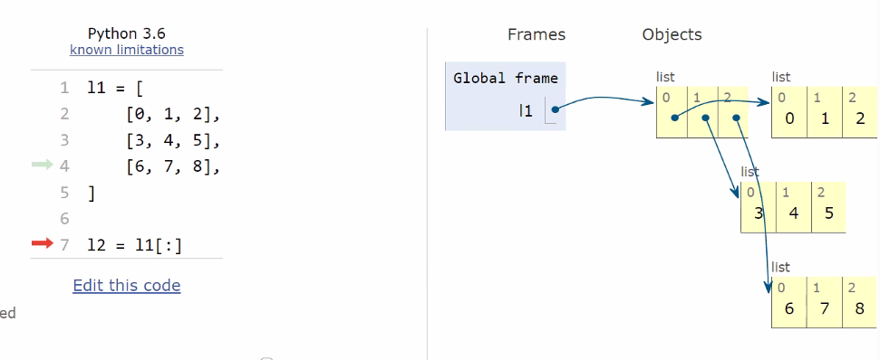

# 파이썬 프로그래밍의 기초 - 자료형

**22년 12월 14일 (수)**

## Jupyter Notebook 설치

pip는 파이썬에 딸려오는 다운로드 

`$ pip install jupyter`

`$ which python`

` $ jupyter notebook`

크롬 설정 모양-글꼴-고정폭 글꼴-`consolas`


**Keyboard shortcuts  for Jupyter Notebook**

| 단축키                         | 의미                           |
| ------------------------------ | ------------------------------ |
| a(above)                       | 위로 새 셀 생성                |
| b(below)                       | 아래로 새 셀 생성              |
| dd                             | 지우기                         |
| z                              | 되돌리기                       |
| ctrl + Enter                   | 실행                           |
| shift + Enter                  | 실행 + 새 셀 만들기            |
| y                              | 마크다운을 코드블럭 모드로     |
| m                              | 마크다운 모드로                |
| Kernel-Restart &  Clear Output | 코드는 그대로. 실행결과 지우기 |
| 00                             | Restart Kernel                 |


---

## Python 기초

## 식별자

*이름과 값을 구분하는 것이 중요하다.* (예약어, 공백, 특수문자 사용불가)

- 아래의 예약어를 제외하고 이름을 지을 수 있다.
- 내장함수나 모듈 등의 이름으로도 만들면 안된다.

```
import keyword
print(keyword.kwlist)
```

```python
# bad SyntaxError
True = 100
False = 100
print = 300
my None = 100
my#$!Var = 200

# good
myTrue = 100
myFalse = 100
myprint = 300
myNone = 100
myVar = 200 
```


## 주석(Comment)

\# 사용

```python
# 주석 사용하기
def my_sum(x, y):
    """
    이함수는 인자 x와 y를 더합니다
    더한 값을 리턴합니다
    이런 주석을 docstring 이라고 부릅니다.
    """
    return x + y

print(my_sum.__doc__)
```


## 변수(variable) 및 자료형

- 변수는 `=`을 통해 할당(assignment)된다.(메모리 할당 `=`)
- 해당 자료형을 확인하기 위해서는 `type()`을 활용한다.(자료형 확인 `type()`)
- 해당 값의 메모리 주소를 확인하기 위해서는 `id()`를 활용한다.(메모리 주소 확인 `id()`)

변수(박스)에 값을 담을 수 있다.

**그럼 변수에 어떤 종류의 값이 들어갈 수 있나요?**
> 1. 숫자형 / 2.문자 / 3. 불리언 / 4. None
---

## 1. 숫자형(Numbers)
   - `int`정수(integer)
   - `float`실수(floating point numbers)
   - `complex`복소수(complex)
- 
### 1-1) 숫자 형 `int` (integer)
- 2진수 : 0b, 8진수 : 0o, 16진수 : 0x
- arbitrary-precision arithmetic
  
  > 메모리를 유동적으로 변환시키는 작업 4바이트가 부족하다면 5바이트 더 부족하다면 6바이트까지 사용

```python
# result 100
num = 100
print(num)

# result 9223372036854775807
import sys
big_num = sys.maxsize
print(big_num)

giant_num = big_num + big_num
print(giant_num)

# 2진수 result 2
bi_num = 0b10
print(bi_num)

# 8진수 result 8
oct_num = 0o10
print(oct_num)

# 16진수 result 16
hex_num = 0x10
print(hex_num)
```

### 1-2) 실수형 `float`
```python
# result 3.5, float
f_num = 3.5
print(f_num)
print(type(f_num))
```
### 1-3) 복소수 `complex` (complex number)
```python
# result 3-4j, complex
number = 3 - 4j
print(number)
print(type(number))

# result 3
print(number.real)

# result 4j
print(number.imag)
```
## 2. 문자(String)
``` python
# result 'abc', 'abc', 'asdasd'
print('abc', "abc", 'asdasd')

# result '이화정', str
name = '이화정'
print(name)
print(type(name))
```
## 3. O/X(Boolean)
- `True`, `False`
```python
# result bool
print(type(True))
print(type(False))

# result False
print(bool(0))

# result True 0 빼고 모두다 True
print(bool(1), bool(-1), bool(2), bool(1.2))

# result False
print(bool(None))

# result False, True, True
print(bool([]), bool([1,2,3]), bool(['']))

# result False, True
print(bool(''), bool('asas'))
```
## 4. 비어있음(None)
- 값이 없음
```python
# result None
print(type(None))

# result None
none_var = None
print(none_var)
```

### cf) 컴퓨터식 지수 표현 방식
- e, E를 사용가능
```python
# result 30000000000
big_num = 30000000000
print(big_num)

# result 30000000000.0
big_num = 3e10
print(big_num)

# result 3.14
small_num = 314e-2
print(small_num)
```
---

**Q. 한 변수에서 수정시 다른 변수 결과값도 바뀌는 이유는 무엇인가요? 리스트 자료형은 바뀌는데 기본 자료형은 왜 안 바뀌나요?**

A. 기본자료형을 제외하고는 같은 값이 변수에 각각 배정되는게 아니라 같은 값을 가리킨다.

@ https://blockdmask.tistory.com/576 자료 참고하기(copy vs deep copy) 

**primitive** vs **reference**

```python
#Q 동일 값에 여러변수. 
atest = btest = [1, 2, 3]
atest[1] = 4
print(atest, btest)
#[1, 4, 3] [1, 4, 3]

# 이건 안 바뀜
a = b = 0
a = 4
print(a, b)
# 4 0
```

```python
# primitive
a = 1
b = 'asdf'
bb = b
c = True
d = None

# reference
e = [1, 2]
f = {1, 2}
g = (1, 2)

#1차원 리스트 실제로 복제할때
l1 = [1, 2, 3]
l2 = l1[:]

# 2차원 리스트
l1 = [[0, 1, 2],
     [3, 4, 5],
     [6, 7, 8],]

l2 = l1[:]
```

```python
import copy

l1 = [
	[0, 1, 2],
	[3, 4, 5],
	[6, 7, 8],
]

l2 = copy.deepcopy(l1)
l2[0][0] = 100
```




---

- 2차원 리스트도 자세히 살펴보면 각각 가장 내부에 있는 값의 주소를 담아둔 것 뿐이다~

**Q.그럼 레퍼런스에 변수를 두개 두는 건 언제 쓰일까요?**

A) ex. 미로풀기 

- deep copy 뜨고 지나간 리스트 자리엔 다른걸 채우면서 헨젤과 그레텔처럼 뭔가를 남겨두고

- 원본이랑 나중에 복제


**왜 python상에서 int의 sys.maxsize는 9223372036854775807인가?**

힌트! 파이썬 설치할 때 64bit 다운 받았음.

-> 64bit - 1bit(맨 앞자리는 음수 양수 부호) 2 ^ (64-1)


**32bit 컴퓨터에서는 왜 4GB 크기까지의 램만 인식될까?**

```
bit = (2 ** (32-1)) # bit
byte = bit / 8
kb = byte / 1024
mb = kb / 1024
gb = mb / 1024

gb * 16 
```

**램 Random Access Memory ?**

왜 Random? 책상에 차례대로 물건을 두지 않듯이.


CPU는 두뇌. 두뇌가 좋으면 손놀림이 빨라 일 처리가 빠르다.

RAM는 작업대. 손놀림이 빨라도 작업대가 작으면 일 처리가 느리다.

32bit는 4GB 메모리 인식 한계를 가지고 있다.


**실생활에서 쓰이는 16진수**

0xffffff 흰색

0x는 16진수 의미

R : ff(255)

G : ff(255)

B : ff(255)


**변수와 매칭이 벗어난 값들은 안 없어지고 메모리에 계속 남아있나요?**

garbage collecting ! C, C++, go언어는 이걸 수동으로 해주었어야 하지만 그 후 언어들은 이름과 묶여져 있지 않는 값의 lock을 자동으로 푼다. 

 `del 변수명`변수 저장 목록에서 변수를 없애는거

--- 
## 따옴표 사용
```python
# result 안녕하세요 '처음뵙겠습니다'
print('안녕하세요.\'처음뵙겠습니다.\'')
print('안녕하세요.',"'처음뵙겠습니다.'")
```
## 문자열 +연산 *연산
```python
# result 'HaHaHa 너무 재미있다.'
laugh = 'Ha'
print((laugh*3)+' 너무 재미있다.')
```
## 이스케이프 문자
|예약문자|내용(의미)|
|-|-|
|`\n`|줄 바꿈|
|`\t`|탭|
|`\0`|널(Null)|

```python
# result '첫번째 텍스트\n 개행 후 텍스트   탭한 후 텍스트'
print('첫번째 텍스트 \n 개행 후 텍스트 \t 탭한 후 텍스트')
```
## end
print 함수는 default로 end='\n'이다.
```python
# result '안녕하세요 반갑습니다.^^'
print('안녕하세요', end='')
print('반갑습니다.', end='^^')
```

## String interpolation
```python
# result '제 이름은 000 입니다.'
name = '000'
print('제 이름은 %s 입니다.'% name)

# result '제 이름은 000 입니다.'
print('제 이름은 {} 입니다.'.format(name))

# result '제 이름은 000 입니다.'
print(f'제 이름은 {name} 입니다.')

# result '오늘은 22년 12월 14일 Wednesday요일 입니다.'
import datetime
today = datetime.datetime.now()

f'오늘은 {today:%y}년 {today:%m}월 {today:%d}일 {today:%A}요일 입니다.'
```

# 산술 연산자
나눗셈(/)은 항상 float를 돌려준다.
```python
# result 2^1000
print(2 ** 1000)

# result 2.5
print(5/2)

# result 2
print(5//2)

# result 1 3
x, y = divmod(7, 4)
print(x, y)

# result -4 -10 10
pos = 4
neg = -10
print(-pos)
print(+neg)
print(-neg)
```
# 비교 연산자

|연산자|내용|
|----|---|
|`<`|미만|
|`<=`|이하|
|`>`|초과|
|`>=`|이상|
|`==`|같음|
|`!=`|같지않음|
|`is`|객체 아이덴티티|
|`is not`|부정된 객체 아이덴티티|
```python
# result False
print(2 < 1)

# result True
print(3 > 1)

# result True
print(10 >= 10)

# result True
print(10 != 20)

# result True
print('hi' == 'hi')
print('hi' == 'Hi')
```

# 논리 연산자
|연산자|
|-|
|`a and b`|
|`a or b`|
|`not a`|

## And 진리표

|값1|값2|결과|
|-|-|-|
|0|0|False(0)|
|0|1|False(0)|
|1|0|False(0)|
|1|1|True(1)|


## Or 진리표

|값1|값2|결과|
|-|-|-|
|0|0|False(0)|
|0|1|False(1)|
|1|0|False(1)|
|1|1|True(1)|

## Not 진리표
|값1|결과|
|-|-|
|0|True(1)|
|1|False(0)|

```python

# result True
print(True or False)

# result False
print(False and True)

# result False
print(not True)

# result True
print(not 0)

# result True
print(not '')

# result True
print(not [])

# result False
print(not [''])
```

## 단축평가 (short-circuit evaluation)
And는 False(0)가 보이면 더이상 보지 않고 False 처리함
Or는 True(1)가 보이면 더이상 보지 않고 True 처리함

```python
# result 0
print(1 and 2 and 0 and 4)

# result 'a'
print('a' or 'b')

# result 0
print(0 and 1)

# result 11
print(10 and 11)

# result ''
print(0 or '')

# result 1
print(1 or 2)

# result 100
print(0 or 100)

# result 10
print(10 or None)
```

# 복합 연산자

|연산자|내용|
|----|---|
|a += b|a = a + b|
|a -= b|a = a - b|
|a \*= b|a = a \* b|
|a /= b|a = a / b|
|a //= b|a = a // b|
|a %= b|a = a % b|
|a \*\*= b|a = a ** b|

```python
# result 2
num = 0
num = num + 1
num += num
print(num)
```

# 기타 연산자
## Concatenation
```python
# result 'python'
print('py' + 'thon')

# result [1, 2, 3, 4]
print([1, 2] + [3, 4])
```
## Containment Test
```python
# result True
print('a' in 'aeiou')

# result False
print('b' in 'asfd')

# result True
print(1 in [4,3,1,2,3])

# result False
print(100 in [4,3,1,2,3])

# result True
print(1 in range(10))

# result False
print(11 in range(10))

# result False
print(10 in range(10))
```

# Identity
파이썬에서 -5 부터 256 까지의 id(메모리주소값)는 동일하다.

```python
# result  1272353194352,  1272353194352 (같음)
num1 = 5
num2 = 5
print(id(num1), id(num2))

# result 1272477573584, 1272477573296 (다름)
num1 = 257
num2 = 257
print(id(num1), id(num2))


# result 1272477573584, 1272477573296 (다름)
str1 = str2 = '가나다'
print(id(str1), id(str2))

# result 1272353194352,  1272353194352 (같음)
str1 = str2 = 'abcdefg'
print(id(str1), id(str2))
```

# Indexing/Slicing
```python
# result p, o, o, thon, thon
book_name = 'python'
print(s[0], s[4], s[-2], s[2:], s[2:6])

# result my name is kim
names = 'my name is kim'
print(namse[0:])

# result name is
print(names[3:10])
```

# 기초 형변환
## 명시적 형 변환
내가 직접 형변환 하는 것
```python
# result True
print(bool(100))

# result 123
print(int('123'))

# result '1100'
print(str(1100))

# bad Error ValueError
num = '3.5'
print(int(a))
```

## 암시적 형 변환
자동으로 변환되는 것
```python
# result 4, 0
print(True + 3, False * 100)

num = 3
f_num = 5.0
j_num = 2+4j

# result 8.0
print(num + f_num)
# result float
print(type(num + f_num))

# result 5+4j
print(num + j_num)
# result complex
print(type(num + f_num))
```