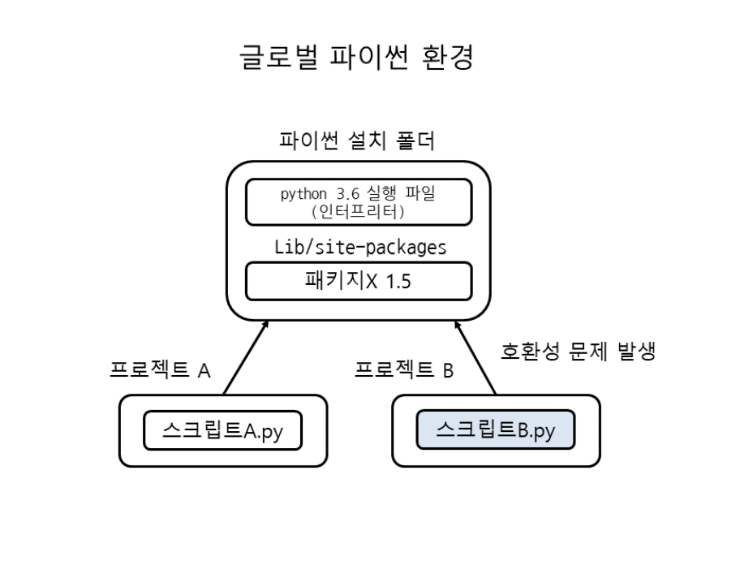
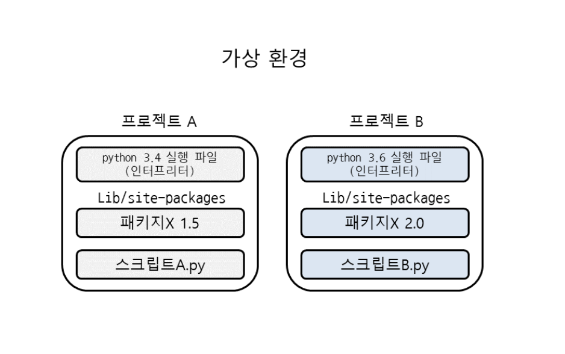

# 가상환경 사용하기 
* 사용이유: pip로 패키지 설치 -> 파이썬 설치 폴더(디렉터리)의 Lib/site-packages 안에 저장됨 => pip로 설치한 패키지는 모든 파이썬 스크립트에서 사용 가능  
> BUT 여러 프로젝트를 개발할 때 패키지 버전 문제 발생 가능. 패키지 버전이 달라짐에 따라 호환이 되지 않는다면 개발시 상당히 불편해짐 (ex. 프로젝트 A에서는 패키지X 1.5 사용 & 프로젝트 B에서는 패키지X 2.0 사용)
> 이런 문제를 해결하기 위해 파이썬에서는 가상 환경(virtual environment) 제공

`글로벌 파이썬 환경에서 패키지가 호환되지 않는 경우`


## 가상환경 
* 가상환경은 독립된 공간을 만들어 주는 기능 
* 가상환경에서 pip로 패키지를 설치하면 가상 환경 폴더(디렉터리)의 Lib/site-packages 안에 패키지 저장해줌으로써 서로 다른 개발 환경에서도 버전 문제 발생하지 않고 개발 가능!

`파이썬 가상환경으로 독립된 공간을 구성`



## 가상환경 만들기(윈도우 기준)

### **venv 모듈에 가상환경 이름 지정해서 만든다.**
    > python -m venv 가상환경이름 


1. Windows 명령 프롬프트
```
C:\project>python -m venv example # C:\project 폴더 아래 가상환경 생성 
C:\project>cd example             # example 폴더 안으로 이동 
C:\project\example>Scripts\activate.bat # Scripts 폴더 안의 activate.bat 파일 실행 
(example) C:\project\example>     # 가상환경 활성화됨을 확인 가능 
```

2. Windows PowerShell
```
PS C:\project> python -m venv example
PS C:\project> cd example
PS C:\project\example> .\Scripts\Activate.ps1 # Activate.ps1 파일 실행
(example) PS C:\project\example>
```

### **패키지 목록 관리**
가상 환경에 설치된 패키지는 목록을 저장해 두었다가 나중에 다시 설치 가능 

1. 패키지 목록 저장 
다음과 같이 pip freeze로 패키지 목록과 버전 정보를 requirements.txt 파일에 저장(git 등으로 버전 관리를 할 때 저장소에 설치된 패키지를 모두 추가하지 않고, requirements.txt 파일만 관리하면 OK)
```
(example) C:\project\example>pip freeze > requirements.txt
```

2. 목록대로 패키지 설치 
requirements.txt 파일의 내용대로 패키지를 설치하려면 pip install에서 -r 또는 --requirement 옵션을 사용 
```
(example) C:\project\example>pip install -r requirements.txt
```
* 반대로 requirement.txt파일의 내용대로 패키지를 삭제하려면?
```
(example) C:\project\example>pip uninstall -r requirements.txt
```


---
#### 참고
https://dojang.io/mod/page/view.php?id=2470