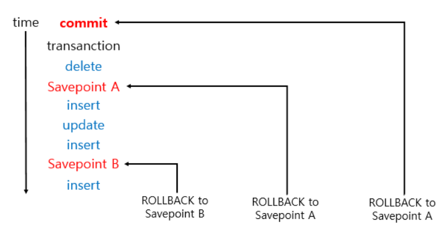

## TCL - COMMIT, ROLLBACK 
---

###  Savapoint 의미
- **현재 작업 중인 transaction을 잘게 쪼개는 역할**
- Savepoint를 저장해서 rollback to [savepoint]라는 명령어를 통해 지정한 savepoint로 rollback 명령을 수행할 수 있음 
  
  

  출처: seulhee030 tistory 

  - (1) rollback to savepoint B: 지정해줬던 savepoint B 시점으로 이동하여 B 시점 이후로 수행했던 작업들이 rollback 됨 
  - (2) rollback to savepoint A: 지정해줬던 savepoint A 시점으로 이동하여 A 시점 이후로 수행했던 작업들이 rollback 됨 
  - (3) rollback: 마지막 commit 시점으로 이동하여, 그 이후에 일어났던 모든 작업들이 rollback
  
 

---
#### 참고자료
@ https://seulhee030.tistory.com/52