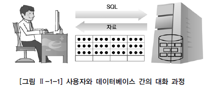
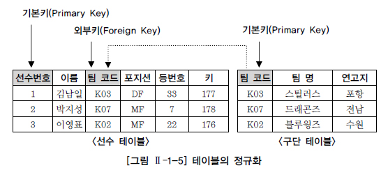
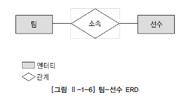

# 데이터베이스 

**데이터를 일정한 형태로 저장해 놓은 것**

ex) 
- 학교: 학생 관리 목적으로 학생 개개인의 정보 저장 
- 기업: 직원 관리 차원에서 이름, 부서, 월급 등의 정보 저장 

특정 기업이나 조직 또는 개인의 필요에 의해 엑셀과 같은 소프트웨어 이용하여 정리하여 저장
> But 관리 대상이 되는 데이터의 양이 점점 많아지고 같은 데이터를 여러 사람이 동시에 여러 용도로 사용하게 되면서 단순히 엑셀 같은 개인이 관리하는 소프트웨어 만으로는 한계에 부딪히게 됨. 또한, 부주의로 인해 데이터가 손상되거나 유실되는 상황 발생 가능 

> 보다 효율적인 데이터의 관리 및 예기치 못한 사건으로 인한 데이터 손상 방지와 더불어 필요시 필요한 데이터를 복구하기 위해 강력한 기능의 소프트웨어를 필요로하게 되었고 이러한 기본적인 요구사항을 만족시켜주는 시스템을 `DBMS(Database Management System)`라고 함

 

### 데이터베이스의 발전 

- 1960년대: 플로우차트 중심 개발 방법 사용. 파일 구조를 통해 데이터 저장 및 관리 
- 1970년대: DB관리 기법이 처음 태동되던 시기. 계층형(Hierarchial) DB, 망형(Network) DB 같은 제품들의 상용화 
- 1980년대: 현재 대부분의 기업에서 관리되고 있는 관계형 DB 사용화. Oracle, Sysbase, DB2와 같은 제품이 사용됨
- 1990년대: Oracle, Sysbase, Informix, DB2, Teradata, SQL Server 외 많은 제품들이 보다 향상된 기능으로 정보시스템의 핵심 솔루션으로 자리잡게 됨 

 

### 관계형 데이터베이스(Relational Database)
- 기존 파일시스템의 문제점: 하나의 파일을 많은 사용자가 동시 검색은 가능하나 입력, 수정, 삭제는 할 수 없으므로 원래의 데이터 파일을 여러 개 복사하여 사용하게 됨. 여러 개의 데이터 파일이 존재하는 경우, 동일한 데이터가 여러 곳에 저장되는 문제가 발생하고, 하나의 원본 파일에 대한 변경 작업이 발생했을 때 모든 복사본 파일에 대한 변경 작업을 한꺼번에 병행하지 않으면 서로 다른 정보 파일이 존재하기 때문에 데이터의 불일치성 발생
    > 파일시스템은 분산된 데이터 간의 정합성을 보장하기 힘들게 된다! 

- 관계형 DB는 정규화를 통한 합리적인 테이블 모델링을 통해 이상 현상을 제거하고 데이터 중복을 피할 수 있으며 동시성 관리, 병행 제어를 통해 많은 사용자들이 동시에 데이터 공유 및 조작 가능 
- 메타 데이터를 총괄할 수 있으므로 데이터의 성격, 속성 또는 표현 방법 등 체계화 가능 
- 데이터 표준화를 통한 데이터 품질 확보  
- 인증된 사용자만이 참조할 수 있도록 보안 기능 제공 
- 테이블 생성 시 다양한 제약조건을 이용해 사용자가 실수로 조건에 위배되는 데이터 입력, 관계를 연결하는 중요 데이터 삭제 방지 등을 통해 데이터 무결성(Integrity)를 보장 가능 
- 시스템 장애로부터 사용자가 입력, 수정, 삭제하던 데이터가 제대로 반영될 수 있도록 보장해주는 기능과 시스템 다운, 재해 등의 상황에서도 데이터를 회복/복구할 수 있는 기능 제공

 

# SQL(Structured Query Language)
- 관계형 DB에서 데이터 정의, 데이터 조작, 데이터 제어를 하기 위해 사용하는 언어 
- 일반적인 프로그래밍 언어와 달리 SQL은 관계형 DB에서 전담 접속(다른 언어는 관계형 DB에 접속 불가)
- 특정 데이터들의 집합에서 필요로 하는 데이터를 꺼내서 조회하고, 새로운 데이터를 입력/수정/삭제하는 행위를 통해 사용자는 DB와 대화할 수 있게 됨. 그리고 **SQL은 이러한 대화를 가능하도록 하는 매개역할** 

    

### SQL 명령어 

|종류              | 명령어          | 설명                                             |
|------------------|----------------|--------------------------------------------------|
|데이터 조작어(DML)| SELECT          | 데이터 조회, 검색                                 |
|                 | INSERT, UPDATE, DELETE | 테이블에 들어있는 데이터에 변형을 가하는 명렁어(새로운 행 삽입, 데이터 삭제, 수정) | 
|데이터 정의어(DDL)| CREATE, ALTER, DROP, RENAME | 테이블과 같은 데이터 구조 정의하는데 사용되는 명령어(구조 생성, 삭제, 변경) | 
|데이터 제어어(TCL)| COMMIT, ROLLBACK | 논리적인 작업의 단위를 묶어 DML에 의해 조작된 결과를 작업단위(트랜잭션) 별로 제어하는 명령어 |

 

# TABLE
- 테이블은 어느 특정한 주제와 목적으로 만들어지는 일종의 집합 
- 데이터는 관계형 DB의 기본 단위인 테이블 형태로 저장됨 
- 모든 자료는 테이블에 등록이 되고, 사용자는 테이블로부터 원하는 자료를 꺼내올 수 있음 
- 테이블에 등록된 자료들은 삭제하지 않는 한 지속적으로 유지됨 
- 자료 입력하지 않는다면 테이블은 본래 만들어졌을 때부터 가지고 있는 속성 그대로 유지하면서 존재하게 됨 
  
 

### 테이블 구조
    
  
  - 테이블은 데이터를 저장하는 객체(Object)로서 관계형 DB의 기본 단위로 관계형 DB에서는 모든 데이터를 칼럼과 행의 2차원 구조로 나타냄 
  - 다시 말해 테이블은 **행과 칼럼의 2차원 구조를 가진 데이터의 저장 장소**
  - 세로 방향 칼럼(Column)
  - 가로 방향 행(Row)
  - 칼럼과 행이 겹치는 하나의 공간 필드(Field)

### 테이블 저장 
- A의 관련된 데이터를 저장할 때 모든 데이터를 하나의 테이블로 저장 X 
- A와 관련된 데이터들을 모아 복수의 테이블로 분할 저장 
- 분할된 테이블은 그 칼럼의 값에 의해 연결됨 
  > 테이블을 분할하여 데이터의 불필요한 중복을 줄이는 것을 `정규화(Normalization)`라고 함. 데이터의 정합성 확보와 데이터 입력/수정/삭제 시 발생할 수 있는 이상현상을 방지하기 위해 정규화는 관계형 DB 모델링에서 매우 중요한 프로세스 

  

 

### 테이블 관계 용어들 
| 용어                  | 설명                                                          |
|----------------------|---------------------------------------------------------------|
|정규화(Normalization)  | 테이블을 분할하여 데이터의 정합성을 확보 및 불필요한 중복줄이는 프로세스 |
|기본키(Primary Key)    | 테이블에 존재하는 각 행을 한 가지 의미로 특정할 수 있는 한 개 이상의 칼럼|
|와부키(Foreign Key)    | 다른 테이블의 기본키로 사용되고 있는 관계를 연결하는 칼럼 |

 

# ERD(Entity Relationship Diagram)
- 테이블 간 서로의 상관관계를 그림으로 도식화한 것을 E-R 다이어그램이라고 함 
- ERD의 구성 요소는 엔터티(Entity), 관계(Relationship), 속성(Attribute) 3가지 

  

 

#### 참고자료
@ https://dataonair.or.kr/db-tech-reference/d-guide/sql/?pageid=4&mod=document&uid=337