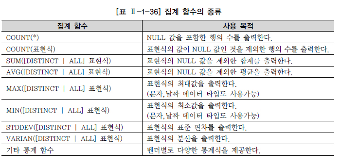

## 집계 함수(Aggregate Function)
---
- 다중행 함수 중 집계 함수의 특성 
  - 여러 행들의 그룹이 모여 **그룹당 단 하나의 결과**를 돌려주는 함수 
  - GROUP BY절: 행들을 소그룹화 
  - SELECT, HAVING, ORDER BY 절에 사용 가능 
  
  

<br>

### GROUP BY절 
- SQL문에서 FROM절과 WHERE절 뒤에 오며, 데이터들을 작은 그룹으로 분류하여 소그룹에 대한 항목별로 통계 정보를 얻을 때 추가로 사용 
- 집계함수와 함께 사용되는 상수는 GROUP BY절에 추가하지 않아도 됨 
- GROUP BY절은 집계 함수 없이도 사용될 수 있음 (DISTINCT와 용도가 비슷해짐)
- 예제)
  
```MySQL
-- 부서별 사원수 조회
SELECT '2005년' year, deptno 부서번호, COUNT(*) 사원수 
    FROM emp
    GROUP BY deptno
    ORDER BY COUNT(*) DESC;
```

<br>

### HAVING 절 
- WHERE 절에서는 집계함수를 사용할 수 없음 
- HAVING 절은 집계함수를 가지고 조건비교를 할 때 사용함 
- HAVING 절은 GROUP BY 절과 함께 사용됨 
- 예제)

```MySQL
-- 사원수가 다섯 명이 넘는 부서와 사원수 조회

SELECT b.dname, COUNT(a.empno) "사원수"
    FROM emp a, dept b
    WHERE a.deptno = b.deptno
    HAVING COUNT(a.empno) > 5;
```

```MySQL
-- 전체 월급이 5000을 초과하는 JOB에 대해 JOB과 월급여 합계 조회 
-- 단, 판매원(SALES)는 제외하고 월 급여 합계로 내림차순 정렬

SELECT job, SUM(sal) "급여합계"
    FROM emp
    WHERE job != 'SALAES'   -- 판매원은 제외
    GROUP BY job            -- 업무별로 GROUP BY
    HAVING SUM(sal) > 5000  -- 전체 월급이 5000을 초과하는 
    ORDER BY SUM(sal) DESC; -- 월급여 합계로 내림차순 정렬
```

<br>

### 특징 
- GROUP BY 절과 HAVING 절의 특징 
  - GROUP BY 절을 통해 소그룹별 기준을 정한 후, SELECT 절에 집계 함수를 사용함
  - 집계 함수의 통계 정보는 NULL 값을 가진 행을 제욓고 수행 
  - GROUP BY 절에서는 SELECT 절과 달리 ALIAS 명을 사용할 수 없음
  - 집계 함수는 WHERE 절에 올 수 없음 (집계 함수를 사용할 수 있는 GROUP BY 정보다 WHERE 절이 먼저 수행됨)
  - WHERE 절은 전체 데이터를 GROUP으로 나누기 전에 행들을 미리 제거시킴 
  - HAVING 절은 GROUP BY 절의 기준 항목이나 소그룹의 집계 함수를 이용한 조건을 표시할 수 있음
  - GROUP BY 절에 의한 소그룹별로 만들어진 집계 데이터 중, HAVING 절에서 제한 조건을 두어 조건을 만족하는 내용만 출력 
  - HAVING 절은 일반적으로 GROUP BY 절 뒤에 위치 

<br>

---
#### 참고자료
@ https://dataonair.or.kr/db-tech-reference/d-guide/sql/?mod=document&uid=343
@ http://www.gurubee.net/lecture/1032