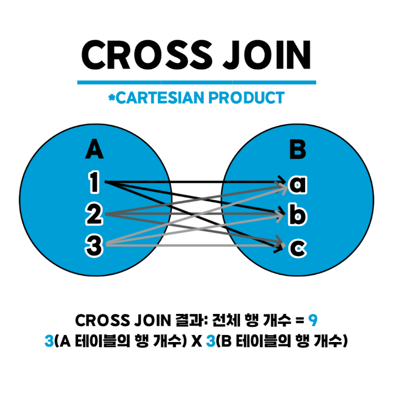
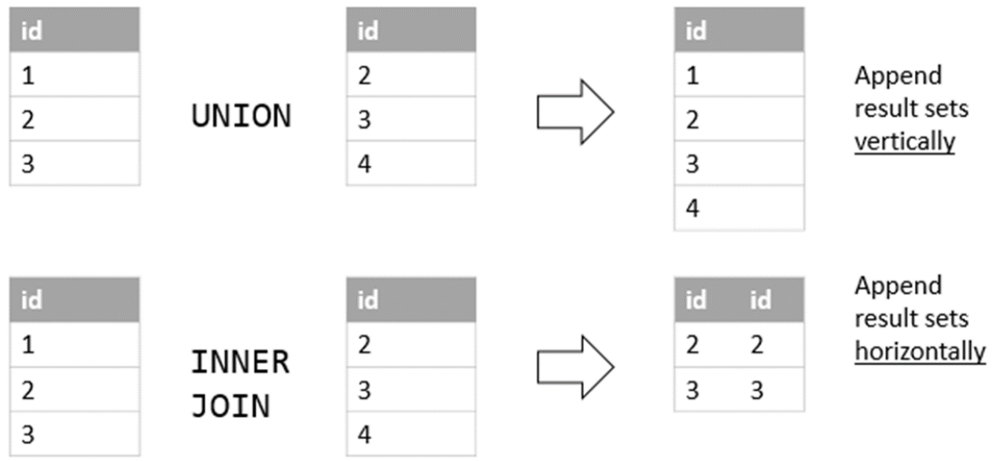
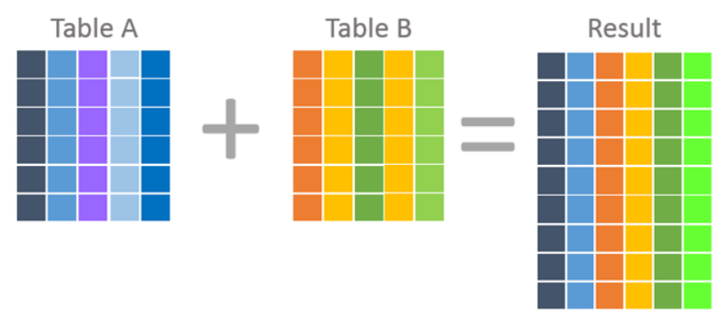

## JOIN
---
- 두 개의 테이블을 서로 묶어서 데이터를 검색하는 방법
- 연결하기 위해서는 테이블이 **적어도 하나의 컬럼을 공유**해야 함 
- 일반적인 경우 행들은 PRIMARY KEY(PK)나 FOREIGN KEY(FK) 값의 연관에 의해 JOIN이 성립됨 
- 하지만 어떤 경우엔 이러한 PK, FK의 관계가 없어도 논리적인 값들의 연관만으로 JOIN이 성립 가능
  
  

  출처: &nbsp;https://lyk00331.tistory.com/107

<br>

### INNER JOIN(내부 조인)
- 두 테이블을 조인할 때, 두 테이블에 모두 지정한 열의 테이터가 존재해야 함
- **교집합**
  
  

```SQL
SELECT <열 목록>
FROM <첫 번째 테이블>
    JOIN <두 번째 테이블>
    ON <조인될 조건>
[WHERE 검색 조건]
```

- INNER JOIN을 JOIN이라고만 써도 INNER JOIN으로 인식함 
  
  
```SQL
SELECT <열 목록>
FROM <첫 번째 테이블>, <두 번째 테이블>

WHERE 조인될 조건 AND 검색 조건 
```

- "," = JOIN 
- ON에 쓸 조인 조건을 WHERE에 써서 더욱 간략하게 작성 가능 

<br>

### OUTER JOIN(외부 조인)
- 두 테이블을 조인할 때, **1개의 테이블에만 데이터가 있어도** 결과가 나옴
- **합집합**
  
  

```SQL
SELECT <열 목록>
FROM <첫 번째 테이블(LEFT 테이블)>
        <LEFT | RIGHT | FULL> OUTER JOIN <두 번째 테이블(RIGHT 테이블)>
        ON <조인될 조건>
[WHERE 검색 조건]
```
- LEFT OUTER JOIN - 왼쪽 테이블 모든 값 출력 
- RIGHT OUTER JOIN - 오른쪽 테이블 모든 값 출력 
- FULL JOIN - 왼쪽, 오른쪽 테이블 모든 값 출력 

<br>

### CROSS JOIN(상호 조인)
- 한쪽 테이블의 모든 행과 다른 쪽 테이블의 모든 행을 조인
- 상호 조인의 결과, 전체 행 개수는 두 테이블의 각 행수를 곱한 수 
- 카디션 곱(CARTESIAN PRODUCT)라고도 함 
  
  

```SQL
SELECT *
FROM <첫 번째 테이블>
    CROSS JOIN <두 번째 테이블>
```

<br>

### SELF JOIN(셀프 조인)
- 자신과 자신이 조인한다는 의미 
- 1개의 테이블 사용 (동일 테이블 사이의 조인)
- FROM 절에 동일 테이블이 두 번 이상 나타남
- 동일 테이블 사이의 조인을 수행하면 테이블과 칼럼 이름이 모두 동일하기 때문에 식별을 위해 반드시 테이블 별칭(Alias)를 사용해야 함 

  

```SQL
SELECT <열 목록>
FROM <테이블> 별칭 A
    INNER JOIN <테이블> 별칭 B
    ON <조인될 조건>
[WHERE 검색 조건]
```

<br>

## UNION
---
- 여러 개의 SELECT문의 결과를 단일 세트로 연결 표현할 때 사용 
- 합친 결과에서 중복되는 행은 하나만 표시 
  - DISTINCT 키워드를 따로 명시하지 않아도 기본적으로 중복되는 레코드를 제거 
- UNION 내의 각 SELECT문은 **같은 수의 열**을 가져야 함 
- 각각 SELECT문의 열을 또한 **동일한 순서**로 있어야 함 
- 열은 **호환되는 데이터 형식**을 가져야 함 
  
  

  출처: https://www.devart.com/dbforge/sql/sqlcomplete/union-vs-union-all.html


```SQL
SELECT * FROM A
UNION (ALL)
SELECT * FROM B
```

<br>

### UNION ALL 
- 두 SQL문의 결과를 결합하는 데 사용 
- UNION과 UNION ALL의 차이  
  - UNION ALL의 경우 데이터 값이 중복하더라도 조건에 일치하는 데이터를 모두 표시 
  - 즉, 중복 제거하지 않음
  


<br>

## JOIN vs UNION
---


출처: https://lyk00331.tistory.com/m/110

| JOIN                                               | UNION                                           |
|----------------------------------------------------|-------------------------------------------------|
|적어도 하나의 속성이 공통인 두 테이블 속성 결합하고자 할 때 사용 | 하나의 결과 세트만 나타냄               |
|새로운 열로 결헙 (**수평결합**)                     |새로운 행으로 결합 (**수직결합**)                   |

- JOIN
  


- UNION
  


<br>

---
#### 참고자료 
@ https://monawa.tistory.com/103#recentComments
