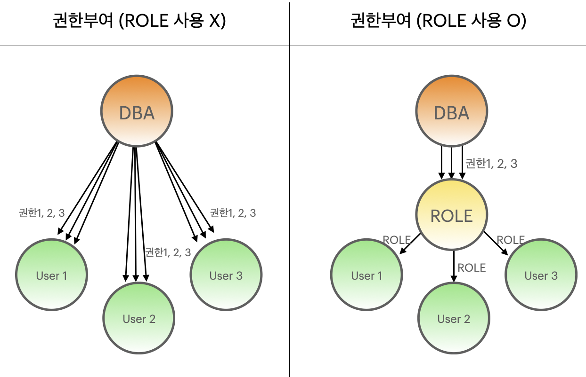

## 롤(ROLE)
---
- 사용자에게 허가할 수 있는 **권한들의 집합**
- 롤을 이용하면 권한 부여와 회수를 쉽게 가능 
- 롤은 CREATE ROLE 권한을 가진 USER에 의해서 생성됨 
- 한 사용자가 여러 개의 ROLE을 ACCESS 할 수 있고, 여러 사용자에게 ROLE을 부여 가능 
- 시스템 권한을 부여 & 취소할 때와 동일한 명령을 사용하여 사용자에게 부여하고 취소함 
- 사용자는 ROLE에 ROLE을 부여할 수 있음
- Orable DB를 설치하면 기본적으로 CONNECT, RESOURCE, DBA ROLE이 제공됨 


    

<br>

### 1. ROLE 생성하기 

```SQL
CREATE ROLE manager;
```

### 2. ROLE에 권한 부여하기 

```SQL
GRANT CREATE SESSION, CREATE TABLE TO manager;
```

### 3. 권한이 부여된 ROLE을 USER나 ROLE에 부여하기 

```SQL
GRANT manager TO scott, test; // scott,  test라는 유저에게 부여한다는 의미 
```