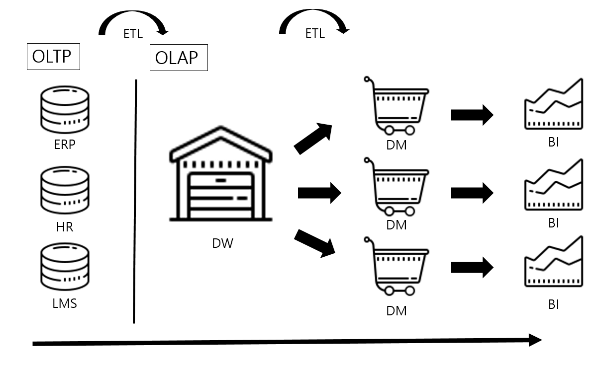

## DW, DM 개념의 등장 

- DW, DM의 등장 이유는 BI로 데이터를 시각화시키기 위함 
- 그리고 BI는 의사결정자들을 위해 탄생하게 됨

 

- ex) 부품제조업체 A기업은 수 억원을 들여 기업 내 ERP를 구축하게 되었음. 그래서 현재 제조하고 있는 제품에 대한 데이터들이 하나씩 쌓이며 기업 자체 데이터를 확보하게 되었음. 이때 A기업 CEO가 ERP를 보며 이걸로 할 수 있는 것이 무엇인지 설명하라고 했을 때 담당자는 어떻게 말해야 할까? 의사결정권자들은 수 억이나 들인 ERP 시스템이 도대체 본인들의 회사 미래에 어떤 영향을 줄 수 있을 지에 궁금하고, 당장 실물로 보고싶어 함. 그렇기에 해당 ERP = OLTP 데이터를 분석관점에서 풀어 의사결정권자들에게 정보를 제공하는 데이터로 바꾸기 위해 OLAP가 탄생했고, DW, DM, BI 개념이 등장하게 됨 

 

- OLTP와 OLAP
  - OLTP 데이터들은 정규화가 지켜지지 않으면 무결성 원칙에 위배되어 각각의 비즈니스에 맡게 적재되도록 설계된 데이터가 들어올 때 문제를 일으킴. 따라서 정규화가 기본적으로 지켜져야 함 
  - 반면 OLAP 환경은 각 OLTP에 있는 데이터가 모여 정보를 만들어 내는 것이 중요하기 때문에 정규화가 중요하지 않고 속성(열)의 의미가 중요함. 그래서 OLAP 환경에 쌓이는 열별 데이터의 행이 가지는 의미가 가장 중요 
  - DW의 개념은 분석을 원칙으로 하며 OLAP 환경으로 개발되어지는 이유 
  - 또한, OLTP에서 OLAP 한경으로 데이터를 보내는 과정을 ETL 기술로 처리하며 ETL 내에 데이터를 이동시키는 길을 데이터 파이프라인이라고 함 
  - 이 ETL 기술은 OLTP에서 OLAP로 데이터를 흘릴 때 개발되고, DW, DM에서도 ETL이 등장하게 됨

 

## DW, DM, BI

- OLAP에서 DW와 DM이 어떻게 구성되어 BI로 전달되는가? 
- OLTP 데이터들은 ETL로 가져와 OLAP 환경이 구성되면 DW가 만들어짐
- 이 DW 안에는 한 기업에서 사용하는 모든 시스템들의 데이터가 들어있음 
- 예를 들어 생산, 제조, 인사, 고객 데이터 등의 OLTP에서는 각각 분할된 시스템 데이터가 OLAP의 DW에선 하나로 합쳐진 것 
- 이러한 기업의 데이터를 하나로 합친 개념이 EDW(Enterprise Data Warehouse)
- 기업에 모든 데이터가 하나로 합쳐진 데이터 웨어하우스(DW)의 용량은 기업마다 다르겠지만 OLTP보단 훨씬 크기 때문에 DW에 BI 솔루션을 도입해 데이터를 시각화 시킨다면 퍼포먼스 문제가 발생하게 될 것 
- 즉, BI 화면에 DW 있는 데이터를 가져오는데 로딩시간이 길어지는 등의 문제점 발생 

 

- 이런 문제를 해결하기 위한 방법이 데이터 마트(DM)로 구축하는 방법 
- DW내 데이터를 주제영역별로 나누어 각 주제에 맞는 데이터를 따로 보관하여 생성한 두 번째 DW를 데이터 마트라고 함
- 그리고 주제별로 구성된 데이터 마트에 BI를 연결시켜 퍼포먼스를 향상했고 이러한 로직대로 OLAP 환경이 구축됨 
- 데이터 웨어하우스에 데이터 마트까지 ETL을 통해 주제영역별로 나누어 데이터를 보낸 후 마트가 완성되면 BI는 해당 마트를 바라보아 데이터를 시각화
- 단, 마트를 구성하게 된다면 하나의 마트에는 하나의 BI화면이 보여져야 하기 때문에 다른 데이터의 BI화면을 개발하고 싶다면 해당 주제에 맞는 데이터 마트를 구성해야 함
  
 

- BI는 정형 리포트와 비정형 리포트로 나누어지게 됨
- 정형리포트는 말 그대로 개발한 사람이 설계한 리포트대로만 보여지는 리포트로 PowerBI, Tableau 등이 있음
- 반면, 비정형 리포트는 보고싶은 관점에서 리포트를 보는 것으로 다차원으로 바라보는 리포트를 말함
- 다차원으로 빠르게 데이터를 바라보기 위해선 DW의 속성(열)에 따른 값을 미리 계산하여 가지고 있다가 사용자가 원하는 속성별로 연결시켜 값을 보여주는 개념 

 

## 결론 

- DW구성의 배경은 의사결정권자들의 미래를 위한 정보를 제공해주기 위해 탄생했고 그 과정은 OLTP - ETL - DW - ETL - DM - BI 순으로 진행됨 

    
    

 

#### 참고자료
@ https://in-harvey-it.tistory.com/24