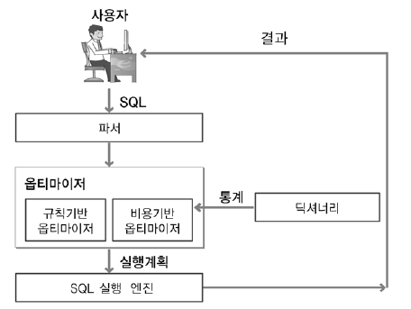

## 옵티마이저(Optimizer)
---
- 가장 효율적인 방법으로 SQL을 수행할 최적의 처리 경로를 생성해주는 DBMS의 핵심 엔진 
- 컴퓨터의 두뇌가 CPU인 것처럼 DBMS의 두뇌는 옵티마이저
- 개발자가 SQL을 작성하고 실행하면 소프트웨어 실행파일처럼 즉시 실행되는 것이 아닌 옵티마이저(Optimizer)라는 곳에서 "이 쿼리문을 어떻게 실행시키겠다!"라는 여러가지 실행계획을 세우게 됨. 이렇게 실행계획을 세운 뒤 시스템 통계정보를 활용하여 각 실행계획의 예상 비용을 산정한 후 각 실행계획을 비교해서 최고의 효율을 가지고 있는 실행계획을 판별한 후 그 실행계획에 따라 쿼리를 수행하게 되는 것 

 

 

### 옵티마이저 종류

- 규칙 기반 옵티마이저 
  - 개념: 사전에 정의된 규칙 기반
    - 실행 속도가 빠른 순으로 규칙을 먼저 세워두고 우선순위가 앞서는 방법을 채택하는 것 
  - 기준: 실행우선 순위(Ranking)
  - 인덱스: 인덱스 존재 시 가장 우선시 
  - 성능: 사용자 SQL 작성 숙련도 
  - 장점: 판단이 매우 규칙적 실행 예상 가능 
  - 단점: 예측 통계정보 요소 무시 
  - 사례: AND 중심 양쪽 '='시 Index Merge 사용 

 

- 비용 기반 옵티마이저 
  - 개념: 최소비용 계산 실행계획 수립
    - 옵티마이저 실행 계획을 세운 뒤(최대 2천개까지) 비용이 최소한으로 나온 실행 계획을 수행
  - 기준: 엑세스 비용(Cost)
  - 인덱스: Cost에 의한 결정 
  - 성능: 옵티마이저 예측 성능
  - 장점: 통계 정보를 통한 현실 요소 적용 (통계정보가 없는 경우 비효율적인 실행계획을 생성할 수 있으므로, 정확한 통계정보를 유지하는 것이 중요)
  - 단점: 최소 성능 보장 계획의 예측 제어 어려움
  - 사례: AND 중심 양쪽 '='시 분포도별 Index 선택   

 

### 주요 통계 정보들 

| 구분    | 세부 통계 정보                                 |
|--------|------------------------------------------------|
|테이블  |테이블의 전체 행의 갯수 |
|        |테이블이 차지하고 있는 전체 블록 갯수|
|        |테이블의 행들이 가지고 있는 평균 길이 | 
|컬럼    |컬럼 값의 종류   |
|        |컬럼 내부 Null 값의 분포도 |
|        |컬럼 값의 평균 길이|
|        |컬럼 내부 데이터 분포의 추정치 |
|인덱스  |LEAF BOLOCK 수: 데이터를 보관하는 블록 수|
|       |LEVELS: 인덱스 트리의 LEVEL 정보 |
|       |CLUSTERING FACTOR: 접근하고자 하는 데이터가 모여있는 밀집도|
|시스템  |I/O 성능 및 사용률|
|       |CPU 성능 및 사용률 |

 

---
#### 참고자료
@ https://coding-factory.tistory.com/743