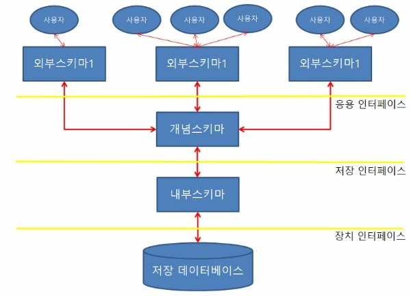

## 스키마 
---
- 데이터베이스의 구조와 제약 조건에 관한 전반적인 명세를 기술한 메타데이터의 집합
- 스키마는 데이터베이스를 구성하는 데이터 개체(Entity), 속성(Attribute), 관계(Relationship) 및 데이터 조작 시 데이터 값들이 갖는 제약 조건 등에 관해 전반적으로 정의함
- 스키나는 사용자의 관점에 따라 외부 스키마, 개념 스키마, 내부 스키마로 나눠짐 

 

 

### 스키마 특징 
- 데이터 사전에 저장되며, 다른 이름으로 메타데이터라고도 함
- 현실 세계의 특정한 한 부분의 표현으로서 특정 데이터 모델을 이용해서 만들어짐 
- 스키마는 시간에 따라 불변인 특성을 가짐 
- 데이터 구조적 특성을 의미하며, 인스턴스에 의해 규정됨

 

### 스키마의 3계층 
- 외부 스키마(External Schema) = 사용자 뷰(View)
  - 사용자나 응용프로그래머가 각 개인의 입장에서 필요로 하는 데이터베이스의 논리적 구조를 정의한 것
  - 전체 데이터베이스의 한 논리적인 부분으로 볼 수 있으므로 서브 스키마라고도 함 
  - 하나의 데이터베이스 시스템에는 여러개의 외부 스키마가 존재할 수 있으며 하나의 외부 스키마를 여러 개의 응용 프로그램이나 사용자가 공용할 수도 있음
  - 일반 사용자는 질의어(SQL)을 이용하여 DB를 쉽게 사용 가능 
  - 응용 프로그래머는 C, JAVA 등의 언어를 사용하여 DB에 접근

 

- 개념 스키마(Conceptual Schema) = 전체적인 뷰(View)
  - 데이터베이스의 전체적인 논리 구조
  - 모든 응용 프로그램이나 사용자들이 필요로 하는 데이터를 종합한 조직 전체의 데이터베이스로 하나만 존재
  - 개체간의 관계와 제약 조건을 나타내고 데이터베이스의 접근 권한, 보안 및 무결성 규칙에 관한 명세를 정의
  - 데이터베이스 파일에 저장되는 데이터 형태를 나타내는 것 
  - 기관이나 조직체의 관점에서 데이터베이스를 정의한 것 
  - 데이터베이스 관리자(DBA)에 의해서 구성됨 

 

- 내부 스키마(Internal Schema) = 저장 스키마(Storage Schema)
  - 물리적 저장장치 입장에서 본 데이터베이스 구조로 물리적인 저장장치와 밀접한 계층
  - 실제로 데이터베이스에 저장될 레코드의 물리적 구조를 정의하고, 저장 데이터 항목의 표현 방법, 내부 레코드의 물리적 순서 등을 나타냄
  - 시스템 프로그래머나 시스템 설계자가 보는 관점의 스키마 

 

---

#### 참고자료
@ https://coding-factory.tistory.com/216
