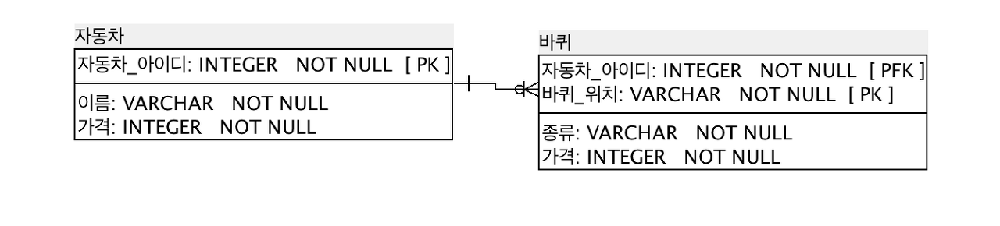
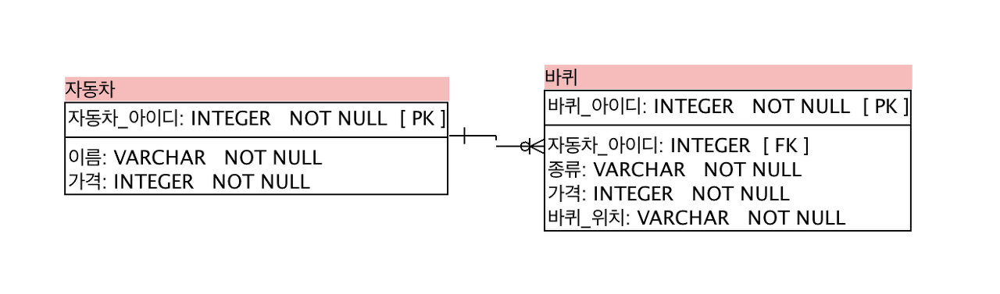

RDBMS의 테이블 생성 및 각 테이블마다 관계를 설정할 때 일반적으로 외래키를 사용 함. 외래키를 통해 다른 테이블과 같은 키를 공유하고 이를 이용해 조인하여 관계를 이용하는 방식 사용 
> 이처럼 외래키를 사용하여 테이블 간 관계를 적립해줄때 사용하는 전략은 크게 식별 관계, 비식별 관계 전략으로 나뉨 

 

## 식별관계
---

출처: deveric tistory 

- **부모 테이블의 기본키**를 **자식 테이블이 자신의 기본키로 사용**하는 관계 
- 즉, 부모 테이블의 키가 자식의 테이블에 포함되기 때문에 부모 테이블에 데이터가 존재해야 자식 테이블에 데이터를 입력할 수 있음 (부모 테이블에 자식 테이블이 종속)
- 따라서 **부모 데이터가 없다면 자식 데이터는 생길 수 없음** 
- 표현 방법: 식별관계는 ERD 상에서 실선으로 표시 

 

### 장단점 
- 장점
  - 데이터의 정합성 유지를 DB에서 한 번 더 가능
  - 자식 테이블에 데이터가 존재한다면 부모 데이터도 반드시 존재한다고 보장 가능
- 단점
  - 요구 사항이 변경되었을 경우 구조 변경의 어려움 
  
 

## 비식별관계
---

- **부모 테이블의 기본키**를 자신의 기본키로 사용하지 않고 **외래키로 사용**하는 관계
- 자식 테이터는 부모 데이터가 없어도 독립적으로 생성 가능 
- 부모와의 의존성을 줄일 수 있으므로 조금 더 자유로운 데이터 생성과 수정 가능 

 

### 장단점
- 장점
  - 변경되는 요구사항을 유동적으로 수용 가능
  - 부모 데이터와 독립적인 자식 데이터 생성 가능
- 단점
  - 데이터 정합성을 지키기 위해서는 별도의 비즈니스 로직 필요
  - 자식 데이터가 존재해도 부모 데이터가 존재하지 않을 가능성 존재(즉, 데이터 무결성 보장 X)

 

### 예시
- 자동차 테이블(부모 테이블)

|자동차_아이디(PK)   |이름     |가격     |
|-------------------|---------|---------|
|12345              |4륜차    |10,000   |

 

- 자동차 바퀴 테이블

|자동차_아이디(PK, FK)  |바퀴_위치(PK)          |
|----------------------|-----------------------|
|12345                 |"FRONT_LEFT"           |
|12345                 |"FRONT_RIGHT"          |
|12345                 |"BACK_LEFT"            |
|12345                 |"BACK_RIGHT"           |

- 개발자가 왼쪽 앞바퀴를 추가적으로 입력하려고 해도, PK는 중복해서 존재할 수 없으므로 입력 자체가 불가능함. 다시 말해 데이터 정합성을 DB에서도 체크할 수 있게 되는 것 
  
  식별 관계는 요구사항이 변하지 않을 때 강력한 데이터 정합성을 보장할 수 있음. 하지만 앞쪽, 왼쪽 바퀴를 1개가 아닌 3개 이상 허용해야 한다고 요구사항을 변경한다면 복잡해짐

  이미 FRONT_LEFT 위치에 데이터가 입력되어 있으므로, 이곳에 데이터를 넣기 위해서는 바퀴 위치 공통 코드를 변경하거나 테이블의 데이터와 구조를 모두 변경해야 하는 불상사가 발생함. **데이터 정합성을 지키기 위해 진행한 식별관계는 유동적인 요구사항을  수용하기 어렵게 만들기도 한다는 것을 기억**

  > 테이블 설계 시 비식별 관계로 테이블 설계가 권장되는 이유 

- IF..비식별 관계로 테이블을 식별했다면 

|바퀴_아이디(PK)    |자동차_아이디(FK)      |바퀴_위치            |
|------------------|-----------------------|--------------------|
|11111             |12345                  |"FRONT_LEFT"        |
|11112             |12345                  |"FRONT_LEFT"        |
|11113             |12345                  |"FRONT_LEFT"        |
|11114             |12345                  |"FRONT_RIGHT"       |

  - 비식별 관계에서는 자동차를 만들기 전, 바퀴 데이터를 입력해야 한다고 요구사항이 변경되었을 때도 자신만이 가지고 있는 인조키인 "바퀴_아이디"를 가지고 있기 때문에 수용 가능 (부모 테이블과 종속적인 관계없이 독립적으로 존재할 수 있기 때문)

 

---
#### 참고자료
@ https://deveric.tistory.com/108