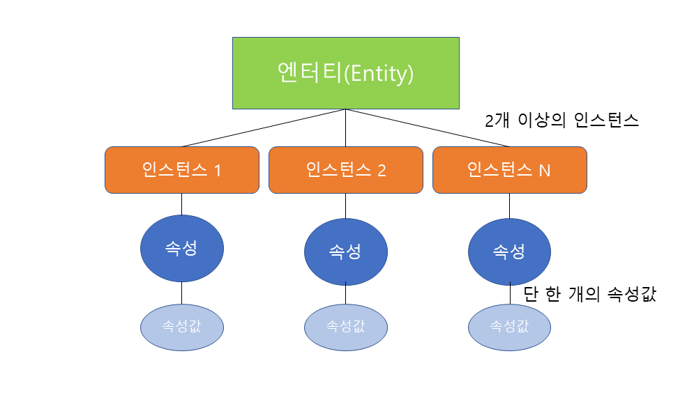
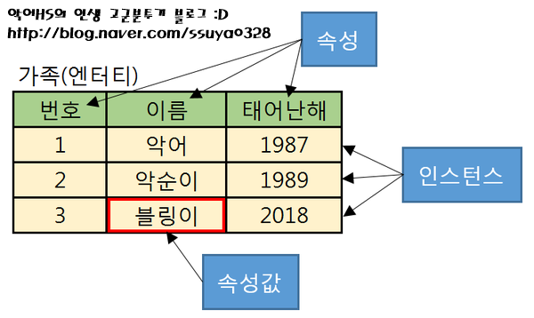

## 엔터티(Entity)
---
- 실체, 객체
- 사람, 사물, 장소와 같이 **여러 특징(속성)을 가진 집합체**
- 업무에 필요하고 유용한 정보를 저장, 관리하기 위한 것 
- ex) 엔터티 - 학생 & 속성- 학번, 이름, 전공 

- 특징
  - 반드시 해당 업무에서 필요하고 관리하고자 하는 정보일 것 
  - 유일한 식별자에 의해 식별 가능 
  - 영속적으로 존재하는 두 개 이상의 인스턴스 집합
  - 반드시 속성을 지님 
  - 다른 엔터티와 최소 한 개 이상의 관계가 있어야 함 

 

### 엔터티 분류 

1. `실체유형`에 따른 분류 
   1) 유형 엔터티(Tangible Entity): 물리적 형태 존재
   2) 개념 엔터티(Conceptual Entity): 물리적인 형태 존재하지 않고 just 관리해야 할 개념적인 정보로 구분 
   3) 사건 엔터티(Event Entity): 업무를 수행함에 따라 발생 

2. `발생시점`에 따른 분류
   1) 기본/키 엔터티(Fundamental/Key Entity):
        - **독립적**으로 존재하며 다른 엔터티의 부모역할
        - 다른 엔터티로부터 주식별자 상속받지 않고 자신의 고유한 주식별자 가짐 
   2) 중심 엔터티(Main Entity):
        - 기본 엔터티로부터 발생 
        - 다른 엔터티와의 관계를 통해 행위 엔터티 생성 
   3) 행위 엔터티(Active Entity):
        - 두 개 이상의 부모 엔터티로부터 주로 발생 
        - 자주 내용이 바뀌거나 데이터양 증가 

 

### 엔터티 이름 부여 
- 현업업무에서 사용하는 용어 사용
- 가능한 약어 사용 X 
- 단수 명사 사용
- 유일한 이름 부여 
- 생성의미대로 이름 부여 

 

## 인스턴스(Instance)
---
- DB에 저장된 데이터 내용의 전체 집합 

 

## 속성(Attribute)
---
- 더 이상 분리되지 않는 최소의 데이터 단위
- 특징 
  - 해당 업무에서 필요하고 관리하고자 하는 정보 
  - 주 식별자를 통해서 식별 가능 (주 식별자에 함수적 종속성을 가짐)
  - **하나의 속성에는 단 한 개의 속성값**을 지님 

 

### 속성의 분류 

1. 속성의 특성에 따른 분류 
   1) 기본 속성(Basic Attribute): 업무 분석을 통해 바로 정의한 속성 
   2) 설계 속성(Designed Attribute): 업무를 규직화하기 위해 새로 만들어지거나 변형된 것으로 일련변호와 같은 속성 
   3) 파생 속성(Derived Attribute): 다른 속성에 영향을 받아 발생한 것으로 일반적으로 **계산된 값** 

2. 엔터티 구성방식에 따른 속성
   1) PK(Primark key) 속성 
   2) FK(Foreign key) 속성 
   3) 일반 속성 - PK, FK에 포함되지 않는 속성 

 

### 도메인(Domain)
- 속성이 가질 수 있는 **범위** 
- ex) 속성이 가질 수 있는 데이터 타입과 크기 등 제약사항 

 

### 속성의 이름 부여 
- 해당 업무에서 사용하는 이름 부여 
- 약어 사용 지양 
- 전체 데이터 모델에서 유일성 확보 
- 서술식 속성명 사용 X 

 

## **엔터티, 인스턴스, 속성, 속성값의 관계**
- 한 개의 엔터티 - 두 개 이상의 인스턴스 집합 & 두 개 이상의 속성값 지님 
- 한 개의 속성 - 한 개의 속성 값 
  
  

  출처: libra303 velog

-  ex) 
    - 엔터티: 테이블
    - 속성: 열(row)
    - 인스턴스: 행(column)
    - 관계: 테이블 간의 관계
    - 식별자: key 

  
         

 

---
#### 참고자료
@ https://velog.io/@libra303/SQLD%EC%97%94%ED%84%B0%ED%8B%B0%EC%9D%B8%EC%8A%A4%ED%84%B4%EC%8A%A4%EC%86%8D%EC%84%B1