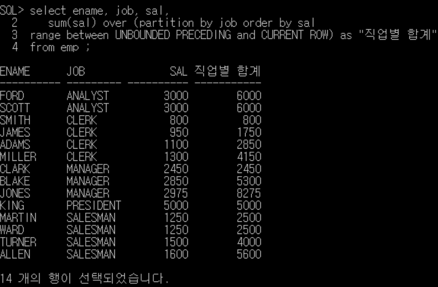
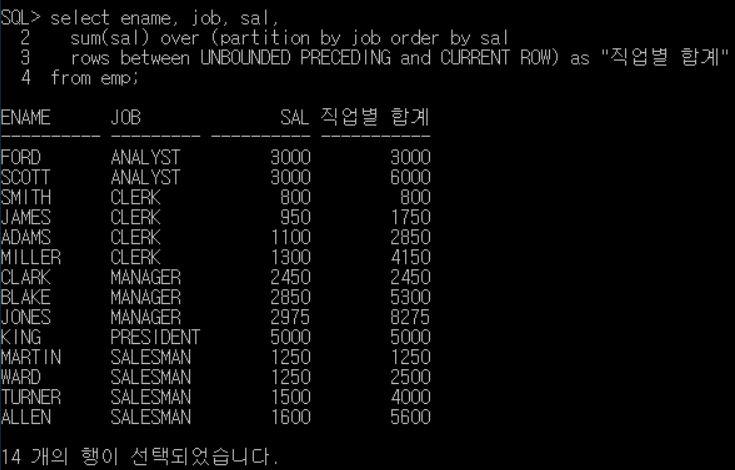
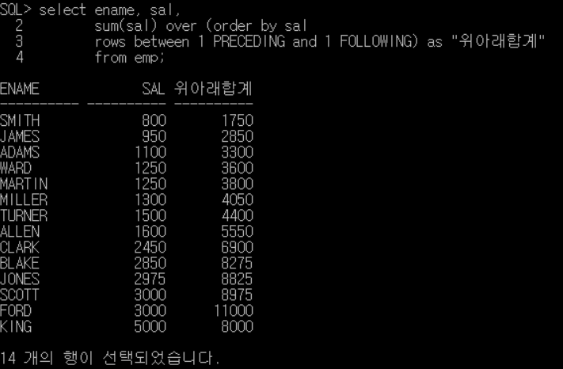

## 윈도우 함수(WINDOW FUNCTION)
---
- 행과 행 간을 비교, 연산, 정의하기 위한 함수 
- 분석함수 또는 순위함수라고 하기도 함 
- 다른 함수들처럼 중첩해서 사용할 수는 없지만 서브쿼리에서는 사용 가능 

<br>

### 기본 문법 
- 윈도우 함수에는 OVER 문구가 필수로 들어감 
  
  ```SQL
  SELECT WINDOW_FUNCTION (ARGUMENTS) OVER([PARTITION BY 컬럼] [ORDER BY 컬럼] [WINDOW 절])
  FROM 테이블명;
  ```

<br>

### 종류 

|구분          |함수                              |비교                                  |
|-------------|-----------------------------------|-------------------------------------|
|순위 함수    |RANK, DENSE_RANK, ROW_NUMBER       |                                      |
|일반 집계 함수|SUM, MAX, MIN, AVG, COUNT         |SQL 서버에서는 OVER절 내에서 ORDER BY 지원 X |
|그룹 내 행 순서 함수| FIRST_VALUE, LAST_VALUE, LAG, LEAD | SQL 서버에서는 지원 X         |
|그룹 내 비율 함수|RATIO_TO_REPORT, PERCENT_RANK, CUME_DIST, NTILE|NTILE 제외 SQL 서버에서는 지원 X|

<br>

#### 1. 순위 함수 

- RANK 
  - 동일한 값이 있는 경우 동일한 순위 부여 (1등이 두 개 있는 경우 다음과 같이 나열 -> 1, 1, 3, 4...)
- DENSE_RANK 
  - RANK와 마찬가지로 동일한 값이 있는 경우 동일한 순위를 부여하나, 중간 순위를 비우지 않음 (1, 1, 2, 3...)
- ROW_NUMBER
  - 동일한 값이라도 고유한 순위를 부여함 

<br>

#### 2. 일반 집계 함수 

- SUM: 합계
- MAX: 최대값 
- MIN: 최소값 
- AVG: 평균 
- COUNT: 조건에 해당하는 컬럼 숫자 출력 

<br>

#### 3. 그룹 내 행 순서 함수 

- FIRST_VALUE 
  - 파티션별로 윈도우에서 가장 먼저 나온 값 구함. 공동 등수를 인정하지 않고 처음 나온 행만 가져오며, MIN 함수를 쓰는 것과 결과가 동일함 
- LAST_VALUE
  - 파티션별로 윈도우에서 가장 마지막에 나온 값 구함. 공동 등수를 인정하지 않고 마지막에 나온 행만 가져오며, MAX 함수를 쓰는 것과 결과 동일함 
- LAG
  - 이전 몇 번째 행의 값을 가져오는 함수로 인자를 최대 3개까지 가짐 
  - 두번째 인자는 몇 번째 앞의 행을 가져올 지 결정하는 것이며, DEFAULT 값은 1 
  - 세번째 인자는 가져올 행이 없을 경우 DAFAULT 값을 지정해주는 것으로 NVL, ISNULL 함수의 기능과 동일 
- LEAD
  - 이후 몇 번째 행의 값을 가져오는 함수로 LAG와 마찬가지로 인자를 최대 3개까지 갖음 

<br>

#### 4. 그룹 내 비율 함수 

- RATIO_TO_REPORT 
  - 파티션 내 전체 SUM 값에 대한 행별 컬럼 값의 백분율을 소수점으로 출력
  - 결과값은 0~1 사이이며 개별 비율의 합을 구하면 1 
- PERCENT_RANK
  - 파티션별로 가장 먼저 나오는 값을 0, 가장 마지막에 나오는 값을 1로 해서 행 순서별 백분율 출력함
  - 구간을 나누어 백분율로 표시 
- CUME_DIST
  - 파티션별 전체 건수에서 현재 행보다 작거나 같은 건수에 대한 누적 백분율을 구함 
- NTILE
  - 파티션별 전체 건수를 ARGUMENT 값으로 N등분한 결과를 출력 

<br>

### 윈도우 함수에서 OVER랑 같이 쓰는 구문 
- RANGE UNBOUNDED PRECEDING
- ROWS BETWEEN 1 PRECEDING AND 1 FOLLOWING 
- RANGE BETWEEN CURRENT ROW AND UNBOUNDED FOLLOWING 

<br>

#### 1. RANGE UNBOUNDED PRECEDING
- 현재 행을 기준으로 해서 파티션 내의 첫번째 행까지 범위를 지정 
- 다시 말해 최종 출력될 값의 맨 처음 행의 값 
- 예제) 사원(emp) 테이블 내 사원 이름, 직업, 월급을 출력하고 직업별 사원들의 월급 합계를 순차적으로 보여주시오.
  
  ```SQL
  SELECT ename, job, sal, 
      sum(sal) over (partition by job order by sal
        range between UNBOUNDED PRECEDING AND CURRENT ROW) as "직업별 합계"
  FROM emp;
  ```
- 결과)
  
  

  출처: superkong1 tistory

  - 동일한 수치가 있을 때에는 두 수치에 대한 함수 결과값의 마지막 값을 보여줌 
    - ANALYST인 직원 모두 월급 3,000 동일 -> sum 함수 결과값인 6,000 연속 출력 

<br>

#### 2. RANGE BETWEEN CURRENT ROW AND UNBOUNDED FOLLOWING 
- 같은 파티션 내 현재행부터 마지막 행까지 
- 반대로 `RANGE BETWEEN UNBOUNDED PRECEDING AND CURRENT ROW`를 쓰면 같은 파티션 내 현재 행을 기준으로 이전 행부터 현재 행까지를 가리킴 
- 예제) 위의 예제에서 ANALYST 합계가 3,000 / 6,000 순차적으로 출력되게 하려면?
  
  ```SQL
   SELECT ename, job, sal, 
      sum(sal) over (partition by job order by sal
        range between UNBOUNDED PRECEDING and CURRENT ROW) as "직업별 합계"
  FROM emp;
  ``` 

- 결과)
  
  

<br>

#### 3. ROWS BETWEEN 1 PRECEDING AND 1 FOLLOWING 
- 현재 행을 기준으로 파티션 내 앞뒤 한 건씩을 범위로 지정 
- UNBOUNDED가 아닌 1, 2 등의 숫자를 사용하여 원하는 값 출력 가능 
- 예제) 사원 테이블을 월급이 낮은 순서부터 나열 후, 이름과 월급, 그리고 본인 기준 바로 위, 아래의 월급과 합계를 내시오.
  
    ```SQL
   SELECT ename, sal,
      sum(sal) over (order by sal
        rows between 1 PRECEDING AND 1 FOLLOWING) as "위아래합계"
  FROM emp;
  ```
 
- 결과)

  

<br>

#### 추가정리) BETWEEN에서 사용하는 구분
- 디폴트 값: RANGE UNBOUNDED PRECEDING 
- 시작어: RANGE or ROWS 
- BETWEEN에서 사용하는 구분(BETWEEN을 지정하면 Start AND End까지 범위지정)
  - CURRENT ROW: 현재 진행 행 
  - ROW PRECEDING: ROW에 입력된 개수 전 레코드까지 (BETWEEN 앞부분 )
  - ROW FOLLOWING: ROW에 입력된 개수 후 레코드까지 (BETWEEN 뒷부분)

---

#### 참고자료 
@ https://for-my-wealthy-life.tistory.com/48

@ https://godsunghoon.tistory.com/35

@ https://superkong1.tistory.com/42