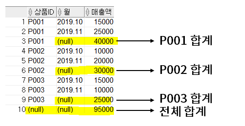
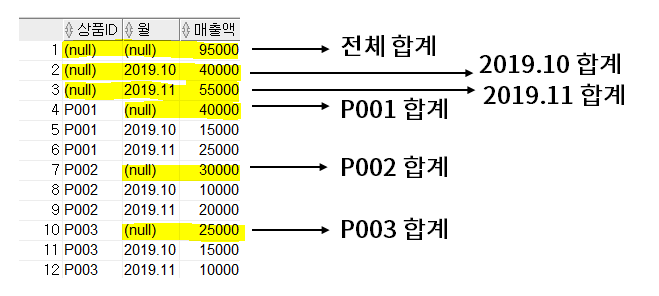
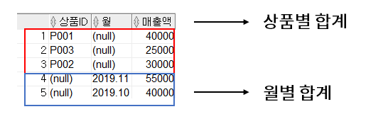

## 집계함수 
---
- 가장 기본적이고 단순한 GROUP BY절은 제외하고, ROLLUP, VUBE, GROUPING SETS만 예시를 통해 설명

<br>

### 1. ROLLUP 
- 소그룹간의 합계를 계산하는 함수
- GROUP BY로 묶은 각각의 소그룹 합계와 전체 합계를 모두 구할 수 있음 
  
  ```MySQL
  SELECT 상품ID, 월, SUM(매출액) AS 매출액
  FROM 월별매출
  GROUP BY ROLLUP(상품ID, 월);
  ```

  

- NULL 값으로 표시된 부분들이 바로 ROLLUP 함수를 써서 나온 합계
- GROUP BY절에서 명시한 모든 컬럼에 대한 소그룹의 합계를 구해주는 것이 아니고 맨 처음 명시한 컬럼에 대해서만 소그룹 합계를 구해줌 
- ROLLUP(A, B)
  - (A, B): A와 B를 GROUP BY 기준으로 해서 COUNT한 결과 
  - (A, NULL): A만을 그룹화해서 COUNT한 결과
  - (NULL, NULL): 전체를 COUNT 

<br>

### 2. CUBE
- 항목들 간의 다차원적인 소계를 계산 
- ROLLUP과 달리 **GROUP BY절에 명시한 모든 컬럼에 대해 소그룹 합계를 계산**해줌 
  
  ```MySQL
  SELECT 상품ID, 월, SUM(매출액) AS 매출액
  FROM 월별 매출
  GROUP BY CUBE(상품ID, 월);
  ```

  

- 상품ID별 합계뿐만 아니라 월별 합계까지 볼 수 있음 
- 상품ID, 월을 기준으로 그룹화하지 않고 전체를 COUNT한 결과도 보여주는 것은 ROLLUP과 동일 

<br>

### 3. GROUPING SETS
- **특정 항목에 대한 소계**를 계산하는 함수 
  
  ```MySQL
  SELECT 상품ID, 월, SUM(매출액) AS 매출액 
  FROM 월별매출 
  GROUP BY GROUPING SETS(상품ID, 월);
  ```

  

- ROLLUP, CUBE에 비해 결과 단순 
- ROLLUP과 CUBE는 GROUP BY 결과에 소그룹 합계와 토탈 합계를 보여주지만 GROUPING SETS는 각 소그룹별 합계만 간단하게 보여줌 
- GROUPING SETS 함수는 각각의 컬럼으로 GROUP BY한 값을 UNION ALL한 것과 동일한 결과를 보여줌 

<br>

---
#### 참고자료 
@ https://for-my-wealthy-life.tistory.com/44
