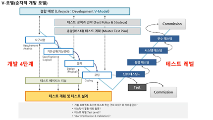
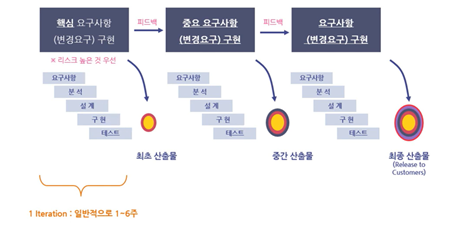

# SW life cycle and testing  
## Model

1.	V-모델(순차적 개발 모델)
- V&V(Verification and Validation)의 의미로, 각각의 개발 단계에서 테스팅을 접근하는 방법을 개략적으로 이해하기 쉽게 모델화하여 보여주는 것
- 초기에 테스트 설계를 통해 결함을 사전 예방하고자 개발 초기 단계에서 테스팅을 수행한다는 것을 보여줌 

 

-	Verification과 Validation
	- Verification: We build the system right? 우리가 명세 내용대로 시스템 만들고 있는가?
	- Validation: We build the right system? 우리마 만드는 시스템이 고객이 원하는 시스템? 
	- 개발 초기 단계에서부터 수행한다는 것은 비즈니스 시나리오, 유즈케이스, 요구사항 명세, 설계 문서나 코드 등의 개발 산출물을 리뷰 형태로 검토하면서 결함을 발견하는 정적 테스팅을 의미(코드가 만들어지기 전 테스팅. 반면 동적 테스팅은 실제 코드를 돌려가며 테스팅)

 

-	개발 4단계: 요구사항 > 기본설계(기능명세) > 설계 > 코딩
-	테스트 레벨: 단위 테스팅 > 통합 테스팅 > 시스템 테스팅 > 인수 테스팅
    - 테스트 레벨에 따라 전략, 기법, 수행 주체, 완료 기준 등이 달라지므로 테스트 레벨은 독립적  

 

2.	 반복적-점진적 개발 모델 
- Iterative(반복적인): 핵심적인 개발 활동을 “리스크”에 따라 반복적으로 적용해 결과물 도출
- Incremental(점진적으로 증가하는): 개발이 진행됨에 따라 “문제”에 대한 이해를 높여, 해결 능력 향상
 

-	단계: 핵심 요구사항 …> 최초 산출물 > 중요 요구사항 …> 중간 산출물 > 요구사항 …> 최종 산출물 
	- 반복적으로 리스크에 따른 우선순위가 높은 것대로 요구사항 반영 결과 모델 점진적으로 증가 
	- 주기(Iteration)가 반복될수록 테스트 범위가 증가 
  

 

3.	폭포수 vs 반복적-점진적 개발 모델 

(1)	폭포수 모델
- 결과물로 수행 전까지 문서만 존재하며, 리스크가 프로젝트 중간 이후까지 유지됨
- 또한 개발 프로젝트 예측이 어렵다는 문제 존재 
 

(2)	반복적-점진적 모델
- 각 Iteration별 실제 개발 결과물이 존재하며, 리스크가 높은 부분을 개발 앞 단계에서 처리함
- 폭포수와 달리 개발 프로젝트 예측에 용이

 

--- 

#### 참고자료 
- 김기태의 JAVA를 자바 Youtube