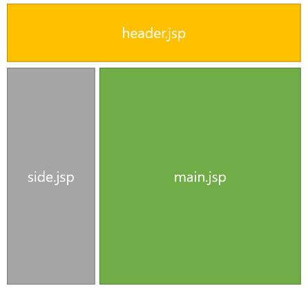

## Web 

2023.01.02 (월)

---

## Web service 
- What: 인터넷에 연결된 / 컴퓨터들을 통해 / 사람들이 정보를 공유할 수 있는 전 세계적인 정보 공간
- 고객(Client)가 컴퓨터를 통해 `요청` <-> Server로부터의 `응답` 
- 요청의 종류
    - 1. Get: 정보를 요청하는 것(줘라!) 
    - 2. Post: 정보를 보내는 것(받아라!)

 

## 웹의 역사

### Static Sites (~1995 mid)

출처: yongseong.log

- 사용자가 URL을 입력하여 브라우저에서 서버 측에 어떤 html 페이지가 필요한 지를 요청 보내면 서버에서는 이미 등록되어 있는 httml 파일 중에 사용자가 요청한 html 파일을 보내서 렌더링 시켜주는 식의 작동 방식 

 

### <iframe> 도입 (1996~)
- iframe 태그가 도입되었고, 페이지 내에서 부분적으로 문서를 받아와서 업데이트하는 방식이 가능해짐 
- ifame 태그: inline frame의 약자로써 해당 웹 페이지 안에 다른 html 파일을 불러와서 삽입할 수 있는 기능 제공 

출처: coding-factory tistory

 

### XMLHttpRequest (1998~)
- fetch api의 원조격이라고 볼 수 있는 XMLHttpRequest가 등장하면서 html 문서 전체가 아니라 Json 형식으로 서버에서 필요한 데이터만 받아와서 JavaScript를 통해 페이지에 렌더링 할 수 있게끔 발전 

 

### Ajax (2005~)
- 위에 언급했던 방식이 본격적으로 AJAX라는 이름을 가지게 됨 
- 사용자가 한 페이지에 머무르면서 필요한 데이터를 서버에서 받아와 부분적으로 업데이트하는 방식 

 

## Web page
인터넷을 이용하면서 접속하게 되는 페이지는 크게 두 가지로 나뉨 
- 1. 정적 웹 페이지
- 2. 동적 웹 페이지 

 

- 정적 웹 페이지 vs 동적 웹 페이지 
  
  
  출처: Dyunge_100.log

정적 웹 페이지의 경우 웹 서버가 요청을 받은 경우 서버는 추가적인 처리과정 없이 클라이언트에게 응답을 보내줌

 

### 정적 웹 페이지(Static Web page)

출처: hogni tistory

- 웹 서버에 **이미 저장된 파일**(HTML 파일, 이미지, JavaScript 파일 등)을 클르아이언트에게 전송하는 웹 페이지
- 사용자는 서버에 저장된 데이터가 변경되지 않는 한 **고정된 웹 페이지**를 계속 보게 됨 
- 따라서 모든 사용자는 같은 결과의 웹 페이지를 서버에 요청하고 응답 받게 됨 
- 예로 들어 회사나 개인의 소개 페이지가 정적 웹 페이지의 좋은 예시 

 

#### 정적 웹 페이지 장/단점
- 장점
    - 빠른 속도: 다른 처리 없이 Just 요청에 대한 파일만 전송하므로 빠름
    - 저비용: 단순한 문서로 웹 서버 구축하므로 호스팅 서버에 연결하는 비용 小
- 단점 
    - 서비스 제공의 한계: 저장된 정보만 보여주므로 서비스가 한정적 
    - 관리의 어려움: 추가, 삭제, 수정 등의 작업이 모두 코드를 직접 건드려야 하므로 관리가 힘듦 

 

### 동적 웹 페이지(Dynamic web page)

출처: hogni tistory

- 서버에 저장된 HTML 파일이 그대로 브라우저에 나오는 것이 아닌, 동적으로 만들어지는 웹 페이지 
- 정적 웹 페이지와 달리 서버에 대한 요청에 대해 서버는 추가적인 처리 과정 이후 클라이언트에게 응답을 보냄 
- 따라서 요청에 관해 사용자는 **조건에 따라 다른 결과**를 받게 됨 
- 동적 페이지는 방문자와 상호작용하기 때문에 페이지 내용은 그때그때 달라지므로 사용자는 **상황, 시간, 요청 등에 따라 달라지는 웹 페이지**를 보게 됨 
- 웹 페이지 상에서 **특정 부분을 동적으로 바꾸는 형태**로 사용됨 
- 예로 댓글, 날씨, 주가 정보 등과 같이 정보 변경이 잦은 곳에서 많이 사용됨 (네이버 뉴스 댓글, 스타벅스 매장 정보, 롭스 상품 검색 등)
- 해당 사이트들은 웹 페이지 전체에 해당하는 정적인 페이지 데이터(HTML 등)를 다 보여준 후에야 동적으로 데이터를 가져와서 나타내 주는 것 
  > 그렇기 때문에 이런 사이트들은 파이썬에서 requests 라이브러리를 이용해서 html 응답을 받아와도 동적인 데이터는 보이지 않는 것(받아온 응답에는 정적 페이지의 html 코드만 포함되어 있으므로)

  

#### 동적 웹 페이지 종류 

1. CSR (Client Side Rendering)
- 데이터가 없는 HTML 문서나 Static 파일만을 처음에 받아와 로드하고, 이후에 데이터를 요청하여 받아오는 방식 
- JavaScript를 사용하여 브라우저에서 페이지를 직접 렌더링 진행 
- 모든 로직, 데이터 가져오기, 템플릿 및 라우팅 등은 서버가 아닌 클라이언트 측에서 처리 
  
2. SSR (Server Side Rendering)
- CSR과 상반되게 서버에서 동적으로 데이터까지 전부 삽입하여 완성돤 HTML을 넘겨줌 
- 서버 렌더링은 브라우저에서 응답을 받기 전에 처리되므로 클라이언트에서 데이터를 가져오거나 템플릿 작성에 대한 추가 왕복 발생 X 

3. MPA (Multi Page Aplication)
- 새로운 페이지를 요청할 때마다 정적 리소스가 다운되고, 그에 맞춰 전체 페이지를 렌러딩 하는 방식 (즉, SSR 방식으로 렌더링)
- 사용자가 어떠한 요청을 하면(인터넷 주소창에 주소를 입력하거나 링크를 클릭하는 등) 그에 맞는 완전한 페이지를 받아오고 다시 렌터링 
- 장점: 검색 엔진 최적화(SEO, Search Engine Optimization) 관점에서 유리 
- 단점: 새로운 페이지로 이동할 때마다 완전히 새로 렌더링 되므로 깜빡거리고, 프론트엔드와 백엔드가 밀접하게 연결되어 개발 복잡 

4. SPA (Single Page Application)
- 웹 애플리케이션에 필요한 모든 정적 리소스를 최초 한 번만 다운로드 
- 그 이후, 새로운 페이지에 대한 요청이 있을 때마다 페이지 갱신에 필요한 데이터만 전달 받고, 그 정보를 기준으로 페이지를 갱신 (즉, CSR 방식으로 렌러딩) 
- SPA 만드는 데 사용되는 프레임워크: React, Bue, Angular
- 장점
    - 최초 접속 시 맨 첫 페이지 로딩 시간은 길어도 이후 페이지부터 속도가 빠름
    - MPA와 달리 깜빡거림이 없고 반응 속도가 좋음 
    - 로컬 데이터를 효과적으로 캐싱 
- 단점
    - 초기 구동 속도 느림 
    - SEO에 불리 

--- 
#### 참고 

@ https://velog.io/@kysung95/SSR-vs-CSR-%EB%8B%B9%EC%8B%A0%EC%9D%98-%EC%84%A0%ED%83%9D%EC%9D%80-feat.-ssg

@ https://velog.io/@dyunge_100/WEB-%EC%A0%95%EC%A0%81-%EC%9B%B9-%ED%8E%98%EC%9D%B4%EC%A7%80%EC%99%80-%EB%8F%99%EC%A0%81-%EC%9B%B9-%ED%8E%98%EC%9D%B4%EC%A7%80

@ https://coding-factory.tistory.com/892

@ https://hogni.tistory.com/75