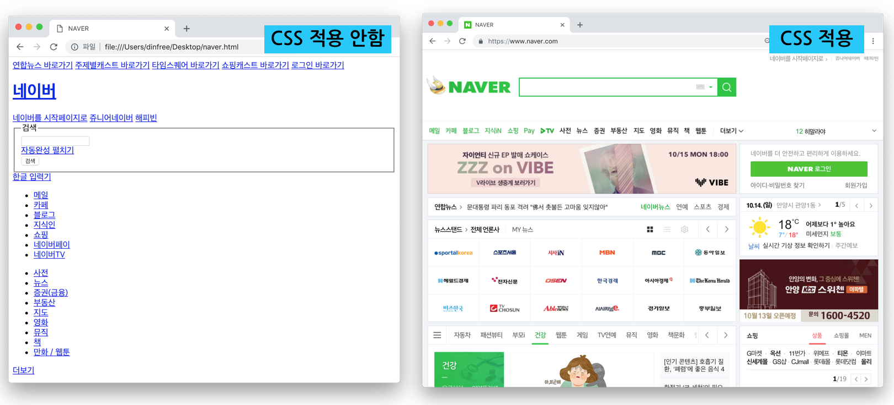
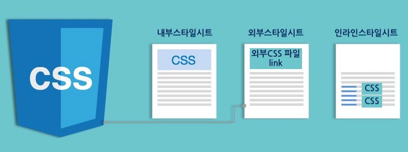

## CSS (Cascading style sheets)

2023.01.03 (화)

- HTML과 함께 웹을 구성하는 기본 프로그래밍 요소 
- HTML이 텍스트나 이미지, 표와 같은 구성 요소를 웹 문서에 넣어 뼈대를 만드는 것이라면, CSS는 색상이나 크기, 이미지 크기나 위치, 배치 방법 등 웹 문서의 디자인 요소를 담당 
- CSS는 HTML로부터 디자인적 요소를 분리 해 정의할 수 있음 
- 잘 정의된 CSS는 서로 다른 여러 웹페이지에 적용할 수 있음 (템플릿/테마)
- JavaScript와 연계해 동적인 콘텐츠 표현이나 디자인 적용 가능 
  
  [CSS 적용예시]
  

  출처: dinfree 

<br>

- 사용 이유 
    - 웹 문서의 내용과 상관없이 디자인만 바꾸거나 디자인은 그대로 두고 웹 문서의 내용 변경 용이 
    - 다양한 기기(PC, 스마트폰, 태블릿 등)에 맞게 탄력적으로 바뀌는 콘텐츠 -> 반응형 디자인(Responsive Design)
    - 동일한 문서를 가지고 서로 다른 CSS 테마 적용이 가능 

<br>

### 기본 문법 
- `선택자(selector)`와 `선언부(declaration)`로 구성 
- 선택자
    - 스타일을 적용하고자 하는 HTML 요소(태그, 아이디 등) -> 선택자 정의가 중요 
    - CSS의 핵심은 적절한 선택자를 사용하는 것이며 복잡한 문서 구조에서 특정 부분을 선택하기 위한 선택자 지정은 어려울 수 있으며 html 구조를 처음부터 잘 설계하는 것이 중요 
- 선언부
    - CSS 속성 이름과 값 
    - 콜론(:)으로 구분 되어진 다수의 항목을 포함 
    - 각 선언은 항상 세미콜론(;)으로 끝나며, 선언블록은 중괄호({})로 묶음 
- /* comment */은 코드를 설명하는 데 사용됨

```
선택자 {속성: 값; 속성:값 ...}

ex) 
/*h1태그의 색상을 빨간색으로 크기는 15px로 지정합니다.*/
h1 {color:red; font-size:15px;}
```

<br>

### 적용 방법 


출처: dinfree 

<br>

#### 1. 내부 스타일시트 
- html 파일에 스타일을 기술하는 방법 
- <head></head> 태그 사이에 <style></style> 태그 부분에 작성 
- html과 CSS가 한 파일에 있으므로 작업이 쉽고 간편하지만 
- **CSS의 재활용이 안됨** (따라서 특별한 경우가 아니면 외부 스타일시트 권장)
```html
<head>
<style>
    <!-- 모든 p태그에 아래 스타일 적용-->
    p {
        font-size: 24px;
        color: #0000ff;
    }

    <!-- blue-medium 클래스 가진 p에 아래 스타일 적용 -->
    p.blue-medium {
        font-size: 24px;
        color: #0000ff;
    }
</style>
</head>

```

<br>

#### **2. 외부 스타일시트**
- CSS를 작성하는 가장 기본적인 방법 
- 별도의 파일에 CSS 문서를 작성하고 해당 CSS를 필요로 하는 html 문서에서 불러와 사용하는 형식 
- 이때 CSS는 동일한 서버에 있어도 되고 url을 통해 다른 서버의 CSS를 불러오는 것도 가능 

```css
/* css 파일 
green-small 클래스 가진 모든 요소 */
.green-small {
    font-size: 12px;
    color: green;
}
```

```html
<link rel="stylesheet" type="text/css" href="mystyle.css">
<link rel="stylesheet" type="text/css" href="http://cdn.site.com/css/mystyle.css">

<p class="green-small">This is Samll Green</p>
```

<br>

#### 3. 인라인 스타일 
- html 태그에 필요한 디자인 속성을 **직접 관리**하는 형식
- 그때 그때 필요한 디자인을 바로 적용할 수 있어서 편리하나, 일관된 디자인 체계 유지하는 데에는 방해가 되므로 꼭 필요한 경우가 아니라면 사용하지 X 

```html
<h1 style="color:blue; margin-left:30px;">This is a heading</h1>
```
---
<br>

### 캐스케이딩(Cascading)과 우선순위 

#### 케스케이딩의 의미 
- 폭포처럼 떨어져 내리는 
- CSS에서 디자인 속성이 html 문서의 구조 DOM(Document Object Model) Tree 구조에서 상우위 요소에서 정의한 속성이 하위 요소로 전달되는(상속 개념)의미에서 유래됨 

<br>

- 상위 태그에서 정의된 디자인 속성은 하위 태그로 속성 
- 하위 태그에서 상위 태그에 정의된 디자인 속성 변경 가능 
```html
<!-- body 태그 안에 있는 모든 요소들은 빨간색 글자로 표시 -->
<body style="font-color:red">
    <h1>Hello</h1>
</body>
```

<br>

#### 우선 순위 
- 동일한 디자인 속성이 외부 스타일시트, 내부 스타일시트, 인라인 스타일시트에 적용 되어 있는 경우 우선순위는? 
- 가장 나중에 정의되는 스타일 
- 인라인 스타일시트가 가장 높은 우선순위로 적용되고 외부 스타일시트와 내부 스타일시트는 문서상 정의된 순서에 따라 우선순위 결정됨 
- 일반적인 우선순위(낮은순 -> 높은순)
  - 브라우저 디자인 정의 -> 외부 스타일시트 -> 내부 스타일시트 -> 인라인 스타일시트 
---
<br>

### 셀렉터(Selector)
- HTML 문서에서 **스타일의 적용 대상**을 지칭  
- 기본적으로 태그, 아이디, 클래스를 셀렉터로 사용하며, 이들을 조합해 특정 조건에 맞는 셀렉터 정의해서 사용 
    - html 문서의 기본 구성요소인 태그는 가장 기본이 되는 셀렉터 
    - 태그에 사용할 수 있는 id속성은 문서 내 유일한 값으로 셀렉터로 사용 가능 
    - 스타일 정의에 클래스를 사용하고 html 태그에 class 속성으로 스타일 지정 (외부 스타일시트 예시 코드 참조)

| 셀렉터      | 사용예          | 사용예 설명                          |
|------------|-----------------|--------------------------------------|
|.class      |.intro           |html 태그에서 class="intro"로 된 모든 태그 영역 선택|
|#id         |#banner          |html 태그에서 id="banner"로 된 태그 영역 선택|
|*           |*                |문서 내 모든 요소를 선택                     |
|태그        |p                |문서 내 모든 <p> 태그 영역 선택              |
|태그, 태그  |div, p           | 모든 <div>와 <p> 태그 영역 선택        |
|태그 태그   |div p            |<div> 태그 안에 있는 모든 <p> 태그 영역 선택 |

---
### 기본 셀렉터 
- **태그, 아이디, 클래스**

<br>

#### 1. 태그 셀렉터 
- 태그 이름으로 요소를 선택 
- 같은 디자인 속성을 가지는 여러 태그는 ,로 나열해 일괄적용 

```css
p {
    text-align: center;
    color: red;
}

h1, h2, h3, h4 {color: blue;}

/* 경우에 따라서는 태그의 특정 속성에 대해 셀렉터 지정 가능 
예를 들어 <input> 태그는 type 속성에 따라 다양한 입력양식을 제공하는 데, 
이 경우 특정 type에만 배경색이나 크기 지정하기 위해 태그 셀렉터에 속성 사용 가능 */
input[type=text] {
    background-color: blue;
    color: white;
}
```
<br>

#### 2. id 셀렉터 
- HTML 요소의 id 속성을 사용해 특정 요소를 선택
- id는 페이지 내에서 유일한 값이므로 **하나의 고유한 요소를 선택**하는 데 사용 

```css
#id_name {color: blue;}
```

```html
<div id="id_name">
</div>
```

<br>

#### 3. class 셀렉터 
- 클래스 셀렉터는 특정 클래스 속성이 있는 요소를 선택 
- .class name 형식으로 사용 
- class로 디자인을 먼저 정해놓고 필요한 곳에서 해당 class 지정해 사용

```css
.class_name1 {color: blue;}
p.class_name2 {color: red;}
```

```html
<div class="class_name1">
</div>
```

<br>


---
#### 참고자료 
@ https://dinfree.com/lecture/frontend/122_css_1.html
