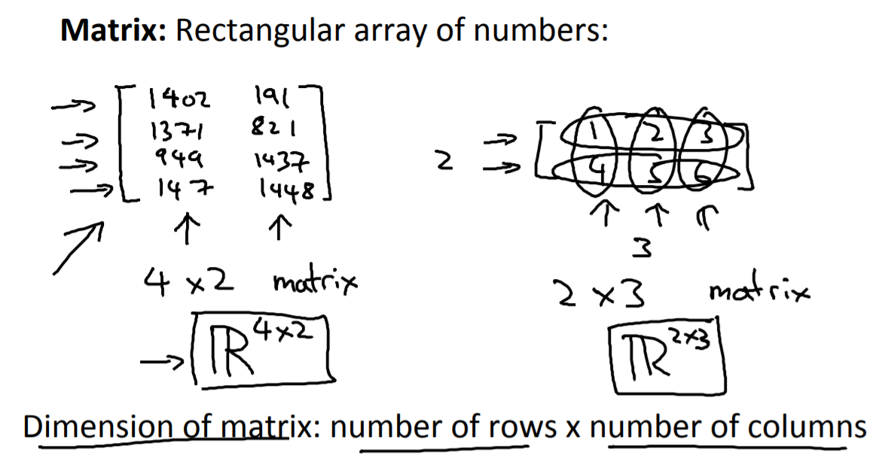
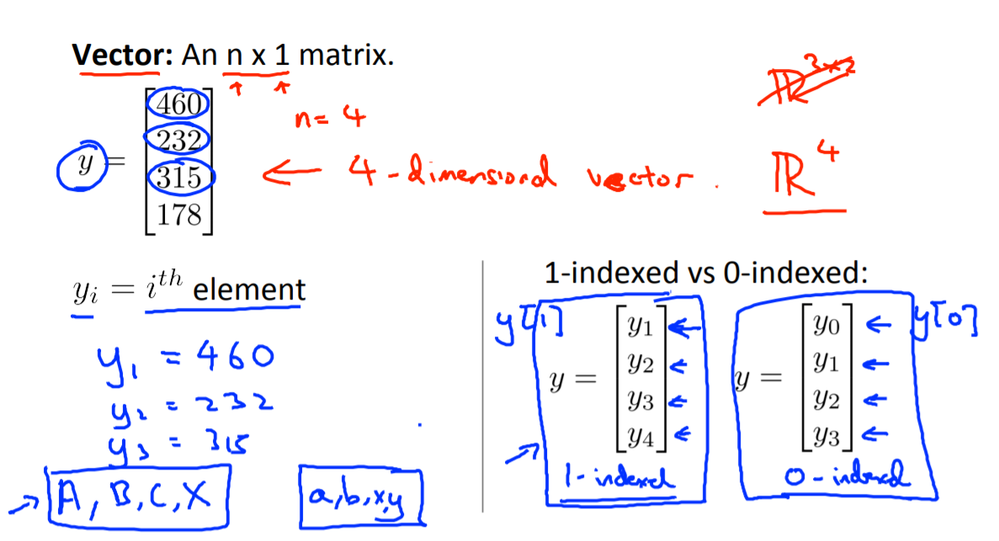

## 벡터와 행렬
---

### 행렬(Matrix)
- 행과 열을 가지는 2차원 형상을 가진 구조 
- 가로줄을 행(row), 세로줄을 열(column)이라고 함 
- 다량의 데이터에 대한 계싼을 편리하게 하기 위함 
  -  cf) 표(Graph): 여러가지 데이터를 효과적으로 시각화하기 위함
- 3차원부터는 주로 텐서라고 부름 
  
  

  출처: box-world tistory
  
  - 4행 2열 -> $TR^{4X2}$

### 벡터(Vector)
- 크기와 방향을 가진 양 
- 숫자가 나열된 형상이며 파이썬에서는 1차원 배열 또는 리스트로 표현 
  