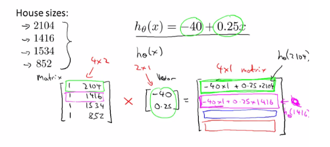
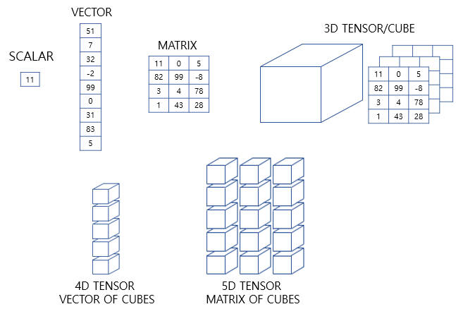

## 벡터와 행렬
---

### 행렬(Matrix)
- 행과 열을 가지는 2차원 형상을 가진 구조 
- 가로줄을 행(row), 세로줄을 열(column)이라고 함 
- 다량의 데이터에 대한 계싼을 편리하게 하기 위함 
  -  cf) 표(Graph): 여러가지 데이터를 효과적으로 시각화하기 위함
- 3차원부터는 주로 텐서라고 부름 
  
  

  출처: box-world tistory
  
  - 4행 2열 -> $TR^{4X2}$

#### 행렬의 장점 

- 복잡한 식도 행렬을 통해 간단하게 표기 가능 
  
  

  - ex) Hosing price를 예측하고자 할 때 기존에 주어진 데이터에 대한 가설함수가 주어졌을 떄 데이터를 x에 데입하여 적절한 y값을 예측함 
  - 하지만 행렬을 활용해 가설함수 $h = X * a$ 형태로 Matrix를 이용하여 식을 변환해 훨씬 간단하게 표현 가능 
  - X: Matrix / Housing Size 값을 모아놓은 행렬 
  - a: Vector / 가설함수 h의 매개변수 $\theta$
  - 원래는 Housing price에 대한 가설함수 H(x)의 매개변수인 $\theta$는 2개이기 때문에 Matrix가 아닌 대수적인 형태로도 계싼 가능 
  - 하지만 좀 더 정확한 Houson Price 예측을 위해 Size 이외에 집의 층수 등 다양한 특징(Feature)이 고려되어 매개변수 $\theta$가 100개로 늘어난다면, 이러한 경우에는 대수적인 형태로 표현하기 어렵기 때문에 Matrix로 변환하여 표현하는 것이 필요함 

#### 행렬 X 행렬 
- 행렬(Matrix) x 행렬(Matrix)을 계산할 때 유의해야 할 점은 **행렬의 열(column)과 다른 한쪽의 행(row)의 크기가 같아야 한다는 점** 
- m x n 행렬 A와 n x o 행렬 B를 곱하면 m x o 행렬 C가 도출되어야 함 
- ex) 
  
  $\begin{bmatrix}1&3\\2&5\\ \end{bmatrix} \begin{bmatrix}0&3\\1&2\\ \end{bmatrix} = \begin{bmatrix}9&15\\7&12\\ \end{bmatrix}$

  - $\begin{bmatrix}1&3\\2&5\\ \end{bmatrix} \begin{bmatrix}0\\3\\ \end{bmatrix} = \begin{bmatrix}1*0+3*3\\2*0+5*3\\ \end{bmatrix} = \begin{bmatrix}9\\15\\ \end{bmatrix}$
  
  - $\begin{bmatrix}1&3\\2&5\\ \end{bmatrix} \begin{bmatrix}1\\2\\ \end{bmatrix} = \begin{bmatrix}1*1+3*2\\2*1+5*2\\ \end{bmatrix} = \begin{bmatrix}7\\12\\ \end{bmatrix}$

#### 특징과 종류 

- Maxtrix간의 곱 연산에서 결합법칙은 성리하지만 교환 법칙은 성립하지 X (다시 말해 A x B와 B x A는 동일하지 않음)
- 일반적인 행렬 외에 단위행렬, 역행렬, 전치행렬이 있음 

<br>


### 벡터(Vector)
- 크기와 방향을 가진 양 
- N X 1차원의 행렬 
- 하나의 열을 가지며 여러 개의 행만을 가지기 때문에 벡터 내부 데이터의 수가 곧 벡터의 차원(Demension)이 됨
- 숫자가 나열된 형상이며 파이썬에서는 1차원 배열 또는 리스트로 표현 
  
  

<br>

### 텐서(Tensor)

- 인공 신경망은 복잡한 모델 내의 연산을 주로 행렬 연산을 통해 해결함 
- 행렬 연산이란 단순히 2차워 배열을 통한 행렬 연산만을 의미하는 것이 아닌, 머신러닝의 입/출력이 복잡해지면 3차원 텐서에 대한 이해가 필수로 요구됨 

#### Numpy를 사용한 텐서 설명 

```python
import numpy as np
```

#### 1) 0차원 텐서(스칼라)
- 스칼라는 하나의 실수값으로 이루어진 데이터 ex) 키, 몸무게 등  
- 이를 0차원 텐서라고 함 
- 차원을 영어로 Dimension이라고 하므로 0D 텐서라고도 함 

```python
d = np.array(5)
print('텐서의 차원: ', d.min)
print('텐서의 크기(shape): ', d.shape)

# 텐서의 차원: 0
# 텐서의 크기(shape): ()
```

- Numpy의 ndim을 출력했을 때 나오는 값을 **축(aixs)의 개수** 또는 **텐서의 차원**이리고 부름

#### 2) 1차원 텐서(벡터)
- 숫자를 배열한 것을 벡터라고 하는 데, 벡터는 1차원 텐서 
- 벡터에서도 차원이라는 용어를 쓰는 데 **벡터의 차원과 텐서의 차원은 다른 개념**이라는 점 주의 

```python
d = np.array([1, 2, 3, 4])
print('텐서의 차원: ', d.ndim)
print('텐서의 크기(shape): ', d.shape)

# 텐서의 차원: 1
# 텐서의 크기(shape): (4, )
```

  - 4차원 벡터지만, 1차원 텐서(=1D)
  - 벡터에서의 차원은 하나의 축에 놓인 원소의 개수를 의미하고, 텐서에서의 차원은 축의 개수를 의미함 

#### 3) 2차원 텐서(행렬)

- 행과 열이 존재하는 벡터의 배열 
- 즉, 행렬(matrix)을 2차원 텐서라고 함(=2D 텐서)

```python
# 3행 4열의 행렬
d = np.array([[1, 2, 3, ,4], [5, 6, 7, 8], [9, 10, 11, 12]])
print('텐서의 차원: ', d.ndim)
print('텐서의 크기(shape): ', d.shape)

# 텐서의 차원: 2
# 텐서의 크기(shape): (3, 4)
```

  - 텐서의 크기(shape)란, 각 축을 따라서 얼마나 많은 차원이 있는 지를 나타낸 값 
  - 위의 경우 3개의 커다란 데이터가 있는 데, 그 각각의 커다란 데이터는 작은 데이터 4개로 이루어져 있다고 생각할 수 있음 

#### 4) 3차원 텐서(다차원 배열)

- 행렬 또는 2차원 텐서를 단위로 한 번 더 배열하면 3차원 텐서라고 부름(=3D 텐서)
- 위에서 언급한 0차원 ~ 2차원 텐서는 각각 스칼라, 벡터, 행렬이라고 해도 무방하므로 3차원 이상의 텐서부터 본격적으로 텐서라고 부름 (테이서 사이언스 분야 한정)
- 3D 텐서는 3차원 배열로 이해하면 쉬움 

```python
d = np.array([
  [[1, 2, 3, 4, 5], [6, 7, 8, 9, 10], [10, 11, 12 ,13, 14]],
  [[15, 16, 17, 18, 19], [19, 20, 21, 22, 23], [23, 24, 25, 26, 27]]
])
print('텐서의 차원: ', d.ndim)
print('텐서의 크기(shape): ', d.shape)

# 텐서의 차원: 3
# 텐서의 크기(shape): (2, 3, 5)
```

  - 자연어 처리에서 자주 보게 되는 것이 3D 텐서 
  - 3D 텐서는 시퀀스 데이터(sequence data)를 표현할 때 자주 사용됨 
  - 이때 시퀀스 데이터는 주로 단어의 시퀀스를 의미하며, 시퀀스는 주로 문장이나, 문자, 뉴스기사 등의 텍스트가 될 수 있음
  - 이 경우 3D 텐서는 (samples, timesteps, word_dim)이 됨
  - 또는 일과로 처리하기 위해 데이터를 묶는 단위인 배치의 개념에 대해 배울텐데 (bath_size, timesteps, word_dim)이라고도 볼 수 있음 
  - samples 또는 bath_size는 샘플의 개수, timesteps는 시퀀스의 길이, word_dim은 단어를 표현하는 벡터의 차원을 의미함 

<br>

  - 예시) 
  - 3개의 훈련 데이터가 있고 이를 신경망의 모델의 입력으로 사용하기 위해서는 각 단어를 벡터와 해야함 
    - 문서1: I like NLP
    - 문서2: I like DL
    - 문서3: DL is AI
  - 3개의 훈련 데이터를 원-핫 인코딩으로 각 단어를 벡터화 한다면?

    |단어   |One-hot vector |
    |------|----------------|
    |I     |[1 0 0 0 0 0]   |
    |like  |[0 1 0 0 0 0]   |
    |NLP   |[0 0 1 0 0 0]   |
    |DL    |[0 0 0 1 0 0]   |
    |is    |[0 0 0 0 1 0]   |
    |AI    |[0 0 0 0 0 1]   |

  - 훈련 데이터의 단어들을 모두 원-핫 벡터로 바꿔서 인공 신경망의 입력으로 한 꺼번에 사용한다고 하면 다음과 같음 
  - 이렇게 훈련 데이터를 다수 묶어 입력으로 사용하는 것을 딥러닝에서는 배치(Batch)라고 함 
  
    [[[1, 0, 0, 0, 0, 0], [0, 1, 0, 0, 0, 0], [0, 0, 1, 0, 0, 0]],

    [[1, 0, 0, 0, 0, 0], [0, 1, 0, 0, 0, 0], [0, 0, 1, 0, 0, 0]],

    [[0, 0, 0, 1, 0, 0], [0, 0, 0, 0, 1, 0], [0, 0, 0, 0, 0, 1]]]

  - (3, 3, 6)의 크기를 가지는 3D 텐서

#### 그 이상의 텐서 

- 3차원 텐서를 배열로 합치면 4차원 텐서가 됨
- 4차원 텐서를 배열로 합치면 5차원 텐서가 됨 
- 이렇게 텐서는 다차원 배열로 계속 확장됨 
  
  

---
#### 참고자료 

@ https://box-world.tistory.com/8

@ https://wikidocs.net/37001

@ https://velog.io/@babydeveloper/BoostCamp-Day-6

@ https://lemidia.github.io/development/boostcamp-week2-day6/