### Overfitting
---

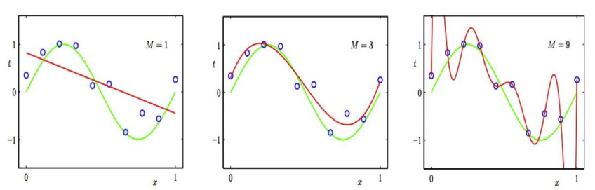
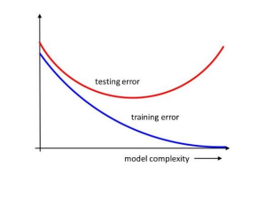

- Model's Capacity가 극대화 되면서 학습 오차(training error)가 일반화 오차(generalization error)에 비해 현격하게 낮아지는 현상
- 다시 말해 train data에 한해서는 높은 정답률을 보이지만 test data에 대해서는 낮은 정답률을 보이므로 overfitting을 주의해야 한다.

### Avoiding overfiting
---
1. **Dropout (2012, Geoffrey Hinton)**

- What? 
  - 신경망에 적용할 수 있는 Overfitting 방법 중 하나 
  - Training을 진행할 때 매 Batch마다 Layer단위로 일정 비율만큼 Neuron을 끄는 방식
  - Test / Inference 단계에서는 Dropout을 하지 않고, 전체 Neuron이 살아있는 채로 Inference 진행
  - **동일한 데이터에 대해 매번 다른 모델을 학습시키는 것과 마찬가지의 효과 발생(일종의 Model ensemble 효과)**

- Example 
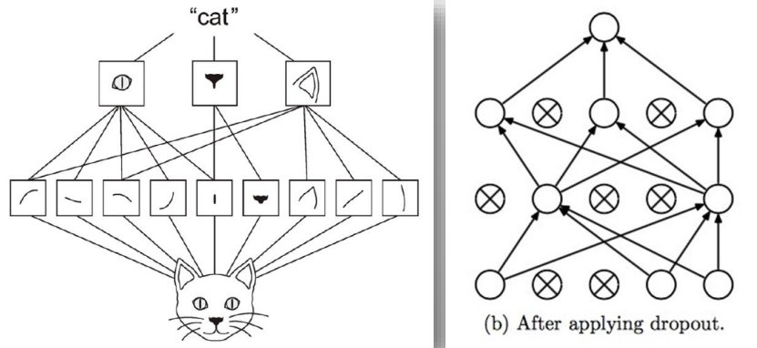
  - 예를 들어서 고양이 이미지를 10 * 10 으로 100개 퍼셉트로 만들어서 이미지 구조를 파악한 후(고양이 눈, 코, 입) 그 이미지가 어떤 이미지에 접근한 것인지는 알 수 있다.
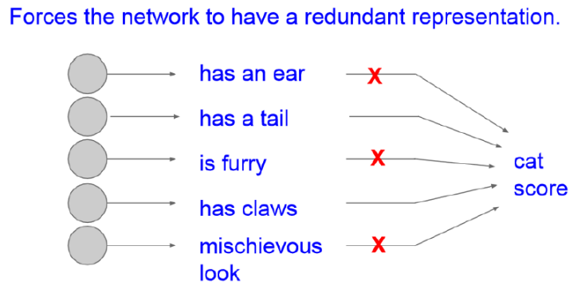
  - dropout을 통해 고양이 이미지를 눈, 입만 보여주고, 코, 꼬리는 안 보여주는 방식으로 학습 가능하다. 
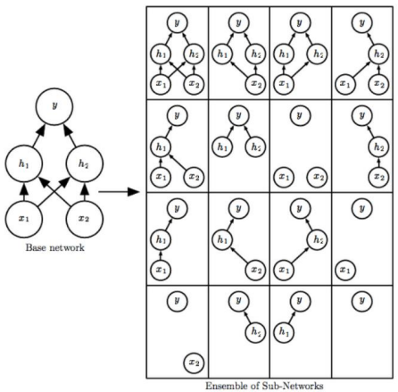
  - 이때 랜덤하게 Neuron을 꺼뜨려 학습을 방해함으로써 모델의 학습이 Training data에 편향되는 것을 막아준다.
  - 그 결과 Training data에 편향되지 않고 Test data에서도 성능을 높일 수 있다.

- How? 
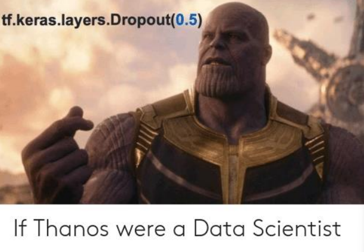  
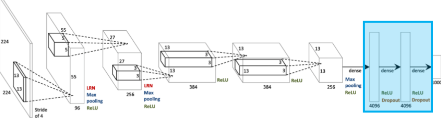
  - 2012년 ImageNet Challenge에서 우승한 Alexnet은 마지막 2개의 Fully-connected layer에 Dropout을 적용하였다. 
  - 이처럼 Dropout은 보통 모든 layer에 적용하는 것이 아니라 마지막 1-2개 layer에 한해서만 적용하며, Dropout 결과 가중치 값이 큰 특정 Neuron의 영향력이 커져 다른 Neuron들의 학습 속도에 문제를 발생시키는 **Co-adaptation**을 회피할 수 있게 해준다. 
  - 따라서 전반적으로 Overfiting을 줄여주므로 Test data에 대한 에러를 더욱 낮출 수 있게 해준다. 
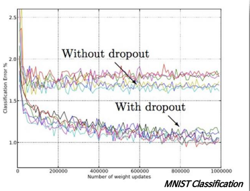

1. **Batch Normalization (2015)**
- What?
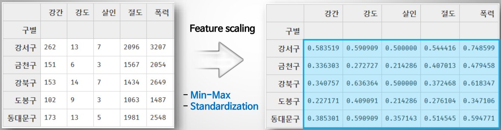
  - Input data에 대해 Standardization과 같은 Normalization을 적용하면 전반적으로 model의 성능이 높아지는 것
  - 데이터 내 Column들 간의 수치 차이가 클 경우 해당 값이 큰 Column에 의해 model이 민감해질 수 있기 때문에 Scale을 통해 조정 필요
  - 신경망의 경우 Normalization이 제대로 적용되어 있지 않으면 **최적의 cost 지점으로 가는 길을 빠르게 찾지 못함**
  - 매 layer마다 정규화를 진행하므로 가중치 초기값에 크게 의존하지 않으며, Overfiting을 억제해줌과 더불어 학습 속도 및 학습 결과가 개선되므로 Dropout, L1/L2 regularization보다 더 많이 활용된다. 

- How? 
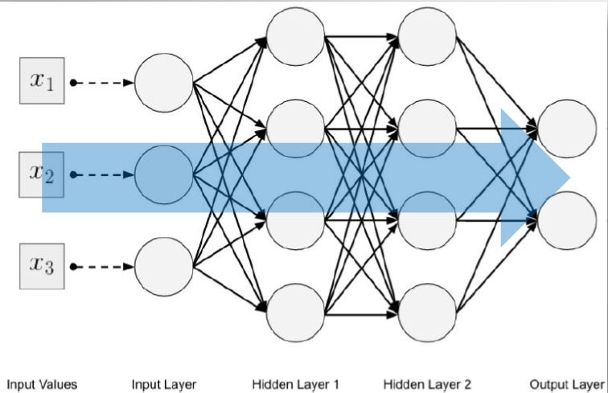
  - Standardization과 같은 모델은 input data뿐만 아니라 신경망 내부의 중간에 있는 Hidden layer로의 input에도 적용하는 것이 Batch Normalization
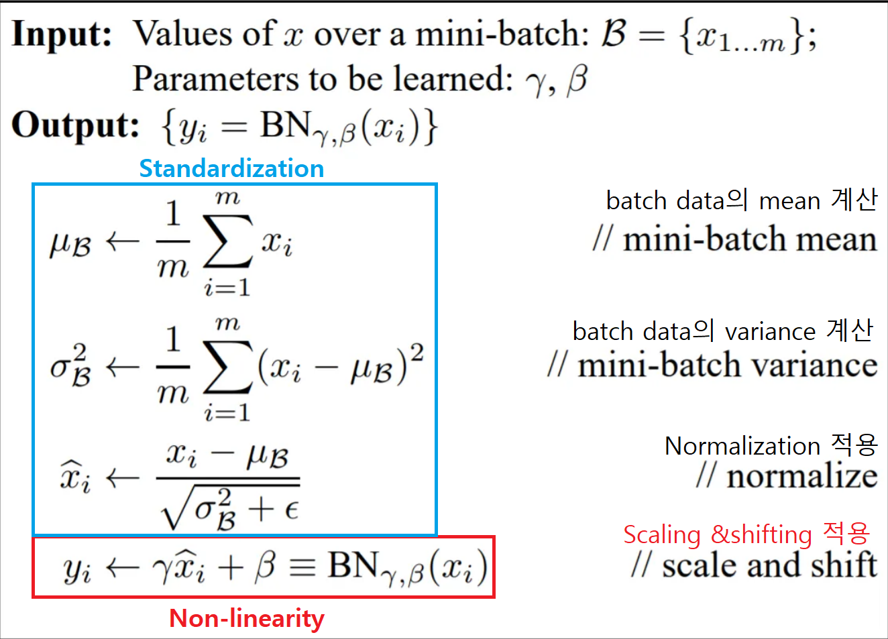
  - 각 Hidden layer로의 Input data에 대해 평균이 0, 분산이 1이 되도록 Normalization을 진행 후 Hidden layer의 출력 값이 비선형성을 유지할 수 있도록 Scaling & Shifting을 적용한다.
  - 그 결과를 Activation function에 전달하여 Hidden layer의 최종 output을 계산한다. 
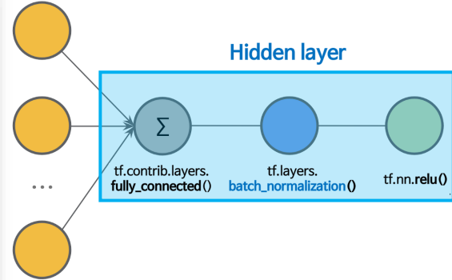
  - Activation function을 적용하기 전에 Batcj normalization을 먼저 적용해준다. 

#### Reference
image source @ https://j.mp/3eAcuu7
