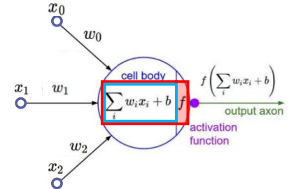
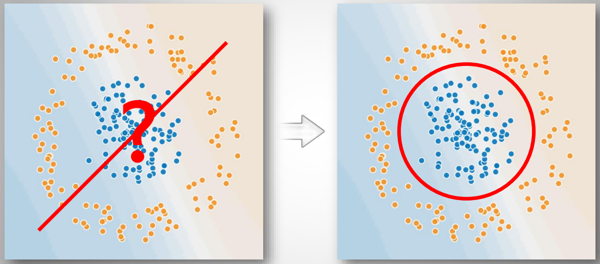
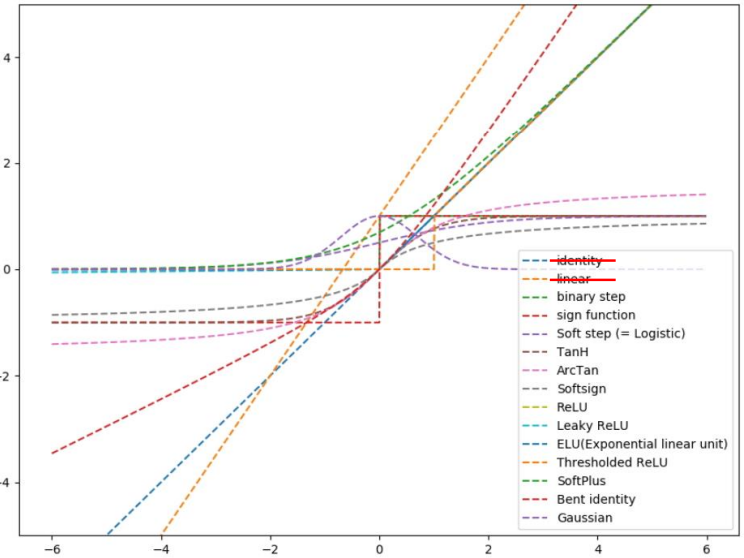
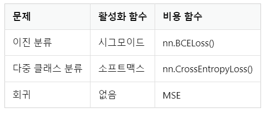

### Activation Function 
---
- Activation Function의 필요성 

ex. 단층신경망
    - 신경망에서 넘겨져 온 각 input 데이터와 각 가중치 값 w(=θ)값을 곱해서 더하면 선형결합이 된다. 
    - 그리고 선형결합의 결과에 Non-linear Function을 거치게 하여 최종 출력값을 도출하게끔 하는 역할이 바로 Activation Function 
  
    > 그렇다면 활성화 함수를 씌워서 Data를 비선형으로 바꾸는 이유는 무엇일까? 

    - 선형은 쉽지만, **망이 깊어지지 않는다는 단점**이 있기 때문이다. 
    - 모델을 복잡하게 만들고자 hidden layer을 여러겹 쌓아도 상수인 a, b가 있고 변수인 x, y가 있다면 결국 **f(ax + by) = af(x) + bf(y)의 성질을 가졌기 때문에 망이 깊어져도 선형 회귀(Linear Regression)** 모형이 되는 것이다. 

  : 선형 -> 비선형 - 곡선을 구부리고 구부리고 구부리다 보면 더욱 복잡한 모델을 만들 수 있다.

 

- Hidden layer 
  - Hidden layer를 여러겹 쌓으면(깊어지면) 더 high-level feature를 학습할 수 있다. 즉, 복잡한 문제를 해결할 수 있게 된다. 
  - hidden layer가 쌓이면서 순차적으로 기존 layer에서 발생된 feature를 조합하여 다음 층으로 전달된다. 이 과정에서 비선형 함수를 사용하며, 이 함수들이 합성되면서 훨씬 더 복잡한 함수로 표현 가능하다. 
  - 이는 다시 말해 representive(표현력)이 더 좋아진다고 할 수 있다. 
  - 다시 말해 hidden layer가 많아진다는 것은 파라미터 수가 많아진다는 뜻이고 이로 인해 representive capacity(수용력: 복잡한 함수를 표현할 수 있는 능력을 가지는 것)이 커지면서 high-level feature를 추출할 수 있게 된다. 

- Activation Function의 종류 
  - **Sigmoid Function, Step Function, Soft max, tanh, ReLU Function** 등 

비선형함수 종류 
  - 주로 사용되는 Activation Function은 Sigmoid, soft max, Relu로 ouput 값(이진분류/다중 클래스 분류/회귀)에 따라 활성화 함수 사용여부 및 사용하는 함수가 달라진다. 
  
  
#### Reference
- Image Source @https://goo.gl/wvjYc1, https://wikidocs.net/60683
- Activation Function 
  @ https://en.wikipedia.org/wiki/Activation_function
- Hiddden layer @ https://sodayeong.tistory.com/28

