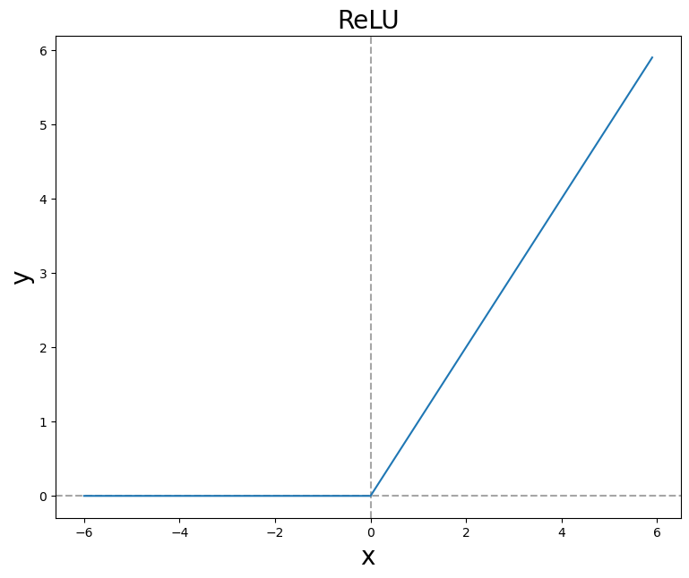

### 렐루 함수(ReLU function) 의미
---
- 렐루 함수(ReLU function)는 우리말로 선형 함수라고 한다.
- 간단히 말하자면 $+$ / $-$ 가 반복되는 신호에서 $-$흐름을 차단하는 의미이다.
- 은닉층에서 많이 사용하는 함수이다.
- 렐루 함수(ReLU function)는 은닉층에 어떤 활성화 함수를 써야 할지 모를 때도 사용한다.

### 렐루 함수(ReLU function) 수식
---
$$h(x)=\begin{cases} 
x \\\ (x>0)\\ 
0 \\\ (x\leq0) 
\end{cases}$$

- 이 수식을 보면 양수면 자기 자신을 반환하고, 음수면 0을 반환한다.

```python
import numpy as np

# ReRU함수
def ReLU(x):
    return np.maximum(0, x)
# 이 코드는 단순하게 최댓값 함수를 사용하여 지금 들어온 값이 0보다 크면 자기 자신을 반환하고, 0보다 작으면 최댓값인 0을 반환하는 함수을 나타낸다.
```
```python
import matplotlib.pyplot as plt

x = np.arange(-6.0, 6.0, 0.1)
y = ReLU(x)

fig = plt.figure(figsize=(9, 7))
fig.set_facecolor('white')

plt.title('ReLU', fontsize=20)
plt.xlabel('x', fontsize=20)
plt.ylabel('y', fontsize=20)
plt.axvline(0.0, color='gray', linestyle='--', alpha=0.7)
plt.axhline(0.0, color='gray', linestyle='--', alpha=0.7)
plt.plot(x, y)

plt.show()
```


### 렐루 함수(ReLU function)를 은닉층에서 많이 쓰이는 이유

1. `기울기 소실(Vanishing Gradient) 문제가 발생하지 않는다.`

- 렐루 함수(ReLU function)는 출력의 범위가 넓고, 양수인 경우 자기 자신을 그대로 반환하기 때문에 `기울기 소실(Vanishing Gradient) 문제가 발생하지 않는다.

2. `기존 활성화 함수에 비해 속도가 매우 빠르다.`

- 렐루 함수의 공식은 양수면 자기 자신을 반환하고, 음수면 0을 반환하다보니, 경사 하강시 다른 활성화 함수에 비해 `학습 속도가 빠르다.`
- 렐루 함수는 편미분(기울기)시 1로 일정하므로, `가중치 업데이트 속도가 매우 빠르다.`

### 렐루 함수의 한계점


- 렐루 함수의 그래프를 보면, 입력값이 음수이면 출력값이 0으로 나온다.
- 가중치 업데이트가 안 되는 현상이 발생할 수 있다.
- `가중치가 업데이트되는 과정에서 가중치 합이 음수가 되는 순간 ReLU 함수는 0을 반환하기 때문에 해당 뉴런은 그 이후로 0만 반환하는 아무것도 변하지 않는 현상이 나타날 수 있는데 이것을 죽어가는 렐루(Dying ReLU) 현상이라고 한다.`
- `렐루 함수는 기울기 소실 문제 방지를 위해 사용되는 활성화 함수이기 때문에 은닉층에서만 사용하는 것을 추천한다.`
- 렐루 함수의 출력값은 양수 또는 0이며, ReLU 기울기도 0또는 1이므로, 둘 다 양수이다.
- 따라서 `가중치 업데이트 시 지그제그로 최적의 가중치를 찾아가는 지그재그 현상이 나타난다.`
- ReLU는 0에서 미분이 불가능하다.(미분이 불가능할지라도 출력값 문제가 아니어서 0에 걸릴 확률이 적기 때문에 이를 무시하고 사용해도 무방하다.)
- 렐루 함수가 입력값이 0일 때, 기울기가 0에 수렴해 가중치 업데이트가 안 되는 현상이 발생한다고는 하지만, 성능상 문제가 없다.

#### Reference 
- concept & code @ https://gooopy.tistory.com/55