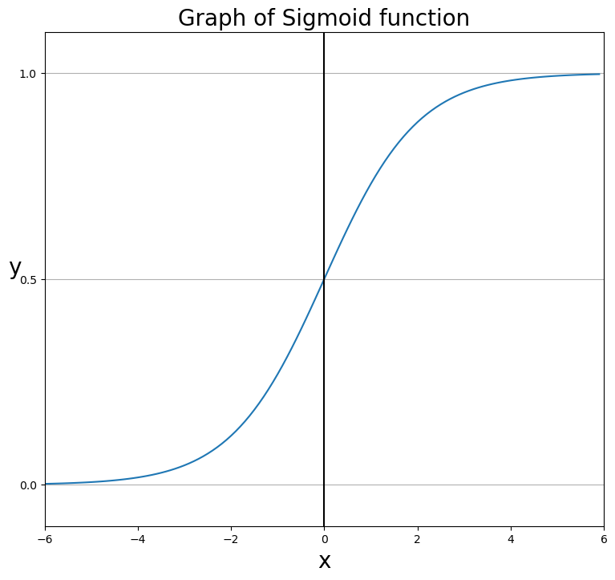
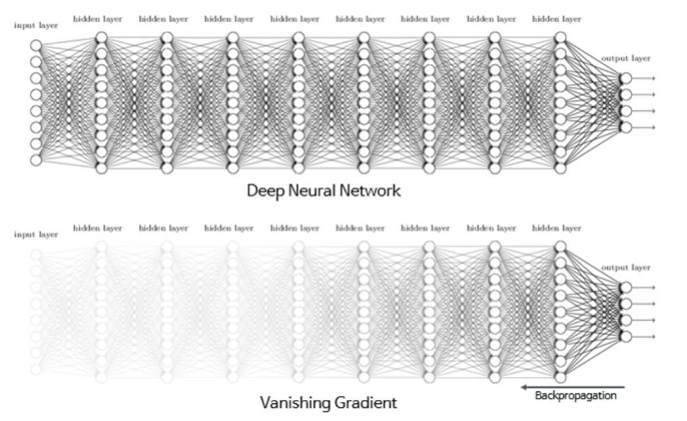

### `시그모이드 함수(Sigmoid Function)`
---
- $a(x)$ = 1 / (1 + $e^{-x}$)

```python
import numpy as np

# 시그모이드 함수
def sigmoid(x):
    return 1 / (1 + np.exp(-x))
```
```python
x = np.arange(-6.0, 6.0, 0.1)
y = sigmoid(x)

# 캔버스 설정
fig = plt.figure(figsize=(9, 8))
fig.set_facecolor('white')

plt.plot(x, y)
plt.ylim(-0.1, 1.1)
plt.xlim(-6, 6)
plt.title('Graph of Sigmoid function', fontsize=20)
plt.xlabel('x', fontsize=20)
plt.ylabel('y', rotation=0, fontsize=20)

plt.yticks([0.0, 0.5, 1.0])
plt.axvline(0.0, color='k')
ax = plt.gca()
ax.yaxis.grid(True)

plt.show()
```

- 시그모이드 함수(Sigmoid function)는 0에서 1 사이의 함수이며, 값이 들어왔을 때, 0~1 사이의 값을 변환한다.
- 시그모이드 함수(Sigmoid functon)를 활성화 함수(Activation function)로 사용하면, 0과 1로 가까운 값을 통해 `이진분류`를 할 수 있다.
- 연속형 데이터이기 때문에, 계단 함수가 끊기지 않는 매끄러운 모양으로 바뀐다.
- 동시에 이상치가 들어온다 할지라도, 시그모이드 함수는 0과 1로 수렴하므로, 이상치 문제가 해결되면서 연속된 값을 전달할 수 있다.

### 2.  `시그모이드 함수(Sigmoid function)` 장점

- 분류는 0과 1로 나뉘며, `출력 값이 어느 값에 가까운지`를 통해 어느 분류에 속하는지 쉽게 알 수 있다.
- 출력값의 범위가 0~1 사이이며, 매우 매끄러운 곡선을 가지고 있어서, 경사하강법(Gradient Descent)을 실행 할 때 기울기가 급격하게 변해서 발산하는 기울기 폭주(Gradient Exploding)가 발생하지 않는다.

### 3. `시그모이드 함수(Sigmoid function)` 단점

- 핵심 : 기울기 소실 문제, 학습 속도 저하 문제 발생

1. 기울기 소실 문제(Gradient Vanishing)


- 입력값이 아무리 크더라도, 출력되는 값의 범위가 매우 좁기 때문에 경사하강법(Gradient Descent) 실행한 경우에 범위가 너무 좁아서, 0에 수렴하는 기울기 소실(Gradient Vanishing)이 발생할 수 있다.
- 출력 값의 중앙값이 0이 아닌 0.5이며, 모두 양수이기 때문에 출력의 가중치 합이 입력의 가중치합보다 커지게 되는데 이를 `편향 이동(Bias Gradinet)라고 한다.
- 신호가 각 레이어를 통하게 할 때마다 분산이 계속 커지게 되어, 활성화 함수(Activation function)의 출력이 최댓값과 최솟값이 0과 1에 수렴하게 된다.
- 0이나 1에 가까울수록 당연히 출력되는 값이 0에 가까워지게 되는데, 이로 인해 뉴런의 기울기(Gradient)값이 0이 된다.
- 역전파 시 0이 곱해져서 기울기가 소멸(kill)되는 현상이 발생해 버리는 것(역전파가 진행될수록 아래 층(Layer)에 아무런신호가 전달되지 않는 것)을 기울기 소실(Gradient Vanishing)라고 한다.

2. 학습 속도 저하 문제
- 시그모이드 함수의 출력값은 모두 양수기 때문에 경사하강법을 적용할 때, 그 기울기가 양수거나 음수가 한다.
- 이는 기울기 업데이트가 지그재그로 변동하는 결과를 가지고 오고, 학습 효울성을 감소시켜 학습에 더 많은 시간이 들어가게 만든다.

### 4. `시그모이드 함수(Sigmoid function)` 결론
- 출력층에서 시그모이드 함수(Sigmoid function)를 사용하는 것은 상관없으나, 아래로 정보가 계속 흘러가는 은닉층(Hidden layer)에서는 시그모이드 함수를 활성화 함수(Activation function)로 사용해서는 안 된다.
- 즉, 시그모이드 함수(Sigmoid function)는 이진 분류를 하고자 하는 경우 출력층에서만 사용하는 것을 권장한다.
- 은닉층(Hidden layer)은 입력층(시작), 출력층(끝) 사이에 있는 부분이다.
- 은닉층에는 선형 함수와 시그모이드 함수는 사용하지 않는 것이 좋다.
- 시그모이드 함수는 이진 분류를 하고자 하는 경우 출력층에서만 사용하는 것을 권장한다.
- 입력층에서 시그모이드 함수를 쓰고자 한다면, 발전형인 하이퍼볼릭 탄젠트 함수(Hyperbolic tanh function)를 사용하는 것을 추천한다.

#### Reference 
- concept & code @ https://gooopy.tistory.com/52