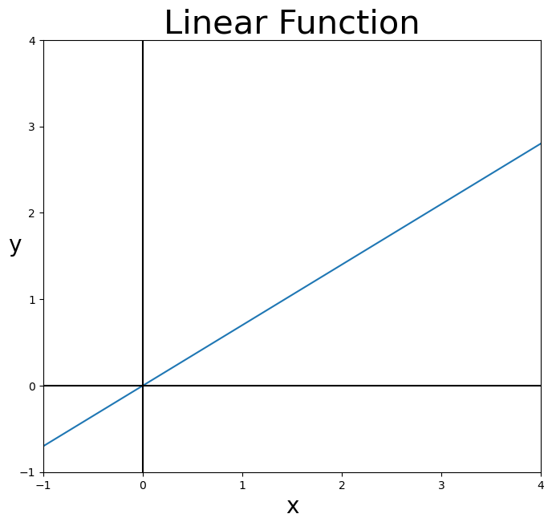
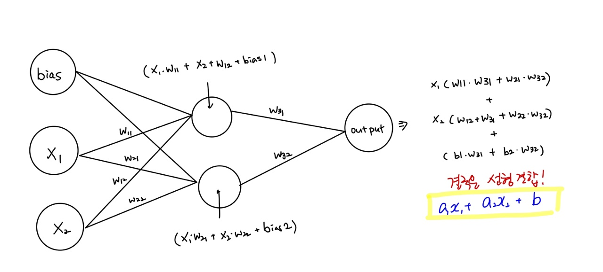

### 계단함수(Step Function)
---
- Step Function은 말 그대로 계단 모양 함수로, 특정값 이하는 0이고 특정값 이상은 1로 출력하도록 만들어진 함수 
- y = 1 (x >= 0)
- y = 0 (x < 0)
  
```python
import numpy as np
import matplotlib.pyplot as plt

# 계단함수 1.
def step_fuction1(x):
    if x <= 0:
        return 0
    elif x > 0:
        return 1 

# 계단 함수 2. 
def step_function2(x):
    y = x > 0               
    # x > 0의 결과는 x로 주어진 인자들이 0보다 큰지 작은지 진리값 반환 
    # True -> y = 1 / False -> y = 0
    return y.astype(np.int) # 데이터 x를 정수(int) 타입으로 바꿔주는 것
```

```python
np.arange(-5.0, 5.0, 0.1)
y = step_function2(x)

# 캔버스 설정 
fig = plt.figure(figsize=(8,8)) # 캔버스 생성 
fig.set_facecolor('white')      # 캔버스 색상 설정

plt.plot(x, y)
plt.ylim(-0.5, 1.5)
plt.xlim(-5, 5)
plt.ylabel('y', fontsize = 20, rotation = 0)
plt.xlabel('x', fontsize = 20)
plt.title("Step Function", fontsize=30)
plt.show()
```


> x가 0을 기준으로 y값이 계단을 올라가듯 크게 변하는 함수

> 순수하게 신경 세포의 전달 방법을 묘사한 기법으로, 출력되는 결과값이 갖는 정보가 너무 희석된다는 단점 존재 

> ex. 합산된 값이 0.1인 경우와 1.0인 경우는 산술적으로 10배의 차이가 나나 이를 무시하고 단순하게 1로 전달하므로, 합산된 값의 강도에 대한 의미가 부여되지 X 

### 선형 함수(Linear Funtion)
- 정직하게 자신의 값을 나타내는 선형 함수(y=ax + b)
- 선형 함수는 **활성화 함수**로 사용하지 못한다.

```
# 선형 함수
def Linear_Function(x, k):
    return k*x

x = np.arange(-5.0, 5.0, 0.1)
y = Linear_Function(x, 0.7)

#캔버스 설정 
fig = plt.figure(figsize=(8, 7))
fig.set_facecolor('white')

plt.plot(x, y)
plt.ylim(-1, 4)
plt.xlim(-1, 4)
plt.axhline(c="black")
plt.axvline(c="black")
plt.ylabel('y', fontsize = 20, rotation = 0)
plt.xlabel('x', fontsize = 20)
plt.title("Linear Function", fontsize = 30)
plt.show()
```

> 1. 선형 함수는 layer를 쌓는 의미가 없게 만든다.


> 2. 입력치에 이상치가 존재하는 경우 분류를 불가능하게 만든다. 

    > 예를 들어 학습 기간에 따른 합격 여부를 나눈다고 할 때, 공부 기간이 4일 이하인 경우 불합격 비중이 많았으며 5일 이상인 경우 합격 차지 비중이 많았다고 한다면 신경망은 4일을 기준으로 합격 / 불합격 여부를 나누려고 학습할 것이다. 그러나 누군가 지나치게 공부를 오래하여 1달 동안 공부를 했다고 할 때, 이를 이상치로 제거하지 않고 그대로 넣을 경우 신경망은 어디를 기준으로 분류해야 할 지 헷갈리게 된다. 
    
> But 다층 신경망아 아니거나(은닉층이 없는 단층 신경망이거나) 입력치에 이상치가 없거나, 이상치를 조정하ㅕ 데이터에서 이상치가 존재하지 않는 형태로 만들었다면 선형 함수를 써도 큰 문제가 없다. 


#### Reference 
- concept & code @ https://gooopy.tistory.com/51