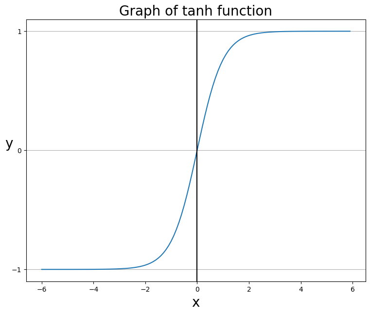

### 하이퍼볼릭 탄젠트 함수(tanh)
- 하이퍼볼릭 함수는 우리말로 쌍곡선 함수라고 한다.
- 쌍곡선 함수는 표준 쌍곡선을 매개변수로 표시할 때 나온다.
- 삼각함수 $tanx$ = $sinx$ / $cosx$에서 나왔다.
- 쌍곡선 함수에서 쌍곡선 함수에서 쌍곡탄젠트(Hyperbolic tangent)는 $tanhx$ = $sinhx$ / $coshx$를 통해서 구한다.

- $sinhx = \frac{e^x - e^{-x}}{2}$
- $coshx = \frac{e^x + e^{-x}}{2}$
- $tanhx = \frac{sinhx}{coshx} = \frac{e^x - e^{-x}}{e^x + e^{-x}}$
- $sinhx$ =하이퍼볼릭 샤인, 쌍곡 샤인, 신치
- $coshx$ = 하이퍼볼릭 코샤인, 쌍곡 코샤인, 코시
- $tanhx$ = 하이퍼볼릭 탄젠트, 탄젠트, 텐치

```python
import numpy as np

# 하이퍼볼릭 탄젠트
def tanh(x):
    p_exp_x = np.exp(x)
    m_exp_x = np.exp(-x)
    y = (p_exp_x - m_exp_x) / (p_exp_x + m_exp_x)
    return y
```
```python
import matplotlib.pyplot as plt

x = np.arange(-6.0, 6.0, 0.1)
y = tanh(x)

# 캔버스 설정
fig = plt.figure(figsize=(9, 7))  # 캔버스 생성
fig.set_facecolor('white')  # 캔버스 색상 설정

plt.plot(x, y)
plt.title('Graph of tanh function', fontsize=20)
plt.xlabel('x', fontsize=20)
plt.ylabel('y', fontsize=20, rotation=0)

plt.yticks([-1.0, 0.0, 1.0])  # 특정 축에서 특정 값만 나오도록 설정
plt.axvline(0.0, color='k')
ax=plt.gca()
ax.yaxis.grid(True)  # y축에 있는 모든 숫자에 회색 점근선을 긋도록 설정

plt.show()
```

- 하이퍼볼릭 탄젠트 함수는 -1에서 1 사이의 값을 출력하며, 중앙값도 0이다.
  
### 시그모이드 함수와 하이퍼볼릭 탄젠트 함수 차이

||시그모이드 함수|하이퍼볼릭 탄젠트 함수|
|:-----:|:-----:|:-----:|
|범위|0 ~ 1|-1 ~ 1|
|중앙값|0.5|0|
|미분 최댓값|0.3|1|

- 하이퍼볼릭 탄젠트는 중앙값이 0이기 때문에 경사하강법 사용할 때 시그모이드 함수에서 발생하는 편향 이동이 발생하지 않는다.
- 시그모이드 함수보다 범위가 넓기 때문에 출력값이 변화폭이 더 커서 기울기 소실(Gradient Vanishing)증상이 더 적은 편이다.
- 기울기 소실(Gradient Vanishing)은 미분 함수에 대하여, 값이 일정한 값 이상 커지는 경우 미분값이 소실되는 현상을 말한다.
- 은닉층에서 레이어를 쌓고자 한다면, 하이퍼볼릭 탄젠트를 사용하는 것이 효과적이다.
- 하지만 기울기 소실 현상 문제는 시그모이드함수와 마찬가지로 존재하고 있다.
- 따라서 `은닉층에서는 (ReLU)함수가 가장 많이 사용된다.`


#### Reference 
- concept & code @ https://gooopy.tistory.com/54