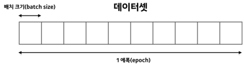
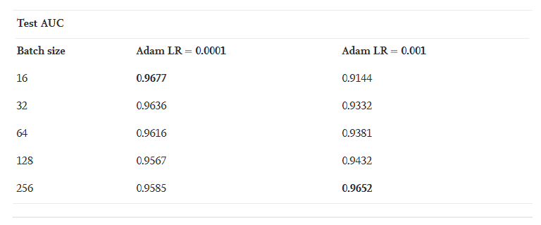
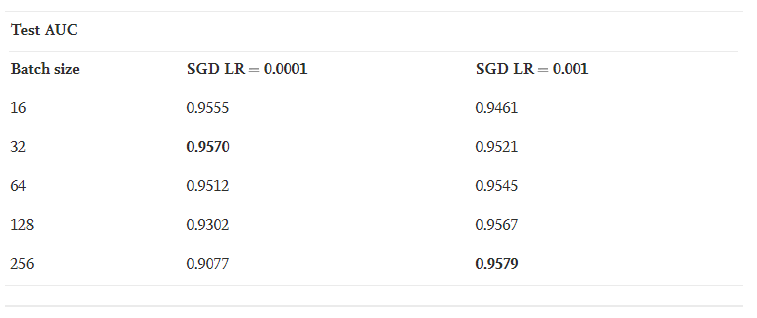
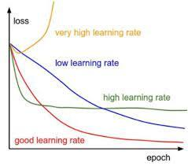
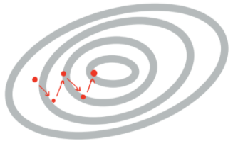
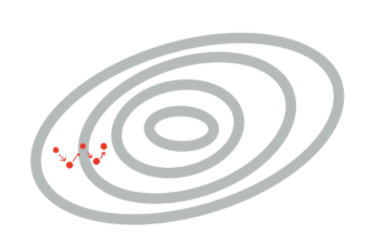
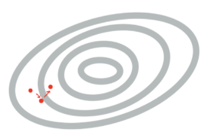
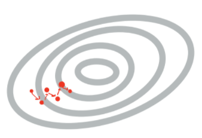
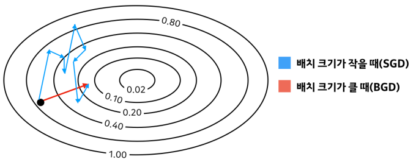

## Batch size와 학습 
--- 
- Optimization_basic에서 설명했듯이 Batch란 학습을 할 때 모델에 한 번에 들어가게 되는 데이터 집합이며, Batch size는 Batch에 포함된 데이터의 개수를 의미 
- 한 번의 학습(1 Epoch)을 할 때 학습 데이터를 Batch size만큼 나누어서 학습을 진행함 
  
  

  출처: https://www.kakaobrain.com/blog/113

 

- Batch size와 학습의 관계 
  - 일반적으로 GPU를 이용하여 학습을 진행하므로 GPU의 병렬 처리 덕분에 배치 크기에 상관 없이 한 번 학습할 때 걸리는 시간이 동일하다고 가정한다면, 이러한 상황에서는 epoch당 학습 횟수를 줄이는 것이 중요 
  - ex) 총 데이터 = 1000개, Batch size = 1, Iteration(학습횟수) = 1000(1000/1)
  - Iteration이란 전체 데이터에 대해 총 Batch의 수를 계산한 것으로, 한 번의 학습을 할 때 몇 번 데이터를 나누어 넣는 지를 나타냄(1 epoch당 1000개의 데이터를 1개씩 나누어 1000번 학습을 진행하므로 1000 Iteration)
  
    > 그렇다면 Batch size가 클 수록 학습 횟수가 줄어드는 셈인데, 학습 횟수가 줄어들면 좋은 것인가?

 

## Learning rate과 Batch size의 상관관계 

Learning rate와 Batch size간 상관관계에 대해 다룬 논문

: https://www.sciencedirect.com/science/article/pii/S2405959519303455#fig2

 

- 실험: 대용량 의료 이미지를 가지고 딥러닝 최적화 기법 중 Adam과 SGD를 사용했을 때 비교 분석 
- 결과: 

  - Adam
  
    

  - SGD

    

> Learning rate와 Batch size가 양의 관계를 띄었고, fine tuning으로 SGD 보다 높은 성능을 냄  

 

- Loss 수렴 측면에서 Batch size의 중요성 
  
  

  출처: inhovation97 tistory

    - 논문의 실험 결과에 의하면 결국 fine tuning에 있어서 learning rate의 수렴 그래프가 사실은 batch size도 굉장히 중요한 역할을 하게됨을 파악 가능 

 

- 내용 정리 
  
1. learning rate가 클 때
   
    

   - 한 번의 step에서 파라미터 학습이 크게 진행되기 때문에 보폭이 커짐 
   - 보폭이 크므로 좀 더 빨리 수렴이 가능하며, 그 만큼 local minima로 빠질 위험이 적음
   - 하지만 너무 크면 오버슛이 심하게 일어나 loss가 전혀 줄지 않을 수 있음(수렴하지 않는 것)

 

2. learning rate가 작을 때 

    

    - step 보폭이 작아 조금씩 학습함
    - 보폭이 작기 때문에 오버슛 발생 x 
    - 하지만 작은 보폭 때문에 local minima에 빠질 위험이 존재함

 

3. Batch size가 클 때 

    

    - 한 번 학습할 때 많은 데이터로 학습을 하게 됨
    - Train 데이터에서 많은 양을 한 번에 볼 수 있으므로, 학습을 하고 모델의 가중치(w)를 갱신할 때 최적화된 경로로 가중치를 갱신하게 됨 
    - 따라서 학습이 빠르며 어느정도 수준까지 수렴이 매우 빠름
    - 모델은 Train 데이터의 분포를 따르려고 하는 데, 한 번에 많은 데이터를 볼 수 있다면 Batch 분포와 Train 데이터의 분포가 비슷해질 수 있기 때문  
    - local optima에 빠질 확률이 작음
 
 

4. Batch size가 작을 때 

    

    - 1epoch 당 iteration이 크기 때문에 step이 많아짐 
    - Batch size가 1이라고 가정하면, 학습을 진행할 때 Batch에 특이값(Outlier)가 포함되었을 때 실제 최적화된 경로가 아닌 다른 경로로 모델의 가중치가 갱신될 것 
    - 작은 배치는 작은 데이터로 학습하므로 loss의 분산이 커서(한 번에 계산하는 데이터 양이 작음) regularize 효과가 있음 
    - step이 많아 local minima로 빠질 수 있으며 학습 시간이 오래 걸릴 수 있음 

 

- Batch size가 큰 경우 학습 도중에 오차가 local optimal에 해당되었을 때는 더 이상 학습되지 않음(Train 데이터의 최적화된 경로를 따르기 때문에 local optimal에서 빠져나올 길이 없게 되는 것)
- 그러나 Batch size가 작을 때는 local optimal에 해당되더라도 Batch 내부의 특이값 혹은 그 자체의 분포가 실제 Train 데이터의 분포와 다르기 때문에 Train 데이터의 최적화된 경로가 아닌 다른 경로로 움직여 local optimal에서 빠져나갈 수 있음 

> 이러한 이유로 인해 Batch size가 무작정 크다고 좋은 것은 아님. 하지만 Batch size가 클 때 학습 속도가 비교적 빠르고 안정적인 학습이 가능하기 때문에 이러한 강점을 얻으려면, 학습이 불안정한 초반에는 학습률을 낮게 사용하거나, 레이어별로 다른 학습률을 적용시키는 방법들이 있음 

 

---
#### 참고자료 
@ https://ladun.tistory.com/85

@ https://inhovation97.tistory.com/32