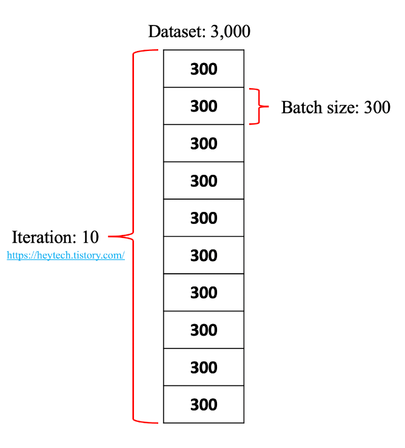

## Optimization basic 
---
- Gradient Descent 과정에서 데이터가 많아지고, 신경망이 복잡해질 수록, 한 번만의 계산으로 최적화된 값(HPO, Hyper-Parameter Optimization)을 찾는 것을 매우 힘든 일 
- 따라서 딥러닝에서 최적화(Optimization)을 할 때는 일반적으로 여러 번 학습 과정을 거치는 데, 여기서 Epoch, Batch size, Iteration이라는 개념 등장 

 

### Epoch, Step 
- Epoch: 전체 데이터 셋에 대해 Forward pass, Backword pass 과정을 통해 **한 바퀴 돌며 학습하는 것**을 의미 
- 쉽게 말해 '전체 데이터셋을 학습한 횟수'
  - ex) 사람이 문제집으로 공부하는 상황을 예로 들자면, epoch는 문제집에 있는 모든 문제를 처음부터 끝까지 풀고, 채점까지 마친 횟수  
  - 문제집을 5번 풀었다면 epoch = 5 
- 순방향 패스(Forward pass): 신경망에서 역전파 알고지름을 사용할 때 입력부터 출력까지 각 계층의 Weight를 계산하는 과정 
- 역방향 패스(Backword pass): 반대로 거슬러 올라가며 기존의 Weight를 수정하는 과정 
- 이 둘을 합치면 Epoch 
- 모델을 만들 때 적절한 Epoch를 사용해야 underfitting과 overfitting을 방지 가능 
- Step: Epoch 과정에서 Weight와 Bias를(parameter) 1회 업데이트 하는 것을 1 Step이라고 부름 

 

### Batch size, Iteration 
- Batch size: 한 번의 Batch마다 주는 데이터 샘플의 size(크기)를 의미
- 비유하자면 사람이 문제 풀이를 통해 학습해 나가는 과정에서 **'몇 개의 문제를 한 번에 쭉 풀고 채점할 지를 결정하는 것'**
  - ex) 문제가 3000개가 있고, 300문제씩 풀고 채점한다면 Batch size는 300
  - 사람이 문제를 풀고 채점을 하며 문제를 틀린 이유나 맞춘 원리를 학습하듯이 딥러닝 모델 역시 마찬가지 
  - Batch size만큼 데이터를 활용해 모델이 예측한 값과 실제 정답 간의 오차(conf. 손실함수)를 계산하여 parameter를 업데이트함 
- Iteration: 전체 데이터에 대해 총 Batch의 수 (=Epoch를 나누어서 실행하는 횟수)
  - ex) 총 데이터 = 3000개, batch size = 300
  - iteration = 10 (10개(3000/300)의 데이터에 대해 학습하는 것)
  - 1 Epoch = 10 iteration 
  - Epoch를 iteration으로 나누는 이유는 메모리의 한계와 속도 때문 
  
  

 

#### Batch size 조절 과정 
- Batch size를 줄일 수록 필요한 메모리가 감소하며, 그에 따라 학습의 속도가 향상됨 (똑같은 데이터를 여러 번 나누어서 weight 갱신을 여러 번 하기 때문)
- Batch size 늘릴 수록 Gradient의 평가 정확도가 올라가며, overfitting 방지 효과 有

---
#### 참고자료 
@ https://m.blog.naver.com/sjc02183/221768995624
@ https://heytech.tistory.com/386
