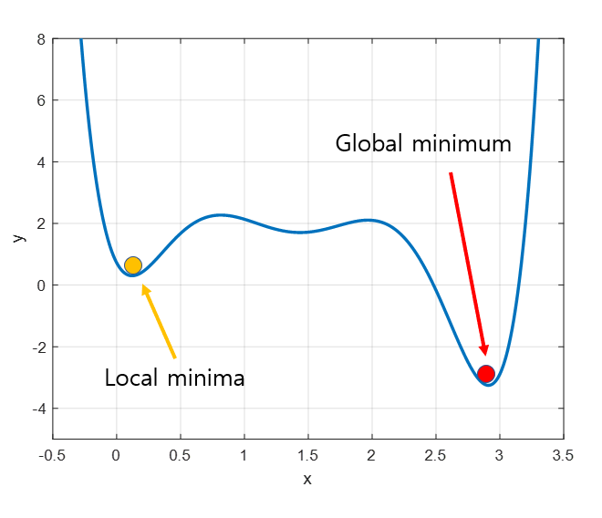

# 경사 하강법(Gradient Descent)
### 개념
- 알고리즘 학습 시 사용되는 최적화 방법(Optimizer) 중 하나
- 경사 하강법은 함수의 기울기(gradient)를 이용해 x의 값을 어디로 옮겼을 때 함수가 최소값을 찾는 지 알아보는 방법
- 이때 y축은 비용(예측값과 정답값 간의 차이)으로, 비용이 가장 작아지는 지점을 찾아야함 
- 다시 말해 알고리즘 학습 목표는 예측값과 정답값 간의 차이인 **손실 함수의 크기를 최소화**시키는 파라미터를 찾는 것 
- 이때, 학습 데이터 입력값(input)을 변경할 수 없기에, 손실 함수 값의 변화에 따라 독립변수인 가중치(weight) 혹은 편향(bias)을 업데이트 해야함 
- 편의상 독립변수 w, b를 x라고 지칭 

 

### 사용 이유 
미분 계수가 0인 지점을 찾지 않고 경사하강법을 쓰는 이유는 아래와 같음
1. 함수가 닫힌 형태가 아닌 경우 
2. 함수가 너무 복잡해 미분 계수를 구하기 어려운 경우 
3. Gradient descent를 구현하는 게 미분 계수를 구현하는 것보다 더 쉬운 경우 
4. 데이터 양이 너무 많은 경우 효율적으로 계산하기 위해 

 

### Gradient descent의 수식 유도 
#### 수식 유도1
- 기울기 양수: x의 값이 커질 수록 함수의 값이 커짐 
- 기울기 음수: x의 값이 커질 수록 함수의 값이 작아짐 
  > 기울기가 양수일 때는 x가 작아지는 방향으로 옮기고, 기울기가 음수이면 x가 커지는 방향으로 옮겨야 함 (즉, 기울기의 반대 방향으로 움직여야 한다!)

  > $x_{i+1} = x_{i}$ - 이동거리 * 기울기의 부호
  

#### 수식 유도2 
- 기울기의 크기: 최솟값에 가까워질 수록 기울기의 크기는 작아짐(접선이 완만해짐)
- 따라서 최솟값에 가까울 수록 조심히 움직여야 발산하지 않고 진정한 최솟값을 찾을 수 있음
- 이는 앞서 수식 유도1 공식에서 살펴봤던 이동거리를 기울기의 크기를 통해 계산해야 한다는 의미 
- 기울기의 크기와 기울기의 부호를 곱하면 ? 결국은 기울기가 된다. 
  > $x_{i+1} = x_{i}$ -기울기
  

- 이때, 사용자의 필요에 맞게 이동 거리를 조절할 수 있도록 해주기 위해 step size 조절 인자를 넣기도 함 **(학습률, learing rate $a$)**
- 학습률 $a$를 포함한 최종 수식
  >  $x_{i+1} = x_{i} - a\frac{df}{dx}$$(x_{i})$

 

### Gradient descent의 시각화 
함수 $f(x)$에 대한 gradient descent의 시각화

### Step size 
- Step size가 너무 작으면 최솟값까지 수렴하지 못함 
- 따라서 Step size가 적절히 커야 수렴 가능한데 
- Step size가 너무 크면 최솟값을 찾지 못하고 함수값이 계속 커질 수 있으므로 적절한 크기의 step size를 찾는 것이 중요함 

### Local minima 문제 
- gradient descent 알고리즘을 시작하는 위치는 매번 랜덤하기 때문에 우리가 실제 찾아가야 하는 값은 Global minima인데도 불구하고 Local minima에 빠져 계속 헤어나오지 못하는 경우 생김 
  

 

---
#### 참고자료 

https://angeloyeo.github.io/2020/08/16/gradient_descent.html