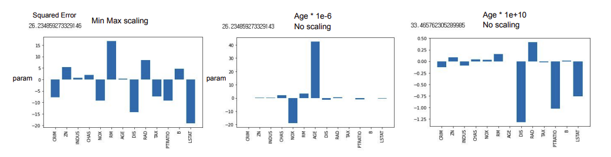
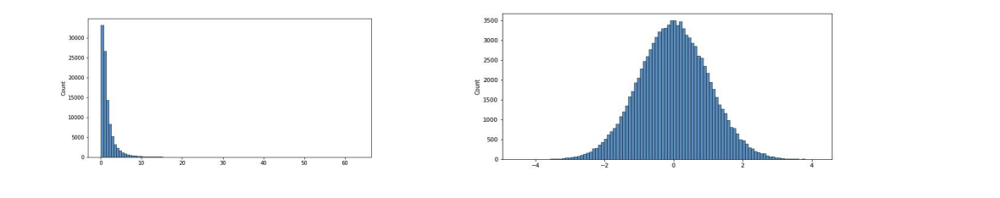
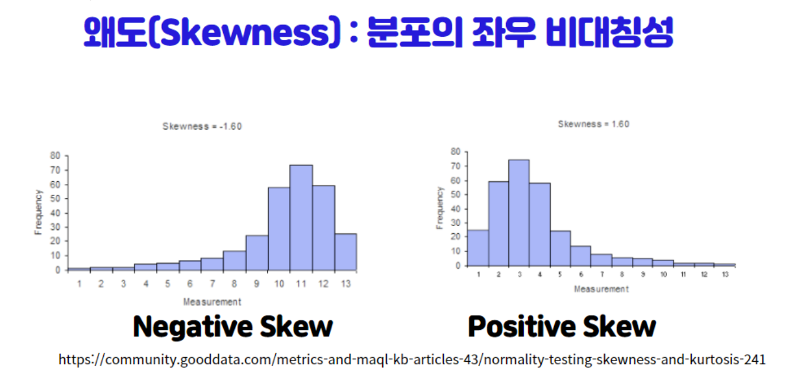
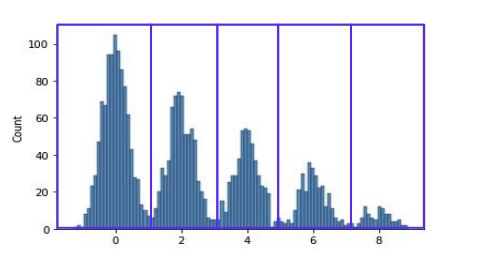

# 데이터 전처리 
**모델에 데이터를 입력하기 위해 데이터를 처리하는 과정**


<br>

## 연속형 변수 처리

### 변수 변환 기법 
1. Scaler(Min-max, Standard, Robust)
2. 함수 변환 (로그, 지수, 제곱, 루트, 역수 등)
3. 구간화(Binning)
   

**데이터 분석에 용이한 분포는 좌우 대칭 모양을 가지는 정규분포에 가까운 모양**

<br>

### Scaling 
1. Min-Max Scaling: 현재 값에서 Minimum 값을 빼고, Max 값과 Min 값의 차이로 나눈 값
   
   $X_{new} = \frac{X_i - min(X)}{max(X) - min(X)}$

2. Standard Scaling: 현재 값에서 평균 값을 빼고, 표준 편차로 나눈 값 
   
   $x_{new} = \frac{x-\mu}{\sigma}$

3. Robust Scaling: 현재 값에서 중위 값을 빼고, IQR로 나눈 값 
   
   $X_{scale} = \frac{x_i-x_{med}}{(x_{75}-x_{25})}$


출처: 부스트코스 
> 1번 차트(왼쪽 기준) Age 피쳐에 Scaling을 진행했을 때(그 중에서도 Min-Max scaling) Squared Error 26.2, Age 피쳐의 계수값은 아주 작은 것을 확인 가능

> 반면에 2번 자트는 Age 피쳐에 1E-6을 곱해 아주 작게 만들고 Scaling은 진행하지 않은 결과 Age 피쳐의 계수값이 아주 커져 타깃에 영향을 주는 피쳐가 되었음. 그리고 3번 차트는 Age 피쳐에 10E10을 곱해 아주 크게 만들고 Scaling 하지 않은 결과 Age 피쳐의 계수값은 아주 작아지고, 모델의 Error가 33.4로 커진 것을 확인 가능 

**Scaling은 잘못하면 계수값에 영향을 주며, 그에 따라 모델의 성능에도 영향을 줄 수 있기 때문에 적절하게 Scaling하는 것이 매우 중요**

<br>

### Scaling + Distribution 
1. Log Transformation: 변수의 분포가 왼쪽으로 치우쳐 있는 경우(꼬리가 오른쪽으로 긴 경우), Log Transformation을 통해 정규 분포에 가까운 분포로 만들어낼 수 있음 (즉, 좌우대칭 분포로 변환 시도)
   

* 반면 분포가 오른쪽으로 치우져 있는 경우(꼬리가 왼쪽으로 긴 경우) 지수변환을 취해 정규분포처럼 만들어줌


cf) 왜도: 분포가 어디에 치우쳐져 있는 지를 보는 대표적인 방법

```
- 음의 왜도(Negative skewness): 왜도에서는 왼쪽에 긴 꼬리를 갖는 왼쪽 꼬리 분포를 음의 왜도나 좌비대칭형(Skewed left)이라 부름 
- 양의 왜도(Positive skewness): 왜도에서는 오른쪽에 긴 꼬리를 갖는 오른쪽 꼬리 분포를 양의 왜도나 우비대칭형(Skewed right)이라 부름 
```

2. Quantile Transformation
- 값을 Uniform하게 변화시키거나 정규 분포로 변환시켜줌 
- Log Transformation과 가장 큰 차이점은 어떠한 분포가 들어와도 정규 분포 혹은 Uniform한 분포로 변환이 가능하다는 것 


<br>

* 분포 변환의 장점


**Transformation을 사용함으로 인해 특정 Feature와 Target과의 관계를 더욱 직접적으로 변환 가능함.** 왼쪽 파트에서 LSTAT 변수와의 상관관계는 -0.74 정도로 나오지만, Transformation을 통해 오른쪽 차트와 같이 상관관계가 -0.79로 Target과 더욱 직접적인 관계를 갖게됨 -> **선형 모델에 해당 피처가 모델의 성능을 올릴 수 있는 요소를 갖게 됨**


### Binning 
- 연속형 변수를 범주형 변수로 변형시키는 방법 
- 변형 이유: 아래와 같이 봉우리가 여러 개 있는 데이터이며 구분되는 구간이 있는 반면, 연속적으로 존재하게 됨으로써 중간중간 유의미하지 않은 정보들이 있을 수 있음. 이 경우에 Overfitting이 발생할 수 있으므로 이를 방지하고자 연속형 변수를 묶어 범주형 변수로 바꿀 수 있음 
  



---
<br>

#### 참고자료

@ 부스트코스 

@ https://seeyapangpang.tistory.com/34

@ https://gooopy.tistory.com/120