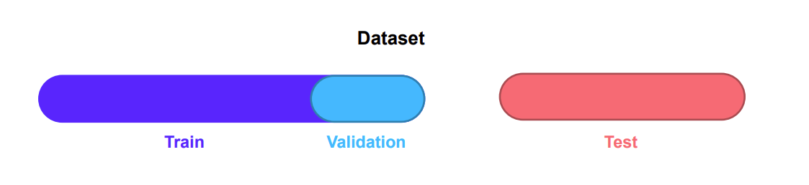
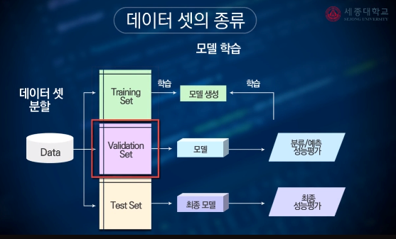
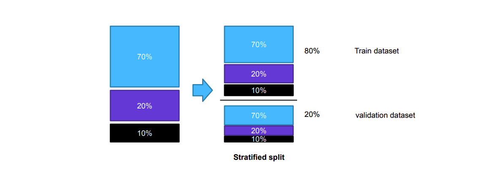
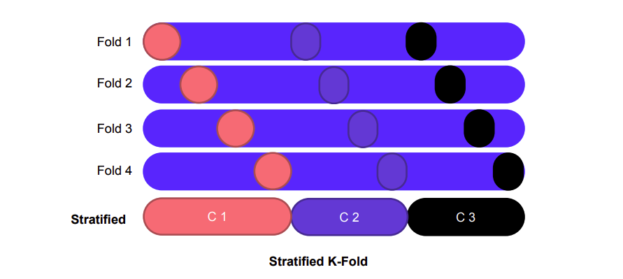
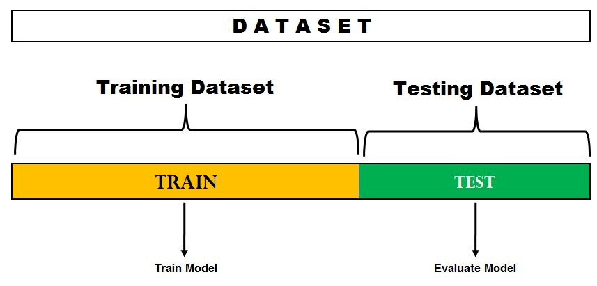
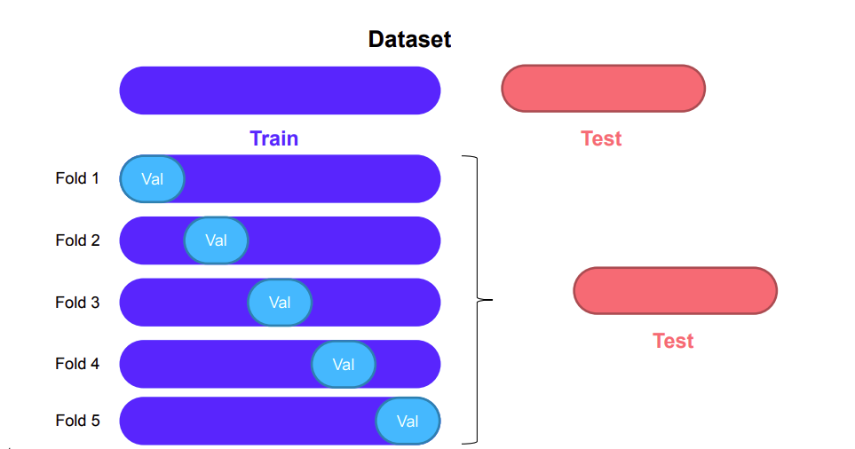
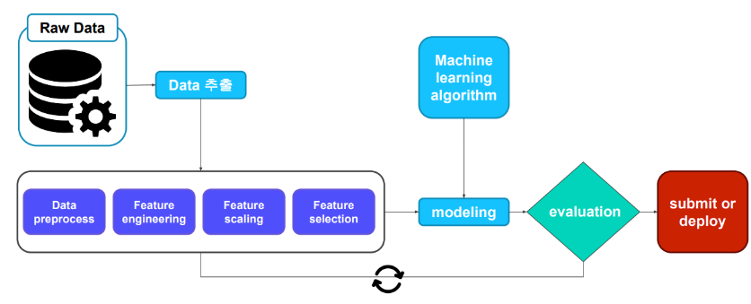

## Data set 
---
### 데이터의 구성 




- Train set 
  - 머신러닝 모델이 보고 학습하는 데이터 셋
- Validation Set 
  - 단순히 Train data:Test data로 데이터를 쪼개는 것이 아니라, Train data 중에서 다시 일정 비율을 Validation data로 분리하는 이유는? 
  - 머신러닝 모델을 **Test set에 적용하기 전에 모델의 성능을 어느정도 파악하기 위함**이 목적 
  - 이를 이용하여 앞서 알아본 Early stopping을 포함한 Regularization 기법들을 사용하거나, Hyper-parameter를 설정하는 데 사용 가능 
- Test set 
  - 가장 중요한 데이터셋 
  - 여러가지 모델을 만들어 하나의 통일된 데이터셋을 기반으로 정량적인 비교를 통해 모델 선택함 
  - 다시 말해 프로젝트의 결과물과 직결되는 데이터 셋 

### 데이터셋 선정 방법 
- Random Sampling
    - 가장 간단하면서도 많이 쓰이는 방법 
    - 장점: 데이터 셋의 크기가 크가는 가정 하에, 랜덤하게 각 Set으로 나눠도 대표성이 유지될 수 있으며 간편함
    - 단점: 데이터 셋의 크기가 작다면 전체 데이터를 대표하기에 어려움이 있을 가능성 존재 

#### Stratified 방식 적용 


- 각 클래스의 분포를 유지하기 위해 사용되는 방법 
- 클래스가 3개가 있다는 가정 하에, 클래스 별로 비율이 뷸균등하게 분포되어 있다면 이를 쪼갤 때 또한 같은 비율 구성으로 쪼개도록 하는 방식
- 전체 데이터에서 무작위로 샘플을 추출할 경우에 비해, **표본이 특정 클래스에 편중될 수 있다는 단점을 보완**하여 샘플의 대표성을 높이는 기법 
  

<br>


- K-fold에 적용시킨다면 위와 같은 형태
  
<br>

## Model 성능 평가 
---

### 1. Hold-Out cross validation (Hold-out 교차검증)

 

- Training과 Test Dataset으로 분리하여 모델 성능 평가 
- Hold-out은 데이터를 Train/Test로 한번만 나누기 때문에 다른 검증 솔루션에 간편하며 속도가 빠름 

<br>

- 예시코드 
```python
# Holdout을 위한 라이브러리 호출
import numpy as np
from sklearn.model_selection import train_test_split 

# 임의의 데이터 생성 
# x와 y에 20x5 Matrix의 행렬을 만들고 y(Targer) 벡터 생성 
x, y = np.arange(100).reshape((20,5)), range(20)
print(data_x) # (20*5)x = y (20*1)

# Train/Test 셋 분리 
x_train, x_test, y_train, y_test = train_test_split(x, y, random_state=1,test_size=0.2)

print("The size of x_train: {},".format(x_train.shape),"The size of x_test: {}".format(x_test.shape))
print("The size of y_train: {},".format(len(y_train)), "The size of y_test: {}".format(len(y_test)))
```

<br>


### 2. K-fold cross validation (K-fold 교차검증)


- Hold-out validation과 다르게, Train과 Validation set을 여러 개 구성하는 방법 
- 각 상황 별로 Train과 Validation을 다르게 구성하여 각 상황마다 모델을 학습시킨 후, 최종적으로 각자 다른 Train과 Validation을 거친 모델들을 모두 사용하여 Test set을 예측
- 사용 시 주의할 점 
    - 머신러닝을 진행하는 과정에서 feature selection, data cleansing 등의 전처리 작업 또한 training 과정의 일부이기 때문에 이는 training set에 대해서만 시행
    - 데이터를 쪼개기 전, 데이터 전체를 살펴 보고 특성에 맞게 어떤 기준을 세워 전처리를 하였다면 이는 쪼갠 뒤의 test data도 같은 기준으로 미리 전처리가 되어 cheating한 효과가 남 
    - 따라서 data set을 먼저 나눈 뒤, train set에만 전처리를 시행하야 하며, 다음 fold에 대해 교차검증 시에도 같은 기준으로 전처리를 진행하여 validation set과 test set에 영향이 없도록 해야 함 

<br>

## Machine Learning Workflow 
---


1. 데이터 추출 
   
2. 데이터 전처리 > 피처 엔지니어링 및 스케일링 > 선택 
   
3. 머신러닝 알고리즘 구현해 모델링 후 Test set에 대해 성능 평가 진행 
   
4. 모델 성능 향상 필요시 2번과 3번 과정 반복 
   
5. 원하는 성능이 나오면 해당 모델 제품으로 배포 

**신뢰도가 있고 정확한 데이터를 기반으로 모델의 훈련이 진행되기 때문에 데이터 추출 및 전처리 과정에 모델 성능에 있어 가장 중요한 단계** 


---
#### 참고자료 
이미지 소스 @부스트코스 머신러닝 기본 개념 소개(2) @요거트맨 velog, ResearchGate

@ https://m.blog.naver.com/sjc02183/221739648990

@ https://modern-manual.tistory.com/20

@ https://modern-manual.tistory.com/20
