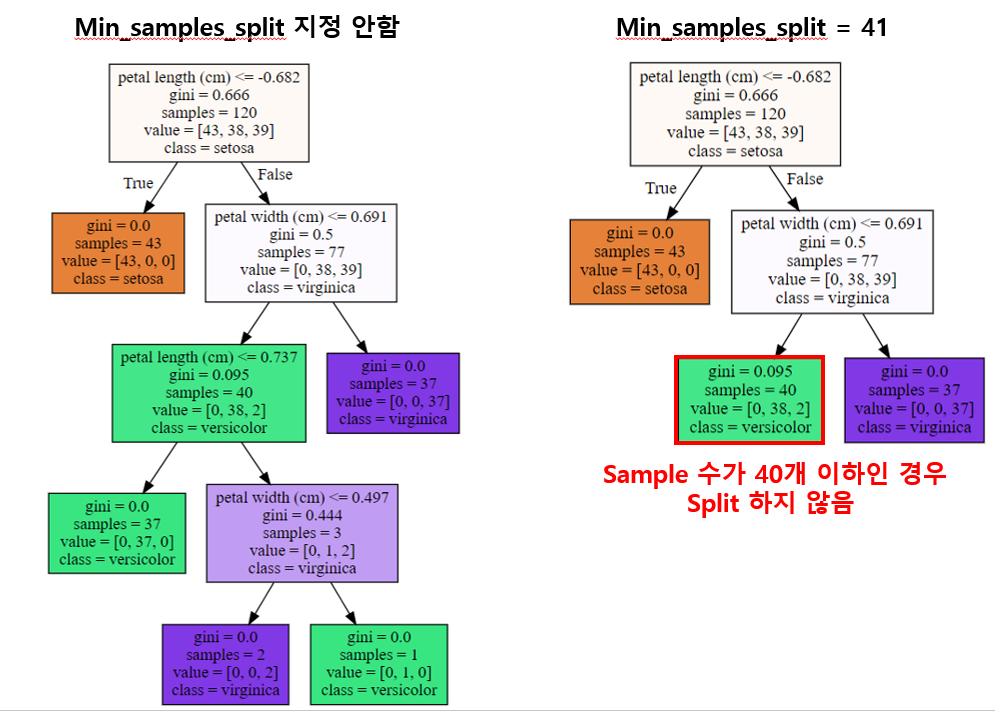
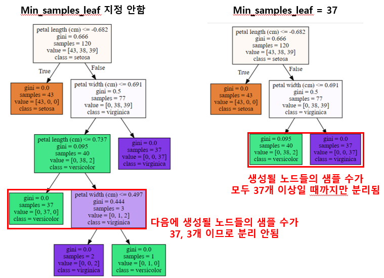
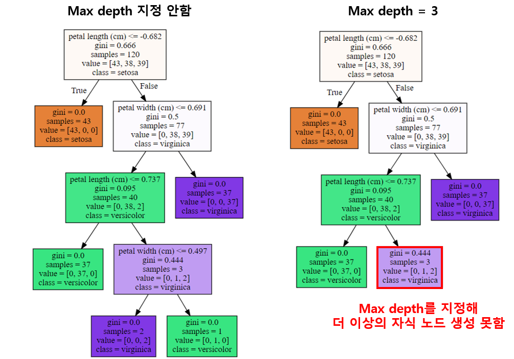
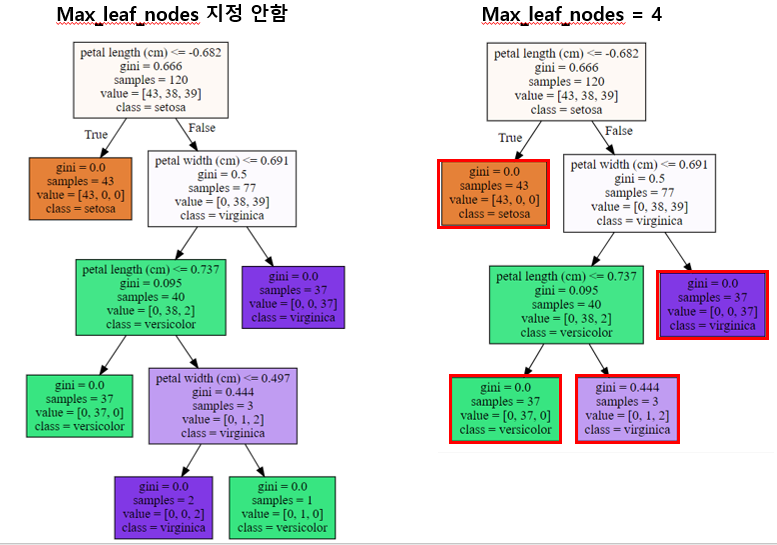

## Decision Tree parameter 
---
- 분류를 위한 클래스인 DecisionTreeClassifier와 회귀를 위한 클래스인 DecisionTreeRegressor
- 동일한 파라미터 사용 

 

|파라미터명                |설명                                             |
|-------------------------|-------------------------------------------------|
|min_samples_split        |노드를 분할하기 위한 최소한의 샘플 데이터 수로 과적합 제어 용도로 사용|
|                         |기본값[디폴트] = 2 |
|                         |작게 설정할 수록 분할되는 노드수가 많아서 과적합 가능성 증가(ex. 1로 설정할 경우 분할되는 노드수가 많아져 과적합 가능성 증가)|
|min_saples_leaf          |leaf가 되기 위한 최소한의 샘플 데이터 수로 과적합 제어 용도로 사용(min_samples_split와 유사)|
|                         |비대칭적 데이터의 경우 특정 클레스의 데이터가 극도로 작을 수 있으므로 이 경우에는 작게 설정|
|max_features             |최적의 분할을 위해 고려할 최대 feature 개수         |
|                         |기본값[디폴트] = None으로 데이터 세트의 모든 feature를 사용해 분할 수행 |
|                         |int형으로 지정하면 대상 feature의 개수를 의미        |
|                         |float형으로 지정하면 전체 피처 중 대상 feature의 퍼센트를 의미 | 
|                         |None: 전체 feature 선정                          |
|                         |sqrt: 체 feature의 제곱근만큼 선정              |
|                         |auto: sqrt와 동일                                |
|                         |log: 전체 feature 중 전체 feature 개수 만큼 선정   |
|max_depth                |트리의 최대 깊이를 규정                            |
|                         |기본값[디폴트] = None으로 완벽하게 클래스 값이 결정될 때까지 깊이를 계속 키우며 분할하거나 노드가 가지는 데이터 개수가 min_samples_split보다 작아질 때까지 계속 깊이를 증가시킴 |
|max_leaf_nodes           |말단 노드[leaf]의 최대 개수                       |

 

### min_samples_split의 이해 

- 노드를 분할하기 위한 최소한의 샘플 데이터 수 
- 디폴트 값인 2를 예시로 들면, 한 번 나눴는데 한 집단에 2개의 데이터가 들어있다면 더 이상 나누지 않음

ex) min_samples_split = 41인 경우 (41개 이상의 샘플만 split 한다는 의미)

출처: 2030bigdata tistory

 

### min_samples_leaf의 이해 

- 말단 노드가 되기 위한 최소한의 샘플 데이터 수 

ex) min_saples_leaf = 37인 경우 (생설될 노드들의 샘플 수가 모두 37개 이상이어야만 split 한다는 의미)

 

### max_depth의 이해 

- 트리의 최대 깊이 지정하는 것

ex) max_depth = 3인 경우 (depth가 3일 때까지만 split한다는 의미)

 

### max_leaf_nodes의 이해 

- 말단 노드읯 ㅚ대 개수 

ex) max_lead_nodes = 4인 경우 (leaf node들이 4가 될 때까지만 split한다는 의미)

 

### max_features의 이해 

- 디폴트는 None으로 이 경우 모든 특징을 이용하여 할의 기준을 정한다는 뜻 

 

---
#### 참고자료 
@ https://wpaud16.tistory.com/78 

@ https://2030bigdata.tistory.com/190