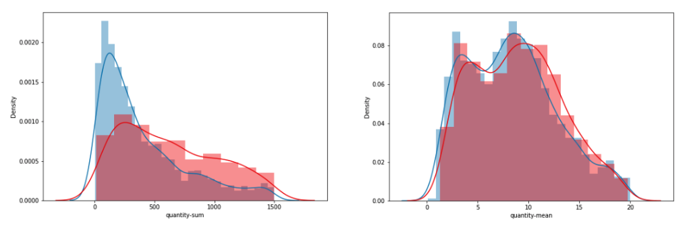

# 피처 엔지니어링(Feature Engineering)
: 원본 데이터로부터 도메인 지식 등을 바탕으로 문제를 해결하는 데 도움이 되는 피처를 생성, 변환하고 이를 머신러닝 모델에 적합한 형식으로 변환하는 작업 

 

- 딥러닝과 달리 머신러닝에서 피처 엔지니어링을 진행해야 하는 이유
  - `딥러닝`은 모델의 구조를 통해 **데이터의 피처를 모델이 스스로 추출**
  - `머신러닝` 알고리즘은 **피처를 스스로 추출 불가능** 
  > 따라서 사람이 직접 데이터를 이해해서 피처를 만드는 피처 엔지니어링 과정이 필요한 것. 양질의 데이터가 제공될 경우 **머신러닝 성능의 80~90%는 피처 엔지니어링을 통해 결정됨**

 

### 좋은 피처란? 

- 레이블의 **분포 차이가 명확**할 수록 좋은 피처
- 분포 차이가 명확하다는 것은 **레이블을 예측할 때 분류하기 더 쉽다**는 것을 의미

 

좋은 피처 vs 나쁜 피처 

 

### 모델 성능 평가 

#### Cross Validation Out of Fold 
- Cross Validation + Out of Fold 
- Cross Validation: 데이터를 여러 개의 폴드로 나눠서 검증 성능을 측정하는 방법 
- Out of Fold: 학습한 모델로 테스트 데이터를 예측하고, 이를 평균 앙상블 하여 최종 예측값으로 사용하는 방법 

 

- 여러 개의 폴드를 사용하여 검증하는 이유
  - 특정 데이터 세트의 모델의 성능이 높게 측정될 수도 있고 낮게 측정될 수도 있기 때문 
  - 즉, 검증에서 사용하는 데이터 세트에도 Bias가 존재 
  - 이러한 Bias의 영향력을 줄이기 위해 여러 개의 폴드를 사용하여 검증 

  

### Early Stopping 
- 반복 학습이 가능한 머신러닝 모델에서 검정 성능 측정을 통해 검증 성능이 가장 **최적**이라고 판단되는 지점에서 학습 조기 종료하는 기법 

    ex) 모델이 특정 스텝에서 전체 데이터를 학습했을 때 이전 스탭보다 성능이 더 떨어지는 경우가 여러 번 반복될 경우 학습 조기 종료 

 

### LightGBM Early Stopping 
- 정형 데이터에서 자주 사용하는 모델 
- Early Stopping을 쉽게 적용 가능 
- 몇 개의 트리를 만들 지 n_estimators 하이퍼파라미터로 설정하고, 이 개수만큼 트리를 만들지만 
- But 설정한 트리 개수가 최적의 값이라고 볼 수 X -> 더 큰 값에서 성능이 좋은 모델이 존재할 가능성 有
  > Early Stopping 적용을 통해 이러한 문제를 n_estimators 값을 크게 설정함으로써 해결 가능함. 모델 트리를 추가할 때마다 검증 성능을 측정하고 성능이 좋아지지 않는 순간에 더 이상 트리를 만들지 않고 학습을 종료하므로써 가장 검정 성능이 좋은 트리 개수를 최종 트리 개수로 사용하는 것! 

 

### 누적합(Cumsum)
- 시간 또는 순서에 따라 증가하는 데이터의 **총합계를 표시**하는 데 사용하는 함수 

---
#### 참고 
@ 부스트코스 피처 엔지니어링(1)