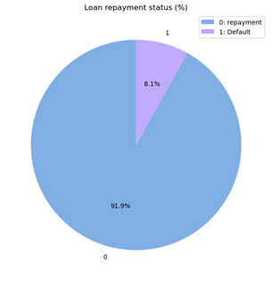
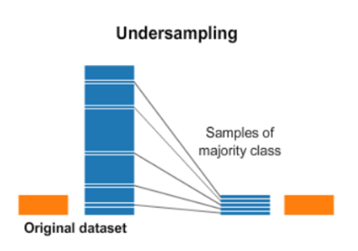
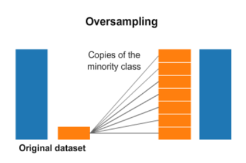

### 불균형 데이터(Imbalanced Data)
---
- Imbalanced Data: 분류 문제에 있어 Y data의 라벨 값 분포가 불균등하게 나타나는 상태를 의미 
- 발생하는 문제점: 데이터가 불균형하다면 분포도가 높은 클래스(아래 예시로 따지자면 class 0)에 모델이 가중치를 많이 두기 때문에 모델 내부에서는 "분포가 높은 것으로 예측하게 된다면 어느정도 맞힐 수 있겠지?"라고 생각함. 다시 말해 모델은 가중치가 높은 클래스를 더 예측하려고 하기 때문에 Accuracy는 높아질 수 있지만, 분포가 작은 값에 데한 Precision 혹은 Recall은 낮아지는 문제가 발생 가능 
  > ex) 
  
  > Train data의 class가 Label 0 : Label 1 = 9 : 1 정도의 비율을 띄고 있기 때문에 모델이 모든 값을 1로 예측하더라도 정확도가 `90%`가 나오게 됨 
  > 이는 Train set에서는 높은 성능을 보이지만 Test set에서는 정작 예측 성능이 낮게 나오는 **과적합 문제** 발생 가능하다는 뜻 

### 데이터 불균형성 해결 방법 
---
#### 1. `Under Sampling(=Down Sampling)`
- Under Sampling: 분포가 높은 class를 낮은 분포의 class 크기에 맞춰주는 방법
- 장점: 유의미한 데이터만 남길 수 있음
- 단점: 정보 유실 

#### 2. `Over Sampling`
- Over Sampling: 분포가 작은 클래스 값을 일련의 과정을 거쳐 생성하는 방법
- 장점: 정보의 손실 X 
- 단점: 오버피팅 야기 가능 > Test data에서의 성능이 나빠지는 결과 초래 가능 

#### Referce
- Imbalanced Data @ https://shinminyong.tistory.com/34
- Under sampling & Over sampling @ https://hwi-doc.tistory.com/entry/%EC%96%B8%EB%8D%94-%EC%83%98%ED%94%8C%EB%A7%81Undersampling%EA%B3%BC-%EC%98%A4%EB%B2%84-%EC%83%98%ED%94%8C%EB%A7%81Oversampling

