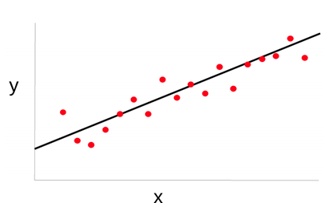
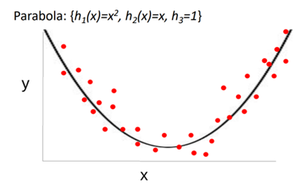
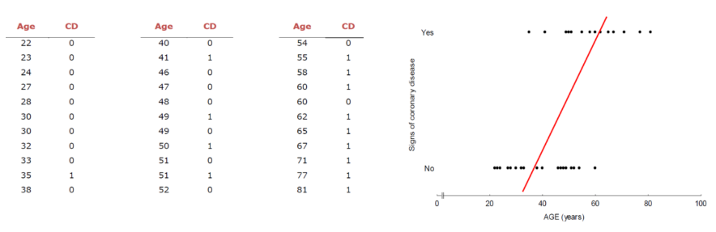
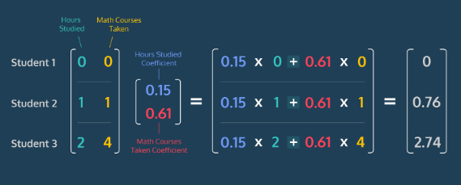
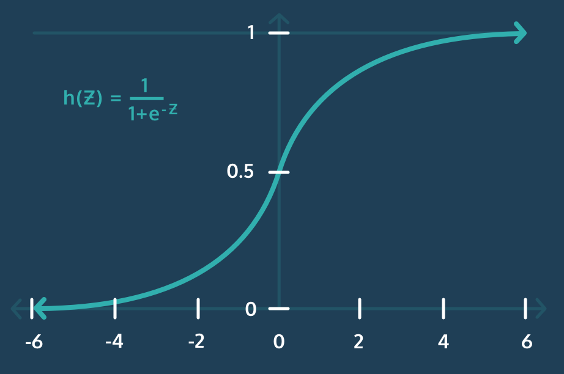
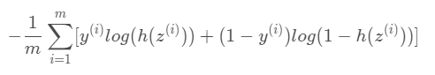
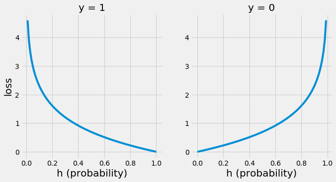

## Linear regression/Logistic regression
---

### Regression(회귀)
- 연속형 변수 y를 **y의 원인이라고 추정되는 x와의 관계를 통해 추정**하는 것 
- y를 예측하는 데, 그 추정값과 실제값의 차이가 평균 0으로 회귀하는 모델
  
  $y = f(x)$
    
    - y: target 변수 (=종속변수, 실수값을 갖는 연속형 데이터)
    - x: 독립변수 (원인이 되는 변수)
    - 원인이 되는 x를 f()라는 회귀 모델(함수)을 이용해서 추정하는 것 
- 하지만 추정을 통해 두 식이 같다고 할 수 없다는 점을 주의 
- 말 그대로 '추정'이므로 완벽히 원래 target 값과 같을 순 없음 
- 또한, 데이터 자체에 noise(잡음)이 있는 등 여러가지 요인에 의해 error가 생기게 되어 실제 결과와 예상치는 동일하지 않고 차이(=잔차, residual)가 발생하게 됨
  
  $y = f(x) + e$

    - e: error(=residual)
    - $e = y - f(x)$
  
        ```
        - 잔차의 분포는 정규 분포이어야 함
        - 잔차와 독립변수 x 사이에 상관 관계가 없고 자기 자신과도 상관이 없어야 함(잔차는 독립이어야 함)
        - 잔차의 분포가 일정해야 함(잔차는 등분산성을 만족해야 함)
        ```

<br>

- 따라서 회귀모델을 만든다는 것은 **오차의 합을 최소로 하는 선을 찾는 모델**을 만든다는 것 
- iid) 
  - **모델의 추정 = (모델의 관계식 추정) + (파라미터 추정)**
  - 모델링을 할 때 일단 관계식을 추정해야 하고, 관계식을 추정한 후에 파라미터를 추정해야 함 
  - 만약 관계식을 선형 모델링 했는 데 사실 선형으로 표현할 수 없다면?(모델 관계식을 잘못 추정한 경우) -> 아무리 weight라는 파라미터를 잘 추정해도 정확한 회귀모델이 아님 
  - 관계식을 잘 추정해야, 이를 이용해 weight 파라미터를 추정하여 올바른 회귀식을 만들 수 있음 
  - 물론, 이러한 조건을 만족했다고 해도 모델과 실제 target 간의 오차를 완벽하게 0으로 만들 수는 없음. 그러나 모델의 관계식을 잘 추정했다면 모델과 실제 target 사이의 잔차 평균을 0에 가깝도록 수렴하게끔 할 수 있음 (이 경우 잔차(error의 분포)가 정규분포를 따르게 될 것)

<br>

- Regression(회귀)는 Linear regression과 Logistic regression 두 가지 방법이 있는 데, 그 둘의 차이는 
- Linear regression은 target 값으로 **실수값을 예측**할 때 사용하는 방법이고, 
- Logistic regression은 Classification을 할 수 있는 regression으로 **정수값을 예측**할 때 사용하는 방법 
  - Binary classification을 하고 싶다면, target 값으로 binary(0이나 1) 값을 갖게 되고, 
  - Multiclass classification을 하고 싶다면, targer 값으로 정수값을 가짐 

<br>

### **Liear regression** 
- 선형으로 모델의 관계식을 모델링 
- $y = w_1·x + b = w_1·x + w_0·1$
  - w: weight(가중치)
  - b: bias(편향)
  
    
    
    출처: sanghyu tistory 

<br>

- 그러나 데이터가 직선 형태로만 존재하지 않기 때문에 x와 y의 관계식에서 x를 h라는 함수에 통과시켜 사용함으로써 보다 복잡한 형태의 데이터도 다룰 수 있도록 함 
  - $y = w_0·1 + w_1·h_1(x)$
  - h(): basis function 
  - x의 기저를 바꾸는 행위를 통해 데이터를 여러 모양으로 표현 가능 
  - ex) 
    - $y = w_0·h_0(1) + w_1·h_1(x) + w_2·h_2(x) = w_0·1 + w_1·x + w_2·x^2$
  
        
    
    - **기저함수와 weight의 선형조합**으로 target값을 예측가능
    - 기저함수 h()는 polynomial(다항), gaussian(가우시안), sigmoid(시그모이드) 등이 될 수 있음 


<br>

### **Logistic regression**
- 데이터가 어떤 범주에 속할 확률을 0에서 1사이의 값으로 예측하고 그 확률에 따라 가능성이 더 높은 범주에 속하는 것으로 분류해주는 지도 학습 알고리즘
- 실수값을  찾는 것이 아닌 암 발생 여부와 같이 discrete(이산적인)값(발생1, 안발생:0)을 찾아야 된다고 한다면, 앞서 살펴본 것처럼 선을 그어 y값을 추정하기 어려워짐 

  

  - y값이 극단적으로 0, 1만을 가지고 중간이 없기 때문에 생긴 일 

<br>

- `그렇다면 이러한 이산적인 값은 어떻게 추정해야 하는가?`

1. 모든 속성(feature)들의 계수(coefficient)와 절편(intercept)을 0으로 초기화한다. 
2. 각 속성들의 값(value)에 계수(coefficient)를 곱해서 log-odds를 구한다. 
3. log-odds를 sigmoid 함수에 넣어서 [0, 1] 범위의 확률을 구한다.

#### Log-Odds 
- 선형회귀에서는 각 속성의 값에다가 계수(coefficient)에 각 곱하고 절편(intercept)을 더해서 예측값을 구함($y= ax + b$)
- 그리고 구한 예측값의 범위는 -∞에서 ∞까진데, 로지스틱 회귀에서는 마지막에 예측값 대민 **log-odds**라는 것을 구해줘야 함 

<br>

- Odds란 사건이 발생하지 않을 확률과 발생할 확률 사이의 비 
- $odds = \frac{P(A)}{P(A^c)} = \frac{P(A)}{1-P(A)}$
- ex) 학생이 0.7 확률로 시험에 합격한다면, 반대로 시험에 떨어질 확률은 0.3이다. 이때 odds는?
  - $Odds of passing = \frac{0.7}{0.3} = 2.33$
  - Log odds of passing = log(2.33) = 0.847

> 이렇게 구한 Odds에 log를 취한 것이 바로 log-odds 

<br>

- 그러나 로지스틱 회귀에서는 여러 속성(feature)들에 계수(coefficient)를 곱하고 절편(intercept)을 더해서 최종값 log-odds를 구해야하기 때문에 까다로움 
- 따라서 여기서서는 ('내적' 혹은 '점곱'이라고 부르는) dot product 방식으로 log-odds를 구함 
- 일단 각 속성(feature)들의 값이 포함된 행렬, 그 속성들 각각의 계수(coefficient)가 포함된 행렬을 아래와 같이 계산 가능 
  
  

  출처: hleecaster 

- 연산은 파이썬 numpy의 np.dot()으로 쉽게 처리 가능 
  
  ```python
  log_odds = np.dot(features, coefficients) + intercept
  ```

<br>

#### Sigmoid Function 
- 로지스틱 회귀에서는 확률을 0에서 1 사이로 커브 모양을 나타내야 하는데, 이걸 가능하게 해주는 것이 바로 sigmoid 함수다. 

    시그모이드 함수 
    
    


- 위에서 구한 log-odds를 sigmoid 함수에 넣어서 0과 1사이의 값으로 변환해주는 것
- 여기서 $e^{-z}$는 지수 함수이고, numpy에서 ep.exp(-z)로 쉽게 계산 가능 

<br>

#### Log Loss(로그 손실)
- 손실함수(Loss Function)은 머신러닝 모델이 얼마나 잘 예측하는 지 확인하는 방법으로, 로지스틱 회귀의 손실함수는 Log Loss임
- 로지스틱 회귀가 확률을 제대로 예측해주는 지, 즉 구해놓은 속성들의 계수(coefficients)와 절편(intercept)이 적절한지 확인하기 위해 손실(Loss)을 고려해야 함 

    

    - $m$: 데이터의 총 개수 
    - $y^i$: 데이터 샘플 i의 분류 
    - $z^i$: 데이터 샘플 i의 log-odd 
    - $h(z^i)$: 데이터 샘플 i의 log-odd의 sigmoid (데이터 샘플 i가 분류에 속할 확률)

<br>

- 로지스틱 회귀모델의 목표는 로지스틱 함수를 구성하는 계수와 절편에 대해 Log Loss(로그손실)을 최소화하는 값을 찾는 것 
- 이때 이 로그 손실을 두 개로 나눠서 이해 필요(로지스틱 회귄느 특정 범주로 분류될 것인가, 그렇지 않을 것인가 2진 분류를 하기 때문)
  - y = 1 (데이터 샘플의 클래스 y가 1인 경우)
    - $loss_{y=1} = -log(h(z^{i}))$
  - y = 0 (데이터 샘플의 클래스 y가 0인 경우)
    - $loss_{y=0} = -log(1-h(z^{i}))$
- 결국 분류(레이블)가 y=1, y=0일 때 각각의 손실 함수를 그래프로 나타낸다면..

    

    - 정확한 예측은 손실이 거의 없는 반면 잘못된 예측은 거의 무한대에 가까운 큰 손실을 초래하는 꼴 
    - 이처럼 예측이 잘못되면서 손실이 점진적으로 증가하는 것을 줄이고, 올바른 예측을 하면서 손실이 작아지는 모델에 가까워지도록 하는 것이 목표 
    - 따라서 선형회귀와 마찬가지로 경사하강법(Gradient Descent)을 사용하여 모든 데이터에서 로그 손실(Log Loss)을 최소화하는 계수를 찾을 수 있음 

#### Logistic Regression code 

```python
# 데이터셋 불러오기 
import seaborn as sns

passengers = sns.load_dataset('titanic')
print(passengers.shape)
print(passengers.head())

# 데이터 전처리 

## 생존여부에 큰 영향을 미쳤을 것으로 예상되는 컬럼을 sex, age, pclass로 지정 
passengers['sex'] = passengers['sex'].map({'female':1, 'male':0})
## 결측치 채우기 
passengers['age'].fillna(value=passengers['age'].mean(), inplace=True)
## Feature 분리 
passengers['FirstClass'] = passengers['pclass'].apply(lambda x: 1 if x == 1 else 0)
passengers['SecondClass'] = passengers['Pclass'].apply(lambda x: 1 if x == 2 else 0)

features = passengers[['sex', 'age', 'FirstClass', 'SecondClass']]
survival = passengers['survived']

# Train/Test set 분리 
from sklearn.model_selection import train_test_split

train_features, test_features, train_labels, test_labels = train_test_split(features, survival)

# 데이터 정규화(Scaling)
from sklearn.preprocessing import StandardScaler

scaler = StandardScaler()

train_features = scaler.fit_transform(train_features)
test_features = sclaler.fit_transform(test_features)

# 모델 생성 및 평가 
from sklearn.linear_model import LogisticRegression

model = LogisticRegression()
model.fit(train_featuresm train_labels)

# 학습세트로 정확도 체크 
print(model.score(train_features, train_labels))

# test set에서의 정확도 체크 
print(model.score(test_features, test_labels))

# 각 Feature들의 계수(coefficients)
print(model.coef_)
```

---
#### 참고자료
@ https://sanghyu.tistory.com/12

@ https://hleecaster.com/ml-logistic-regression-concept/

@ https://idkim97.github.io/machine%20learning/MachineLearning_LogisticRegression/