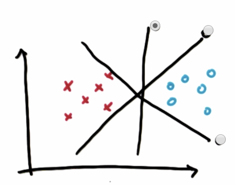
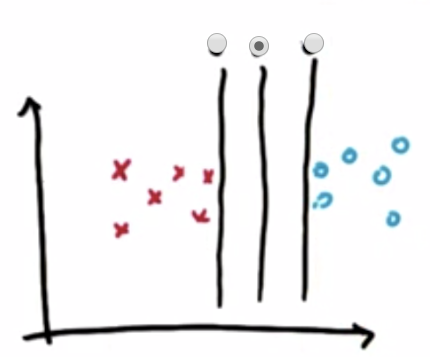
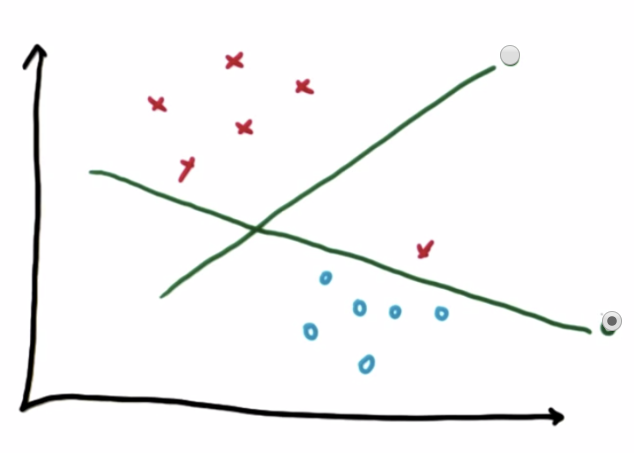
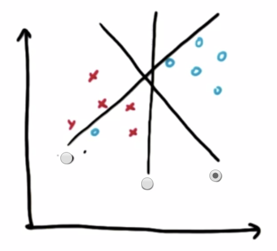
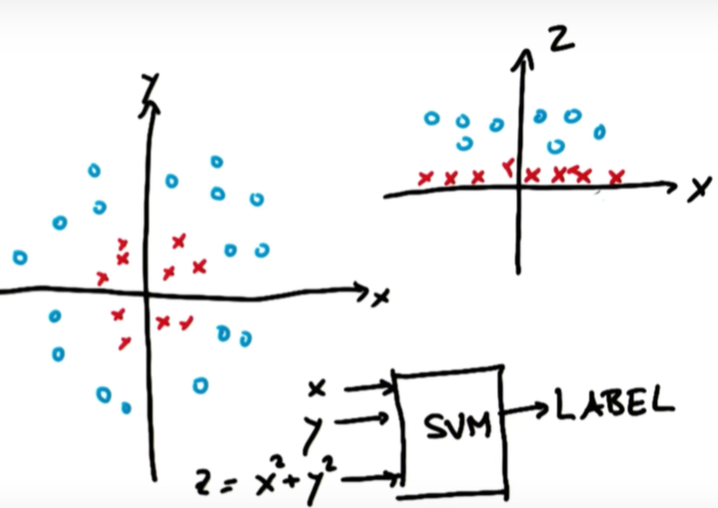

## SVM(Support Vector Machine)
---
- 주어진 데이터가 어느 카테고리에 속할 지 판단하는 이진 선형 분류모델

    

    출처: Udacity 

- 표시가 된 가운데 선이 Margin을 최대화하므로 두 데이터를 더 적절히 구분하는 선
- 위 그림에서 왼쪽 선은 파란 서포트 벡터와의 거리가 길지만 빨간 서포트 벡터와의 거리는 짧음
- 반며 가운데 선은 빨간 서포트 벡터, 파란 서포트 벡터와의 거리가 같음 
- 즉, 각 서포트 벡터와의 Margin을 최대화하는 방향으로 구분선을 잡아야 하므로 가운데 선이 가장 적절한 구분선이 되는 것 
  
  

  > 이렇게 양 옆 서포트 벡터와의 Margin을 최대화하면 Robustness도 최대화가 됨(로버스트하다는 것은 `아웃라이어(outlier)`의 영향을 받지 않는다는 뜻)
    - ex) 
        - case1) data: 1, 2, 3, 4, 5 -> 평균: 3, 중앙값: 3
        - case2) data: 1, 2, 3, 4, 100 -> 평균: 22, 중앙값: 3
        - 평균은 100이라는 아웃라이어의 영향을 받아 크게 바뀌었고, 중앙값은 아웃라이어의 영향을 전혀 받지 않아 바뀌지 않았음. 이때 퍙균은 로버스트(robust)하지 않다고 하고, 중앙값은 로버스트하다고 함
- 다시말해 위 그림에서 왼쪽 선은 로버스트하지 않고, 가운데 선은 로버스트 함
  > Margin을 최대화하면 Robustness도 최대화된다.

 

### 데이터의 정확한 분류 

- SVM 구분선으로 적절한 선은?
  - 아래에 있는 선이 데이터를 더 정확하게 구분하는 선 
  - 위에 있는 선이 Margin이 더 크긴 하나 구분선 아래 빨간 포인트가 있으므로 데이터를 정확하게 분류하고 있지 않음 
- SVM은 무작성 Margin을 크게 하는 구분선을 택하는 것이 아닌, 우선 데이터를 정확히 분류하는 범위를 먼저 찾고 그 범위 안에서 Margin을 최대화하는 구분선을 택하는 것 

 

### Outlier 처리 

- 빨간 포인트 안에 파란 포인트 하나가 섞여있음 
- 이러한 아웃라이어가 있을 경우 어떤 구분선이 가장 적합한가?
  - 맨 오른쪽 구분선이 가장 적합 
  - 빨간 포인트 사이에 섞인 파란 포인트를 아웃라이어로 취급해서 무시하고 Margin을 최대화하는 구분선을 찾은 것 
- SVM은 우선 두 데이터를 정확히 구분하는 선을 찾으나, 두 데이터를 정확히 구분하는 직선이 없을 경우 SVM이 어느정도 아웃라이어를 무시하고 최적의 구분선을 찾음 

 

### 커널 트릭(Kenel Trick)

---
#### 참고자료 

@ https://bkshin.tistory.com/entry/%EB%A8%B8%EC%8B%A0%EB%9F%AC%EB%8B%9D-2%EC%84%9C%ED%8F%AC%ED%8A%B8-%EB%B2%A1%ED%84%B0-%EB%A8%B8%EC%8B%A0-SVM