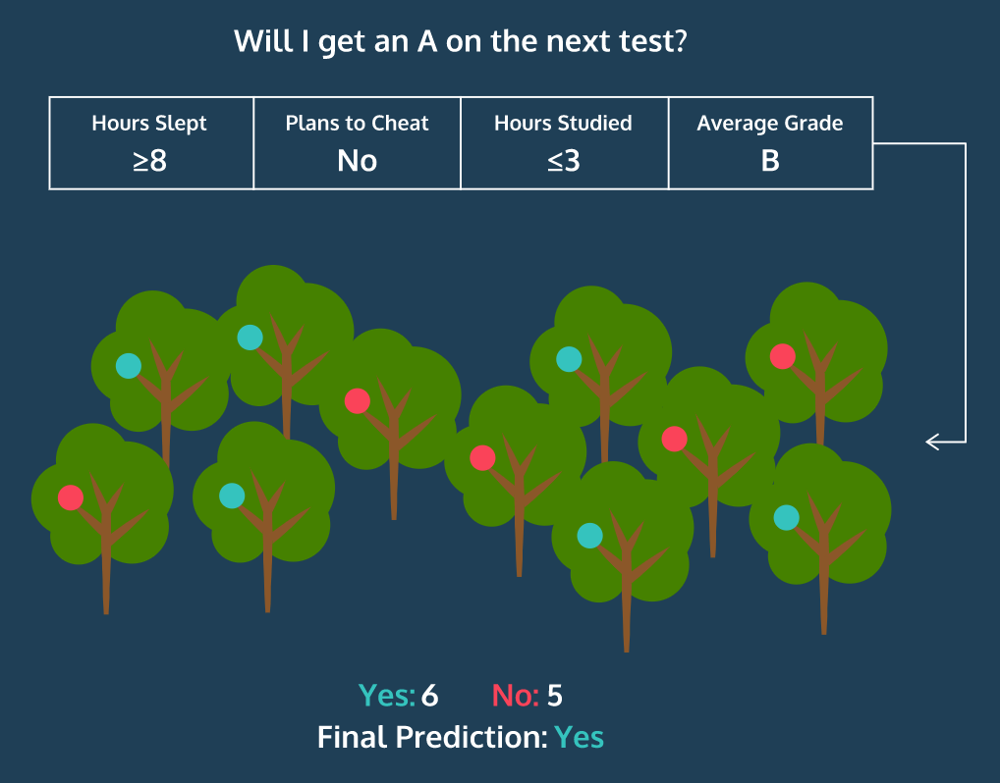
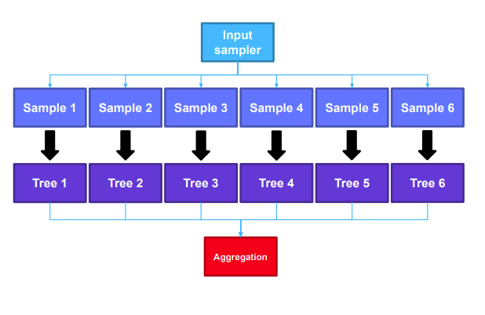
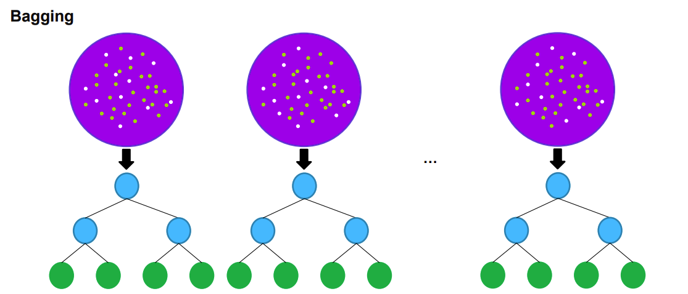
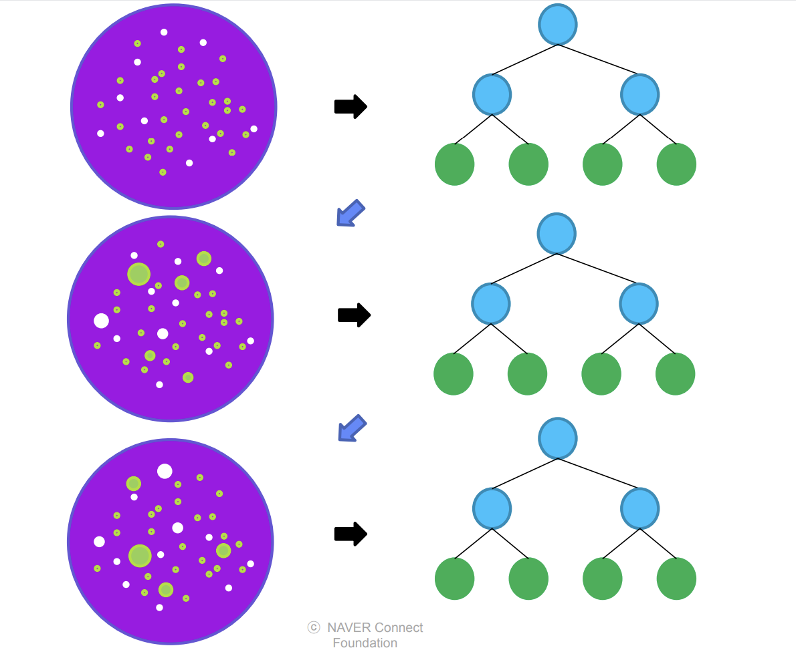
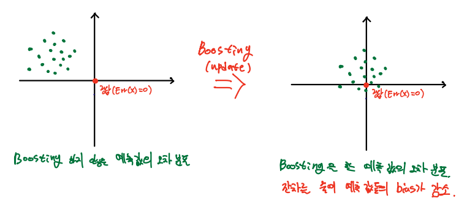
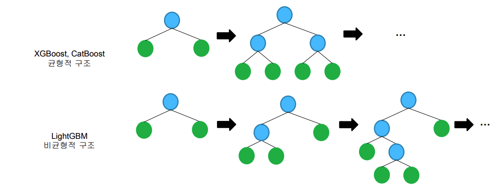

## 트리모델 
---


출처: 부스트코스 트리모델 


- 트리 구조를 활용해 **Feature 값을 특정 기준으로 분류해 목적에 맞는 의사결정을 만드는 모델** 
- 가장 기본이 되는 모델은 의사결정나무(Decision Tree)
- 트리기반 모델 
  - Decision Tree 
  - Random Forest
  - AdaBoost 
  - GBM
  - XGBoost/LightGBM/CatBoost

<br>

### Decision Tree


출처: swalloow tistory 

- 다양한 의사결정 경로와 결과를 나타내는 데 트리 구조를 사용함 
- 위의 그림은 타이타닉 생존자를 찾는 의사결정트리 모델 
  - 첫번째 뿌리 노드를 보면 `성별 <= 0.5` 라고 되어 이쓴데, 이는 남자인가? 여자인가?를 질문하는 것과 같음 
  - 이를 통해 모든 승객에 대한 분류(Classification)를 통해 생존확률을 예측할 수 있을 것 
- 숫자형 결과를 반환하는 것 -> **회귀나무(Regression Tree)**
- 범주형 결과를 반환하는 것 -> **분류나무(Classification Tree)**
- 의사결정트리를 만들기 위해서는 먼저 어떤 질문을 할 것인지, 어떤 순서로 질문을 할 것인지 정해야 함 
- 이러한 '얼마만큼의 정보를 담고 있는 가'를 `엔트로피(Entropy)`라고 함 
  - 엔트로피 = 불확실성의 척도 
  - 엔트로피가 클 수록 데이터 정보가 잘 분포되어 있기 때문에 좋은 지표라고 예상할 수 있음
  - 엔트로피 감소(=데이터 불확실성 감소=순도 증가=정보 획득)
  - 엔트로피 변화가 작은 방향으로 가지를 계속 치며 deep해짐(ex. 나누기 전 엔트로피가 0.95였다면, 나눈 후 엔트로피가 0.75이면 0.2 만큼 엔트로피가 감소했기에 분할 후가 낫다고 판단하고 나누게 됨)
  - 쉽게 말해 엔트로피가 분할 전보다 많이 감소=순도 증가하는 방향으로 학습을 진행 
 
- 장점
  - 이해 및 해석 용이 
  - 예측할 때 사용하는 프로세스가 명백하며, 숫자형/범주형 데이터를 동시에 다룰 수 O
  - 특정 변수의 값이 누락되어도 사용 가능 
- 단점
  - 최적의 의사결정트리를 찾기 어려움 (어떤 것들을 조건(Feature)로 넣어야 할지, 깊이(Depth)는 얼마로 정해야 하는지 등) 
  - 새로운 데이터에 성능이 좋지 않게 나오는 `오버피팅(Overfitting)` 문제가 발생하기 쉬움 (이러한 오버피팅을 방지할 수 있는 대표적인 트리 기반 모델 중 하나가 바로 랜덤포레스트)

<br>

### Random Forest 
- 의사결정트리를 이용해 만들어진 알고리즘
- 분류, 회귀 분석 등에 사용되는 앙상블 학습 방법의 일종으로, 훈련 과정에서 구성한 다수의 결정 트리로부터 분류 또는 평균 예측치를 출력함으로써 동작함 

    

    출처: hyesoup velog

    <br>

- 즉, 랜덤포레스트란 ('무작위 숲'이라는 이름처럼) **여러 개의 의사결정트리를 만들고, 투표를 시켜 다수결로 결과를 결정하는 방법**(일종의 인기투표인 셈) -> 여러 트리 중 오버피팅을 보이는 트리가 있을 수도 있으나 다수의 트리를 기반으로 예측하기 때문에 그 영향력이 줄어들게 되어 좋은 일반화 성능을 보임. 이렇게 좋은 성능을 얻기 위해 다수의 학습 알고리즘을 사용하는 것을 **앙상블 학습법**이라고 부르며, 이를 통해 오버피팅이 생길 경우에 대비 가능 
  - cf) 앙상블 학습: 앙상블 학습(Ensemble Learning)은 여러 개의 분류기를 생성하고, 그 예측을 결합함으로써 보다 정확한 예측을 도출하는 기법이다. 강력한 하나의 모델을 사용하는 대신 약한 모델 여러개를 조합하여 더 정확한 예측을 도출하는 기법 
  


<br>

- 여러 개의 Decision tree를 생성하는 이유 
  - 각각의 트리들이 서로 다른 데이터 셋과 무작위로 선택된 feature을 통해서 학습되기 때문 
  - 트리들이 서로 다른 데이터와 feature를 통해 학습되기 때문에 Tree들이 다양한 시각에서 데이터를 바라볼 수 있기 됨 

<br>

- 어떻게 하면 랜덤하게 트리를 얻을 수 있는가? 
  - 랜덤포레스트는 데이터를 bootstrap해서 포레스트를 구성함
  - `bootstrap aggregationg` 또는 `begging`이라고 하는 데, 이를 통해 각 트리가 서로 다른 데이터로 구축되기 때문에 `랜덤성`이 생기게 됨

<br>

- 투표는 어떻게 진행되는가?
  - 3개의 Decision Tree 모델이 있고 각각의 모델이 이진 분류(Binary Classification) 문제에서 예측한 결과가 다음과 같다고 가정한다면, 
  
  |모델  |결과         |
  |------|-------------|
  |Tree1 |Positive (1) |
  |Tree2 |Positive (2) |
  |Tree3 |Negative (0) |

  - 이 경우, 다수결 투표를 통해 최종 예측값을 결정하면 3개의 Tree 중에서 2개의 Tree가 Positive로 예측했기 때문에 Positive(1)으로 예측하게 됨 
  
    

    출처: data-study-clit tistory

<br>

### 배깅(Bagging)
  



출처: 네이버 부스트코스

- 데이터셋을 랜덤하게 샘플링하여 트리를 만들어 나가며, 생성한 트리의 의사결정들을 취합해서 하나의 의사결정을 만드는 방식으로, Random Forest가 대표적인 예 

  - Boostrap = Data를 여러 번 sampling 
  - Aggregation = 종합(Ensemble)
  - Bagging = Boostrap + Aggregation 

<br>

  

<br>

- 앞서 설명했듯 랜덤 포레스트에서 각 나무들은 `배깅`이라는 프로세스를 통해 나무를 만듦
- 학습 데이터 세트에 총 1000개의 행이 있다고 했을 때, 1000개의 행 중 임으로 100개씩 행을 선택해서 의사결정트리를 만드는 게 배깅 
- 그렇기 때문에 학습 데이터를 일부를 기반으로 생성하되 다양한 트리가 생성될 수 있음 
- 이때 기억해야 하는 것은 **중복을 허용**한다는 것 
- ex) 1000개의 행이 있는 가방(bag)에서 임의로 100개를 뽑아 첫 번째 트리를 만들고 그 100개의 행은 도로 집어 넣음. 그리고 다시 1000개의 행에서 또 임의로 100개를 뽑아 두 번째 트리를 만든 후 다시 가방에 집어넣는 것을 반복 
  - 다시말해 **복원추출** 

<br>

- **Bagging Features**
  - 또한, **트리를 만들 때 사용될 속성(feature)들을 제한**함으로써 각 나무들에 다양성을 줘야함 
  - 원래 트리를 만들 때 모든 속성들을 살펴보고 정보 획득량이 가장 많은 속성을 선택해서 그걸 기준으로 데이터를 분할하였으나, 랜덤 포레스트는 **각 분할에서 전체 속성들 중 일부만 고려하여 트리를 작성하도록 하는 전략**
  - ex) 총 25개의 속성이 있는 데, 그 중 5개의 속성만 뽑아서 살펴본 후 그 중 정보 획득량이 가장 높은 걸 기준으로 데이터를 분할함. 그 다음 단계에서도 다시 임의로 5개만 선택해서 살펴보는 방식 
  
- 그렇다면 몇 개씩 속성을 뽑는 것이 좋을까? 
  - 위 예처럼 총 속성이 25개면 5개, 즉 **전체 속성 개수의 제곱근만큼 선택**하는 게 가장 좋음(경험적으로 그렇게 나타난다고 함. 일종의 a rule of thumb)

<br>

> 이러한 과정들을 거쳐 서로 다른 트리를 만들 수 있게 되었으므로 이것들을 모아 '숲'을 이룬다. 

<br>

- **Random Forest** scikit-learn 사용법 
  - 사이킷런 라이브버리를 사용하여 쉽게 구현 가능 
  - sklearn.ensamble 모듈에서 `RandomForestClassifier`를 불러와 모델을 만들면 되는 데, 이때 숲을 만들 때 **나무의 개수**를 `n_esitimators`라는 파라미터로 지정해주어야 함 

    ```python
    import pandas as pd 
    import numpy as np
    import matplotlib.pyplot as plt
    import warnings 
    warnings.filterwarnings('ignore')

    from sklearn.datasets import load_iris, load_boston
    from sklearn.ensamble import RandomForestClassifier 
    
    # 데이터 로드 
    iris = load_iris()
    df = pd.DataFrame(iris.data, columns=iris.feature_names)
    df['species'] = [iris.target_names[x] for x in iris.target]

    x = df.drop('species', axis=1)
    y = df['species']

    clf = RandomForestClassifier(
      n_estimators = 50, # 붓스트랩 샘플 개수 (또는 base_estimator 개수)
      criterion = 'entropy', # 불순도 측도 
      max_depth = 5, # 개별 나무의 최대 깊이 
      max_features = 'sqrt', # 매 분리시 랜덤으로 뽑을 변수 개수 
      max_samples = 1.0, ## 붓스트랩 샘플 비율 => 1이면 학습데이터를 모두 샘플링 함 
      bootstrap = True, # 복원추출, False이면 비복원 추출 
      oob_score = True, # Out-of-bag 데이터를 이용한 성능 계산
      random_state = 100
    ).fit(x,y) # 모델을 만들고 바로 학습까지 진행 

    ## 예측 
    print(clf.predict(x)[:3])
    print()
    
    ## 성능평가 
    print(clf.oob_score_) ## out-of-bag 성능 평가 점수
    print('정확도: ', clf.score(x, y)) # 테스트 성능 평가 점수(Accuracy)
    print()
    
    ## 변수 중요도
    print(clf.feature_importance_)
    ```

    - `RandomForestClassifier`는 의사결정나무 `DecisionTreeClassifier`와 거의 동일 
    - 따라서 `.fit()`, `.predict()`, `.score()` 같은 메서드 사용 가능 
    - 분류가 아닌 회귀문제의 경우 `RandomForestRegressor` (보스턴 집값 데이터를 활용해 실습 가능. 코드는 따로 첨부는 x)


### Boosting 



- Boosting은 초기에 랜덤하게 선택된 데이터셋을 이용하여 하나의 틀을 만들고 **잘 맞추지 못한 데이터들에 Weight를 부여**하여 다음 트리를 만들 때 영향을 줘 다음번에는 잘 맞출 수 있게 하는 기법
- 위 그림에서 크기가 커진 동그라미가 Weight를 의미함 

  

  출처: inhovation97 tistory

- 딥러닝 모델처럼 이전에 학습한 모델을 Update 시켜 잔차를 줄여나가는 방식으로 모델을 B번 업그레이드 시키는 방법이기 때문에 편향치를 줄일 수 있음 (쪼개지 않은 원데이터에 대해 B번 업데이트 시키는 것)
- 하지만 모델을 Update 할 수록 예측값들이 더욱 가욱데로 shift 되는 데, 그만큼 부스팅 모델은 만져야 할 파라미터가 많고 overfitting의 위험이 커져 적합 난이도가 올라간다는 문제 존재 

<br>

#### 부스팅 트리 모델 중 대표적인 모델 

- LightGBM
- XGBoost 
- CatBoost 

  

  - XGBoost와 CatBoost는 Tree를 생성할 때 균형적인(Balanced) 구조로 생성을 하는 반면, LightGBM은 한 쪽에 가지를 지속적으로 생성한 다음 다른 기지가 생성하는 구조로 성장을 함 
  - 만약 Tree가 성장하는 방식을 제한하지 않는다면 두 방법 모두 Tree 모델이 크게 다르지 않을 수 있음 

<br>

#### Bagging vs Boosting 

|           |Bagging         |Boosting        |
|-----------|----------------|----------------|
|Tree 생성 방법|병렬 모델(각 모델이 서로 연관이 없음)|순차적 모델(이전 Tree의 오류 기반으로)|
|특징       |다양한 Tree 생성 |정밀한 Tree 생성  |

- Bagging은 병렬적으로 여러 개의 독립적인 DT(의사결정나무)를 만들어 평균을 낸다면, **Boosting은 직렬적으로 1개의 모델을 계속 업데이터 시켜나가는 것이 큰 차이점** 

<br>

---
#### 참고자료 
@ https://swalloow.tistory.com/92

@ https://data-study-clip.tistory.com/112

@ https://eusun0830.tistory.com/32

@ https://medium.com/dawn-cau/%EB%A8%B8%EC%8B%A0%EB%9F%AC%EB%8B%9D-%EC%95%99%EC%83%81%EB%B8%94-%ED%95%99%EC%8A%B5-%EC%9D%B4%EB%9E%80-cf1fcb97f9d0

@ http://www.dinnopartners.com/__trashed-4/

@ https://velog.io/@gangjoo/ML-%EB%B6%84%EB%A5%98-%EB%B0%B0%EA%B9%85-Bagging%EA%B3%BC-%EB%9E%9C%EB%8D%A4-%ED%8F%AC%EB%A0%88%EC%8A%A4%ED%8A%B8-Random-Forest

@ https://velog.io/@hyesoup/%EB%9E%9C%EB%8D%A4-%ED%8F%AC%EB%A0%88%EC%8A%A4%ED%8A%B8Random-Forest

@ https://zephyrus1111.tistory.com/253

@ https://inhovation97.tistory.com/66