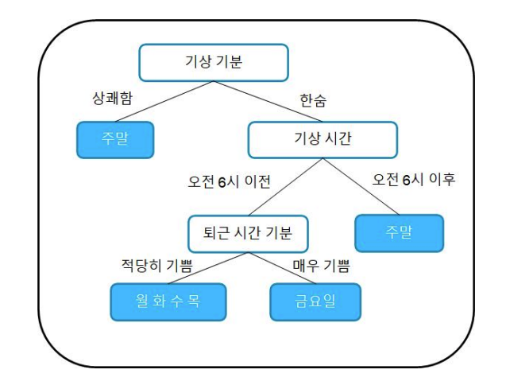
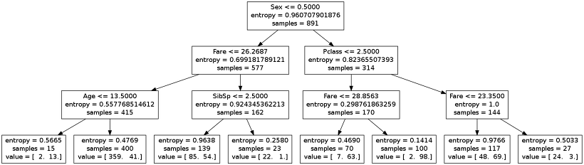
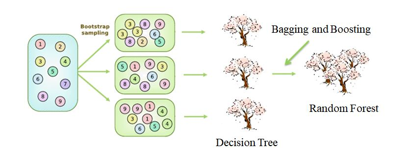

## 트리모델 
---

출처: 부스트코스 트리모델 

- 트리 구조를 활용해 **Feature 값을 특정 기준으로 분류해 목적에 맞는 의사결정을 만드는 모델** 
- 가장 기본이 되는 모델은 의사결정나무(Decision Tree)
- 트리기반 모델 
  - Decision Tree 
  - Random Forest
  - AdaBoost 
  - GBM
  - XGBoost/LightGBM/CatBoost 

 

### Decision Tree

출처: swalloow tistory 

- 다양한 의사결정 경로와 결과를 나타내는 데 트리 구조를 사용함 
- 위의 그림은 타이타닉 생존자를 찾는 의사결정트리 모델 
  - 첫번째 뿌리 노드를 보면 `성별 <= 0.5` 라고 되어 이쓴데, 이는 남자인가? 여자인가?를 질문하는 것과 같음 
  - 이를 통해 모든 승객에 대한 분류(Classification)를 통해 생존확률을 예측할 수 있을 것 
- 숫자형 결과를 반환하는 것 -> **회귀나무(Regression Tree)**
- 범주형 결과를 반환하는 것 -> **분류나무(Classification Tree)**
- 의사결정트리를 만들기 위해서는 먼저 어떤 질문을 할 것인지, 어떤 순서로 질문을 할 것인지 정해야 함 
- 이러한 '얼마만큼의 정보를 담고 있는 가'를 `엔트로피(Entropy)`라고 함 
  - 엔트로피 = 불확실성의 척도 
  - 엔트로피가 클 수록 데이터 정보가 잘 분포되어 있기 때문에 좋은 지표라고 예상할 수 있음
  - 엔트로피 감소(=데이터 불확실성 감소=순도 증가=정보 획득)
  - 엔트로피 변화가 작은 방향으로 가지를 계속 치며 deep해짐(ex. 나누기 전 엔트로피가 0.95였다면, 나눈 후 엔트로피가 0.75이면 0.2 만큼 엔트로피가 감소했기에 분할 후가 낫다고 판단하고 나누게 됨)
  - 쉽게 말해 엔트로피가 분할 전보다 많이 감소=순도 증가하는 방향으로 학습을 진행 
 
- 장점
  - 이해 및 해석 용이 
  - 예측할 때 사용하는 프로세스가 명백하며, 숫자형/범주형 데이터를 동시에 다룰 수 O
  - 특정 변수의 값이 누락되어도 사용 가능 
- 단점
  - 최적의 의사결정트리를 찾기 어려움 (어떤 것들을 조건(Feature)로 넣어야 할지, 깊이(Depth)는 얼마로 정해야 하는지 등) 
  - 새로운 데이터에 성능이 좋지 않게 나오는 `오버피팅(Overfitting)` 문제가 발생하기 쉬움 (이러한 오버피팅을 방지할 수 있는 대표적인 트리 기반 모델 중 하나가 바로 랜덤포레스트)

 

### Random Forest 
- 의사결정트리를 이용해 만들어진 알고리즘
- 분류, 회귀 분석 등에 사용되는 앙상블 학습 방법의 일종으로, 훈련 과정에서 구성한 다수의 결정 트리로부터 분류 또는 평균 예측치를 출력함으로써 동작함 
- 즉, 랜덤포레스트란 **여러 개의 의사결정트리를 만들고, 투표를 시켜 다수결로 결과를 결정하는 방법** -> 이를 통해 오버피팅이 생길 경우에 대비 가능 
  - cf) 앙상블 학습: 앙상블 학습(Ensemble Learning)은 여러 개의 분류기를 생성하고, 그 예측을 결합함으로써 보다 정확한 예측을 도출하는 기법이다. 강력한 하나의 모델을 사용하는 대신 약한 모델 여러개를 조합하여 더 정확한 예측을 도출하는 기법 

 

- 여러 개의 Decision tree를 생성하는 이유 
  - 각각의 트리들이 서로 다른 데이터 셋과 무작위로 선택된 feature을 통해서 학습되기 대문 
  - 트리들이 서로 다른 데이터와 feature를 통해 학습되기 때문에 Tree들이 다양한 시각에서 데이터를 바라볼 수 있기 됨 

 

- 어떻게 하면 랜덤하게 트리를 얻을 수 있는가? 
  - 랜덤포레스트는 데이터를 bootstrap해서 포레스트를 구성함
  - `bootstrap aggregationg` 또는 `begging`이라고 하는 데, 이를 통해 각 트리가 서로 다른 데이터로 구축되기 때문에 `랜덤성`이 생기게 됨

 

- 투표는 어떻게 진행되는가?
  - 3개의 Decision Tree 모델이 있고 각각의 모델이 이진 분류(Binary Classification) 문제에서 예측한 결과가 다음과 같다고 가정한다면, 
  
  |모델  |결과         |
  |------|-------------|
  |Tree1 |Positive (1) |
  |Tree2 |Positive (2) |
  |Tree3 |Negative (0) |

  - 이 경우, 다수결 투표를 통해 최종 예측값을 결정하면 3개의 Tree 중에서 2개의 Tree가 Positive로 예측했기 때문에 Positive(1)으로 예측하게 됨 
  
    

    출처: data-study-clit tistory

 

### Baggin 

### Boosting 

---
#### 참고자료 
@ https://swalloow.tistory.com/92

@ https://data-study-clip.tistory.com/112

@ https://eusun0830.tistory.com/32

@ https://medium.com/dawn-cau/%EB%A8%B8%EC%8B%A0%EB%9F%AC%EB%8B%9D-%EC%95%99%EC%83%81%EB%B8%94-%ED%95%99%EC%8A%B5-%EC%9D%B4%EB%9E%80-cf1fcb97f9d0

@ http://www.dinnopartners.com/__trashed-4/

@ https://velog.io/@gangjoo/ML-%EB%B6%84%EB%A5%98-%EB%B0%B0%EA%B9%85-Bagging%EA%B3%BC-%EB%9E%9C%EB%8D%A4-%ED%8F%AC%EB%A0%88%EC%8A%A4%ED%8A%B8-Random-Forest