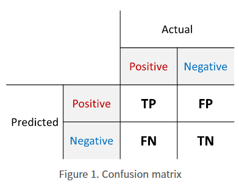
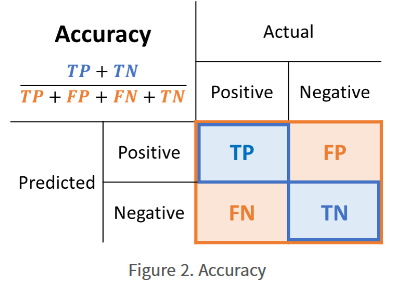
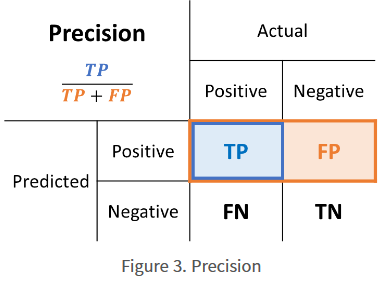
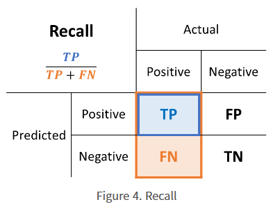
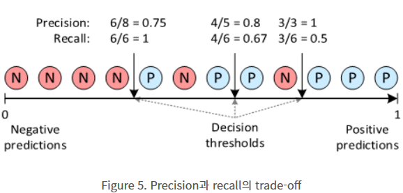
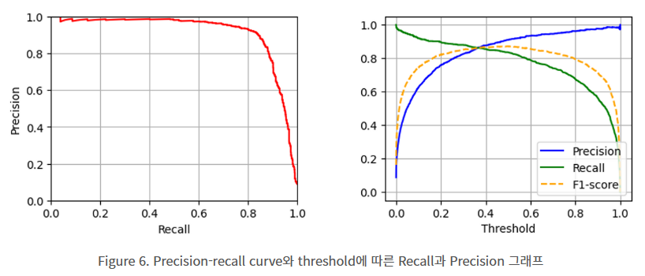
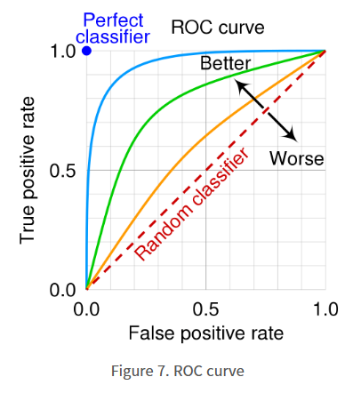

### 혼동 행렬(Confusion Matrix)
---

- 실제 클래스와 예측된 클래스의 매칭을 이용하여 분류 모델을 평가하는 도구 
- 발생 가능한 네 가지 경우
    1) TP(True Positive)
    2) FP(False Positive)
    3) FN(False Negative)
    4) TN(True Negative)

### Accuracy, Percision, Recall
---
#### `정확도(Accuracy)`

- Accuracy: 판별한 전체 샘플 중 TP와 TN의 비율
  > Accracy = $\frac{TP + TN}{TP + FP + FN + TN}$

- 장점: 분류 모델을 평가하기에 가장 단순한 지표 
- 단점: 불균형한 클래스를 가진 데이터 셋을 평가하기 어려움 
    > ex. Positive:Negative = 2:8로 불균형한 클래스를 가지는 데이터 셋일 경우 모든 예측을 Negative로 해버리는 분류기의 정확도도 80%로 측정됨 

#### `정밀도(Precision)`

- Precision: 분류 모델이 Positive로 판정한 것 중, 실제로 Positive인 샘플의 비율로 Positive로 검정된 결과가 얼마나 정확한 지를 나타냄(f=PPV, Positive Predictive Value)
  > Precision = $\frac{TP}{TP + FP}$

#### `재현율(Recall)`

- Recall: 실제 Positive 샘플 중 분류 모델이 Positive로 판정한 비율(=Sensitivity(민감도), TPR(True Positive Rate, 양성률))
- Recall은 분류 모델이 실제 Positive 클래스를 얼마나 빠지지 않고 잘 잡아내는 지를 나타내므로 주요 지표 
  > Recall = $\frac{TP}{TP + FN}$

### Precision-Recall 관계
---
#### `F1-score`
- F1-score: Precision과 Recall의 조화평균으로 1에 가까울 수록 분류 성분이 좋음 (0<F1-score<1)
  > F1-score = $2*\frac{Precision * Recall}{Precision + Recall}$
- Precision-Recall Curve
  > Trade-off 관계: Precision이 올라가면 Recall이 떨어지고 Recall이 올라가면 Precision이 떨어짐
  
  > Decision threshold를 통해 trade-off 관계 조절 가능 (*Decision threshold: 분류 모델의 결과인 [0, 1] 사이의 값을 positive 또는 negative로 결정하는 경계) 

  > Precision-recall curve(우측 그래프의 경우 Precision과 Recall 값을 threshold 변화에 따른 그래프로 나타낸 것)
  

### 그 외 분류 성능 지표 
---
### `Error Rate`
- Error Rate(오분류율): 모델이 전체 데이터에서 잘못 맞춘 비율 
  > Error Rate = $\frac{FP + FN}{TP + TN + FP + FN}$
### `TNR(True Negative Rate)`
- TNR(특이성): 실제 Negative 샘플 중 분류 모델이 Negative로 판정한 비율로 Specificity(특이도) 또는 Selectivity라고도 불림 (Recall과 반대 개념)
  > TNR = $\frac{TN}{FP + TN}$
#### `FPR(False Positive Rate)`
- FPR(위양성률): 실제 Negative 샘플 중 분류 모델이 positive로 판정한 비율
  > FPR = $1 - TNR1$ = $\frac{FP}{FP + TN}$
#### `ROC Curve`
- ROC(Receiver Operating Characteristic) curve: threshold에 따른 TPR(=Recall)과 FPR(=Fall-out)을 나타낸 그래프로 대각선을 기준으로 좌상단에 붙어 있는 ROC curve일 수록 좋은 분류 성능 나타냄
  > 
  
  > ROC-AUC (Area Under the Curve) = ROC curve의 면적

#### Reference
- 분류 성능 지표 
  
  @ https://ai-com.tistory.com/entry/ML-%EB%B6%84%EB%A5%98-%EC%84%B1%EB%8A%A5-%EC%A7%80%ED%91%9C-Precision%EC%A0%95%EB%B0%80%EB%8F%84-Recall%EC%9E%AC%ED%98%84%EC%9C%A8
  
  @ https://white-joy.tistory.com/9?category=1015070