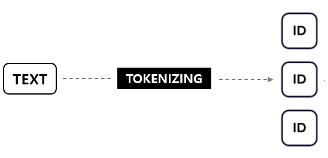
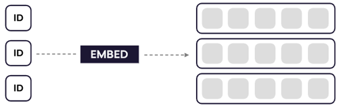
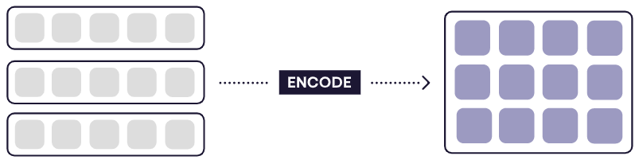
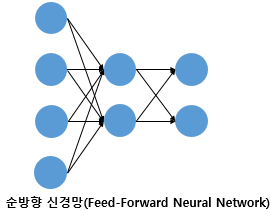

## Tokenization & Embedding vs Encoding 
---

 

### 토큰화 
#### 단어 토큰화(Word Tokenization)
- 토큰의 기준을 단어(Word)로 하는 경우를 말함 
- 여기서 단어는 단어 단위 외에도 단어구, 의미를 갖는 문자열로 간주되기도 함 
- ex) 구두점(Punctuation) 같은 문자를 제외시키는 간단한 단어 토근화 작업을 해보면 아래와 같음
  - Input: Time is an illusion. Lunchtime double so!
  - Output: 'Time', 'is', 'an, 'illusion', 'Lunchtime', 'double', 'so'
  - 입력으로부터 구두점을 제외시킨 후 띄어쓰기를 기준으로 잘라 낸 것을 확인 가능 
- 토큰화 작업은 단순히 구두점이나 특수 문자를 제거하는 정제(Cleaning) 작업을 수행하는 것으로 해결되지 않음 (토큰이 의미를 잃어버리는 경우가 발생하므로)
- 또한, 띄어쓰기 단위로 자르면 사실상 단어 토큰이 구분되는 영어와 달리, 한국어는 띄어쓰기 만으로는 단어 토큰을 구분하기 어려우므로 유의해야 함 

 

#### 문장 토큰화(Sentence Tokenization)
- 문장 토큰화는 여러 문장으로 이루어진 텍스트를 각 문장으로 나누는 것을 의미 
- 즉, 토근의 기준을 문장(Sentence)로 하는 경우 
- ex) 
  - Input: Hello everyone. It's good to see you. Let's start our text mining class! 
  - Ouptut: 'Hello everyone.', It's good to see you.', 'Let's start our text mining clas!'

 

### Embedding vs Encoding 
- Embedding: 토크나이징된 단어 토큰들을 벡터들로 변환하는 과정 
- Encoding: Embedding된 벡터들을 Sentence Matrix로 변환하는 과정 
- 보통 Encoder에서 Embedding과 Encoding을 모두 수행함 

 

- 텍스트가 들어오면 토크나이징을 통해 단어 토큰들로 변환
   
    

- 단어 토큰들은 Embedding을 통해 일련의 단어 벡터들로 변환됨(각각은 Dense vector)
  
  

- 일련의 단어 벡터들은 흔히 Bi-LSTM과 같은 모델을 이용해 순방향 마지막 값과 역방향 마지막 값을 Concat 하는 방식으로, 즉 Encoding을 통해 Sentence Matrix로 변환됨 
  
  

- Sentence Matrix와 Context vector 간의 Attention 연산을 통해 단일 벡터를 얻음 (두 Sentence Matrix 간의 연산도 가능)
  
  

- 이 단일 벡터는 Feed forward 네트워크로 전달되어 Prediction을 수행함 
  
  

 

#### Feed Forward & Attention

- Feed Forward(피드포워드 뉴럴네트워크): 오직 입력층에서 출력층 방향으로 연산이 전개되는 신경망 
  
    

    출처: wikidocs

- Attention Mechanism
---
#### 참고자료
@ https://beausty23.tistory.com/223

@ https://katenam32.tistory.com/40