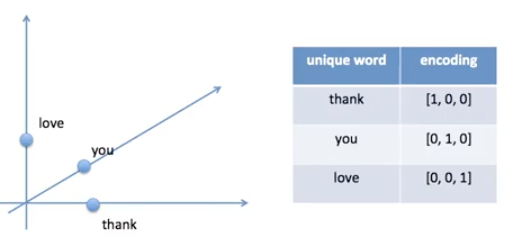

## Tokenization & Embedding vs Encoding 
---

 

### 토큰화 
#### 단어 토큰화(Word Tokenization)
- 토큰의 기준을 단어(Word)로 하는 경우를 말함 
- 여기서 단어는 단어 단위 외에도 단어구, 의미를 갖는 문자열로 간주되기도 함 
- ex) 구두점(Punctuation) 같은 문자를 제외시키는 간단한 단어 토근화 작업을 해보면 아래와 같음
  - Input: Time is an illusion. Lunchtime double so!
  - Output: 'Time', 'is', 'an, 'illusion', 'Lunchtime', 'double', 'so'
  - 입력으로부터 구두점을 제외시킨 후 띄어쓰기를 기준으로 잘라 낸 것을 확인 가능 
- 토큰화 작업은 단순히 구두점이나 특수 문자를 제거하는 정제(Cleaning) 작업을 수행하는 것으로 해결되지 않음 (토큰이 의미를 잃어버리는 경우가 발생하므로)
- 또한, 띄어쓰기 단위로 자르면 사실상 단어 토큰이 구분되는 영어와 달리, 한국어는 띄어쓰기 만으로는 단어 토큰을 구분하기 어려우므로 유의해야 함 

 

#### 문장 토큰화(Sentence Tokenization)
- 문장 토큰화는 여러 문장으로 이루어진 텍스트를 각 문장으로 나누는 것을 의미 
- 즉, 토근의 기준을 문장(Sentence)로 하는 경우 
- ex) 
  - Input: Hello everyone. It's good to see you. Let's start our text mining class! 
  - Ouptut: 'Hello everyone.', It's good to see you.', 'Let's start our text mining clas!'

 

### Embedding vs Encoding 

#### Embedding
- 특정 단어를 기계가 알아 들을 수 있는 방법으로 수치화 한 것 

#### Encoding
- 벡터를 활용해 특징에 대해 수치 데이터로 변환하는 것 
- ex) 
  |A 특징

- 딥러닝 모델에는 text를 input으로 넣을 수 없기 때문에 text를 숫자로 변환해 넣어주어야 하는 데 이것을 **word Encoding**이라고 함 
  
  

  출처: acdong tistory

  - "Thank you love  you"를 위처럼 0, 1, 2로 변환 

- 하지만 딥러닝에서 자주 사용하는 인코딩 방법은 **One Hot Encoding**
  
  

  - 단어 갯수만큼의 n차원 Vector를 만들어 독립적인 방법으로 표현하는 것 
  - ex) 중복되지 않는 단어가 100개면 100차원 Vector 
  
    

  - But.. 원핫인코딩을 하면 'King'이라는 단어가 'woman'보다 'man'과 더 유사하다는 것을 알 수 X 
  - 유사도 측정 방법으로는 대표적으로 유클리디안 유사도와 코사인 유사도가 있는 데, 원핫인코딩을 했을 때 위 그림과 같이 방향 및 거리가 똑같이 1이라 서로 간의 유사도를 알 수 없음 

 

- 원핫인코딩이 아닌 **Embedding**을 사용하면 저차원 상태로 단어 간의 `유사도`를 구할 수 있음 
  
  

  - 유사한 단어인 man과 king / woman과 queen 끼리 뭉쳐있음을 알 수 있음
  - 이것이 바로 임베딩 기법이고, 대표적으로 **word2vec**가 있음 

 

---
#### 참고자료
@ https://beausty23.tistory.com/223 (토큰화)

@ https://acdongpgm.tistory.com/179 (인코딩과 임베딩)